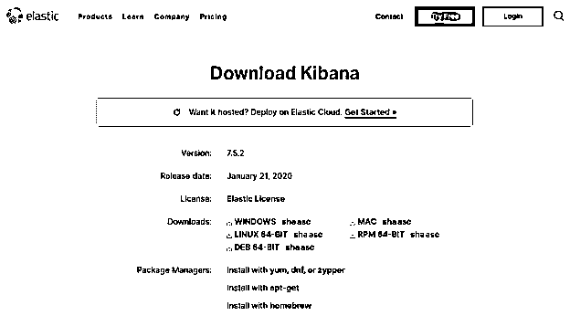
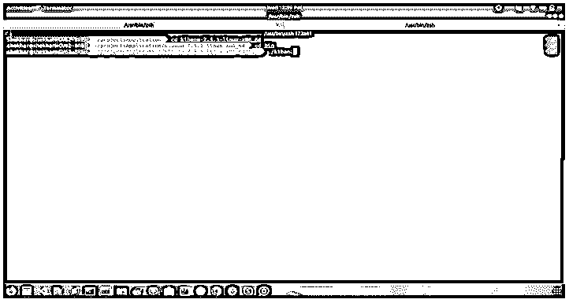
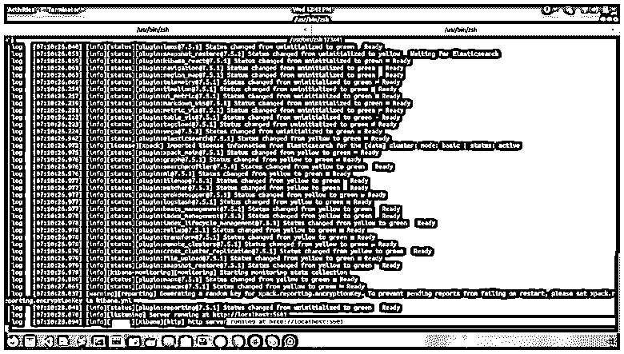
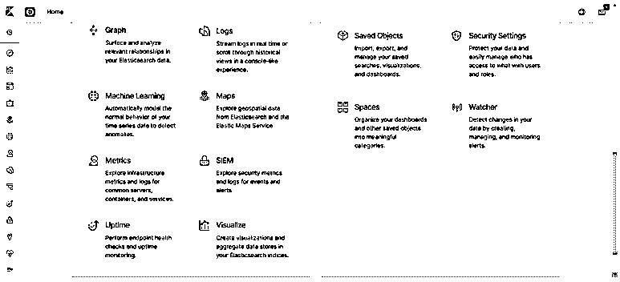
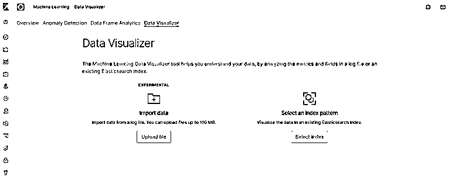
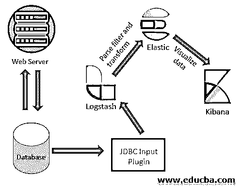

# 什么是基巴纳？

> 原文：<https://www.educba.com/what-is-kibana/>

## 什么是基巴纳简介

Kibana 基本上用于以适当的方式对大型数据集进行可视化，以便更深入地理解。我们可以使用不同类型的方法在 Kibana 中显示结果，如线形图、条形图、饼图、热图、区域图、坐标图、标尺、目标、时间线等。

Kibana 将与 ELK stack 一起推出，我们称之为 Elasticsearch、Logstash 和 Kibana。

<small>Hadoop、数据科学、统计学&其他</small>

### 如何安装 Kibana？

要安装 kibana，请访问 kibana 主网站，并根据您的系统进行选择。

要在 ubuntu/Linux 中安装 kibana，请使用以下步骤:

第一步是安装 kibana，我们必须下载 tar 文件或 deb 文件。

下载 tar 文件后，将该文件保存在一个特定的位置并解压缩。解压缩后，只需转到该文件夹并运行如下命令:

之后，kibana 将启动，您可以在 localhost 中检查它，如下图所示:

**Note:** To run kibana, must you have running elasticsearch in your system, otherwise it will not run successfully.

### 基巴纳的特色

以下是基巴纳的特点

#### 1.形象化

Kibana 基本上使用不同方式的可视化数据。易于可视化数据的方法多为竖条图、横条图、饼图、折线图、热图等。

#### 2.仪表盘

当我们开始可视化日志数据或数据集时，我们可以让它留在船上。在一个地方看到不同种类的选项会给使用数据带来更大的动力。

#### 3.开发工具

开发工具是初学者弹性搜索的最佳学习方式。我们可以直接将“elasticsearch documents”中的示例复制并粘贴到“kibana”中，我们可以看到实时发生的情况。添加、更新和删除索引也非常简单快捷。

#### 4.报告

可视化数据以及仪表板可以转换为有用的信息报告，如 CSV 格式，也可以是共享代码的 URL 形式。

#### 5.过滤器和搜索查询

在 elasticsearch 中编写查询有点复杂，但在过滤器和搜索查询的帮助下，我们可以从庞大的数据集中获得我们想要的信息。

#### 6.插件

Kibana 有非常好的内置插件功能，但也有一个选项来添加第三方插件，以便我们可以获得更多的权力来探索数据。

#### 7.坐标和区域地图

Kibana 中的这种特征地图有助于在地理地图上可视化，从而提供数据的真实视图。

#### 8.时间表

时间轴是 kibana 的另一个可视化特性，主要用于时间数据分析。有时，我们希望在 elasticsearch 中可视化索引期间的数据传输速度，因此我们可以从该功能中获得所有这些细节。这也有助于将数据与前一周期的日、周、月等进行比较。

#### 9.帆布

这是 kibana 的另一个特性，它有助于用不同的颜色组合、不同的形状和文本来表示数据。

### 基巴纳的优势

1.  Kibana 最令人印象深刻的特性是开源，它可以帮助我们可视化大量的日志，显示内联图、条形图、饼状图、热图等。
2.  对于初学者来说，Kibana 非常容易理解。
3.  我们可以轻松地将我们的可视化转换为仪表板的报告。
4.  我们可以很容易地使用不同的颜色来显示复杂的数据使用画布。
5.  Kibana 还具有时间轴的功能，可以可视化和比较以前记录的数据。

### 基巴纳的缺点

1.  有时候给 Kibana 添加第三方插件会因为版本不匹配而成为一件非常繁琐的工作。
2.  有时不仅插件版本问题发生，因为有时当我们升级时，elasticsearch 版本也会出现不匹配错误。

### 用 Kibana 进行机器学习

很难识别任何网络攻击或数据图表中突然出现的高峰，因为在监控时，我们过去常常依靠我们的眼睛来搜索和跟踪任何问题的根本原因，并了解这些问题，我们必须使用时间选择器来设置不同的时间范围。我们可以通过搜索和发现图表中的趋势和峰值来做到这一点，但是有一个工具可以帮助我们查明这些问题，并让我们轻松了解任何此类事件。

使用 X-Pack 机器学习功能，我们可以为任何这样的需求创建作业，并可以通过识别异常值来获得完整的洞察力。它还可以帮助我们通过读取 Elasticsearch 中可用的数据、应用算法，然后在 Kibana 中显示这些数据来执行预测分析。

使用 Elastic Stack，我们可以深入了解我们的数据，例如通过查看每秒的请求数来了解网站的流量。这些信息可以向我们展示趋势，比如峰值时间，但如果我们想获得细节，比如是什么导致了这一点，或者这一趋势背后的原因，我们可以使用 X-Pack 机器学习。它可以为我们提供这些细节(隐藏在数据背后)，并可以使用无监督的机器学习进行弹性搜索。

X-Pack 机器学习对基于时间序列的数据进行处理，并通过识别数据中的异常来自动化分析过程。我们可以实时应用它，也可以将其设置为批处理。它使用专有的机器学习算法来运行机器学习作业。

在这篇博客中，我们将介绍涉及单指标、多指标、群体和高级工作的机器学习工作。我们还将发现 data visualizer 选项，通过它我们可以进一步深入了解数据，并基于这种了解，我们可以决定要进行机器学习分析的领域。

我们将探索异常浏览器选项，通过它我们可以看到一段时间内的最大异常分数。它将异常显示为以不同颜色显示的块。

### 机器学习作业

在 Kibana 中，如果我们想要运行任何机器学习分析，首先，我们必须创建一个机器学习作业，并以相同的顺序执行它以获得结果。作业保存了用于执行机器学习任务的配置和元数据信息的所有细节。

每项工作都有一个或多个检测器，将分析功能应用于数据的特定领域。该作业还具有不同的功能，这些功能通过事件或实体的类型影响异常情况的考虑。例如，基于数据中的其他实体或相对于它们自己以前的行为来分析实体。

为了运行机器学习作业，我们需要转到 kibana 的 UI 部分，运行不同种类的机器学习作业。当我们点击左侧选项“机器学习”时，我们可以使用这些功能，这将打开另一个窗口，如下所示:

### 从 Web 应用程序创建超级酷的仪表板

在这里，我们将讨论如何使用 Logstash 从 RDBMS 中提取数据，并将其推送到 Elasticsearch，然后使用 Kibana 中的数据创建仪表板。

基本上，我将解释我们如何使用 Logstash 从 RDBMS 中提取数据，然后将这些数据发送到 Elasticsearch，从那里我们可以在 Kibana 中读取这些数据以创建仪表板。这种方法非常有趣，因为我们没有对应用程序进行任何更改来获取数据，而是简单地使用 Logstash 的 JDBC 连接器，它为我们提供了一种工具，只需在连接到数据库服务器后编写查询，就可以直接从任何 RDBMS 中提取数据。

对于这种类型的仪表板创建，我们需要创建一个星型模式表，并从其他表中提取数据，这与我们用于报告的方法相同。完成后，我们可以使用 JDBC 连接器通过 Logstash 中的查询来提取数据。Logstash 从 RDBMS 中提取数据，我们可以配置它在 Elasticsearch 中直接发送数据。然后，我们可以在 Kibana 中创建索引模式，使用该索引来创建仪表板。

下图描述了 kibana 的架构:

上图显示了连接到数据库服务器进行读写操作的 web 服务器。我们使用 Logstash 的 JDBC 输入插件，通过编写查询从数据库中获取数据。然后，这些数据被发送到 Elastic，Kibana 使用这些数据来创建仪表板。所以，首先，我们需要了解 JDBC 输入插件是如何工作的。

### 结论

Kibana 是一个用于可视化大量数据的开源软件，也有一些第三方插件，可以更强大地控制数据，从日志或数据集获得更多信息。像 kibana 一样，其他一些工具也是可用的，但 kibana 最好的一点是它是 ELK 堆栈的一部分。

### 推荐文章

这是一个什么是基巴纳的指南。在这里，我们讨论了 Kibana 的安装过程及其特点和优缺点。您也可以看看以下文章，了解更多信息–

1.  [虚拟软件](https://www.educba.com/virtualization-softwares/)
2.  [虚拟化的优势](https://www.educba.com/virtualization-benefits/)
3.  [计算机语言的种类](https://www.educba.com/types-of-computer-language/)
4.  [机器学习数据集](https://www.educba.com/machine-learning-datasets/)
5.  [基巴纳可视化指南](https://www.educba.com/kibana-visualization/)

