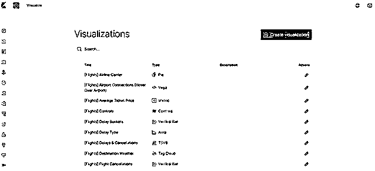
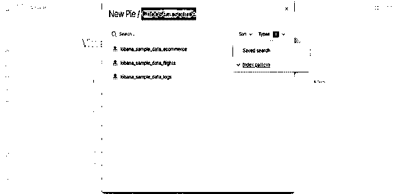
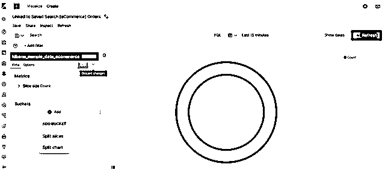
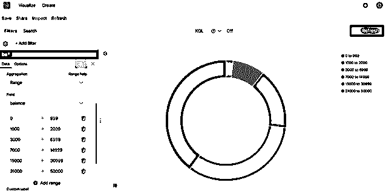
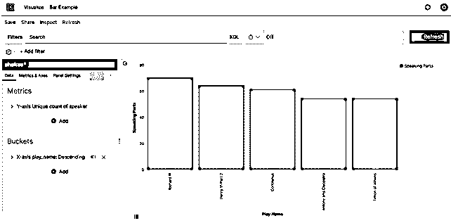
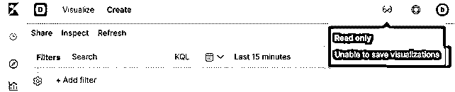
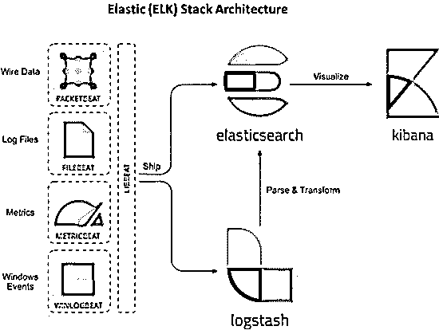

# 基巴纳可视化

> 原文：<https://www.educba.com/kibana-visualization/>

## 基巴纳可视化简介

Visualize 帮助我们以适当的格式可视化 elasticsearch 指数数据，以便理解数据，并且我们可以在仪表板中使用它进行分析。Kibana 代表 elasticsearch 查询将数据可视化。我们可以使用不同的聚合方法来提取和处理数据，并在不同的图表和饼图等中可视化这些信息。

### 基巴纳可视化数据

在 Visualize 应用程序中，我们可以使用各种可视化工具，如图表、表格和地图等，以不同的格式形成我们的数据。在这篇博客中，我们将探讨以下可视化工具:

<small>Hadoop、数据科学、统计学&其他</small>

*   条形图
*   圆形分格统计图表

kibana 中有很多可视化选项，比如地图、Markdown 小部件等。但是我们主要关注这两个常用的。如果我们理解了这两个工具，其他工具也会是类似的。要打开可视化工具，首先，我们必须单击左侧的可视化工具可视化图像，它将打开一个新窗口，如下所示:

#### 1.圆形分格统计图表

使用饼图选项进行可视化的过程如下:

1.  单击 kibana 左侧的可视化图形，它将显示一个如上图所示的窗口。
2.  然后单击右侧的“创建可视化”选项卡，我们将看到如下所示的新窗口。

3.  现在单击饼图选项，它将打开一个新窗口，如下所示:

4.  现在从上面选择一个源的窗口中，从类型的下拉列表中选择索引模式。

默认情况下，饼图将显示单个切片中的数据，因为默认搜索匹配所有文档。如果我们想过滤哪个切片必须显示在饼图中，我们可以使用 elasticsearch bucket 聚合。这种聚合方法将在结果中只显示那些与查询匹配的文档。甚至我们还必须显示不同范围内的存储桶，为此，我们使用存储桶窗格过滤器，详情如下:

因此，如果我们想在饼图中显示特定字段的数据，那么我们必须执行以下步骤:

*   首先，从源和索引模式中选择任何数据集。
*   然后点击桶窗格，并选择添加>分割切片，如图所示。

*   然后单击聚合并选择范围。我们可以添加任意多的范围。
*   在字段下拉列表中选择您的属性字段名称。
*   最后单击应用更改，我们将看到如下结果:

#### 2.条形图

条形图的步骤与上述饼图中的解释相同。当我们从创意可视化中选择一个垂直条形图时，桶窗格的一些功能将会发生变化，如下图所示。

在上面的图像中，左侧的桶窗格中，我们必须选择 x 轴和 y 轴。当我们选择一个选项时，它会自动显示下一个选项，最后我们必须单击应用更改，我们会得到上面的图像。

### 检查可视化

Kibana 可视化还允许我们通过 inspect 选项检查我们的数据。我们可以在屏幕顶部的存储区窗格窗口中获得检查选项(保存共享检查刷新)。

**1。**点击检查选项。

**2。**要下载 CSV 格式的数据，点击下载，然后会显示两个选项:

*   **格式化 CSV:** 此格式下载表格格式的数据。
*   **Raw CSV:** 这将下载数据集中提供的数据。

我们还可以从视图下拉菜单中的选项请求中看到收集数据的请求。

### 保存可视化效果

如果我们想在仪表板中看到可视化结果，那么我们必须保存它们。

*   在基巴纳顶部，有一个保存选项。点击保存选项。
*   之后，它将显示写可视化的标题和描述，这是可选的。最后点击保存细节以在仪表板中可视化。

**只读访问**

有时，我们没有权限保存可视化效果，我们可以从下面显示的内容中进行检查，然后保存选项将不可用。

**分享可视化**

*   当您完成所有数据的可视化后，我们可以在共享菜单的帮助下在外部共享它。
*   我们既可以创建可视化的直接链接，也可以生成 PDF 和 PNG 报告。

### 有麋鹿的基巴纳建筑

Kibana 附带了 ELK 堆栈，其大部分架构都可用，如下所示:

在上面的架构中，我们可以看到来自左侧的数据要么直接发送到 elasticsearch，要么通过 logstash 发送到 elasticsearch，最后来自 elasticsearch 索引的数据发送到 kibana，在那里我们必须可视化来自其他来源的数据以做出决策。

### 结论

Kibana 可视化工具是实时搜索和地图的结合。Kibana 仪表板提供您数据的完整详细信息，使您能够深入了解细节。Kibana 现在也可以在 Amazon premises EC2 或 Amazon Elasticsearch 服务上找到。不仅是 Kibana，我们还可以使用其他开源工具来进行适当的数据可视化，但是 Kibana 是 ELK stack 的一部分，所以很容易将来自 Elasticsearch indices 的数据导入到 Kibana 中。

### 推荐文章

这是一个基巴纳可视化指南。这里我们讨论两个可视化工具和架构。您也可以浏览我们的其他相关文章，了解更多信息——

1.  [基巴纳替代品](https://www.educba.com/kibana-alternatives/)
2.  [什么是数据可视化](https://www.educba.com/what-is-data-visualization/)
3.  [最佳数据可视化工具](https://www.educba.com/best-data-visualization-tools/)
4.  [数据可视化的类型](https://www.educba.com/types-of-data-visualization/)

