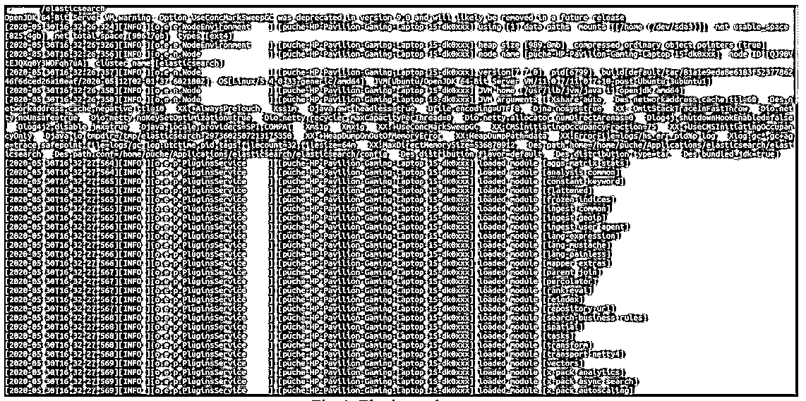
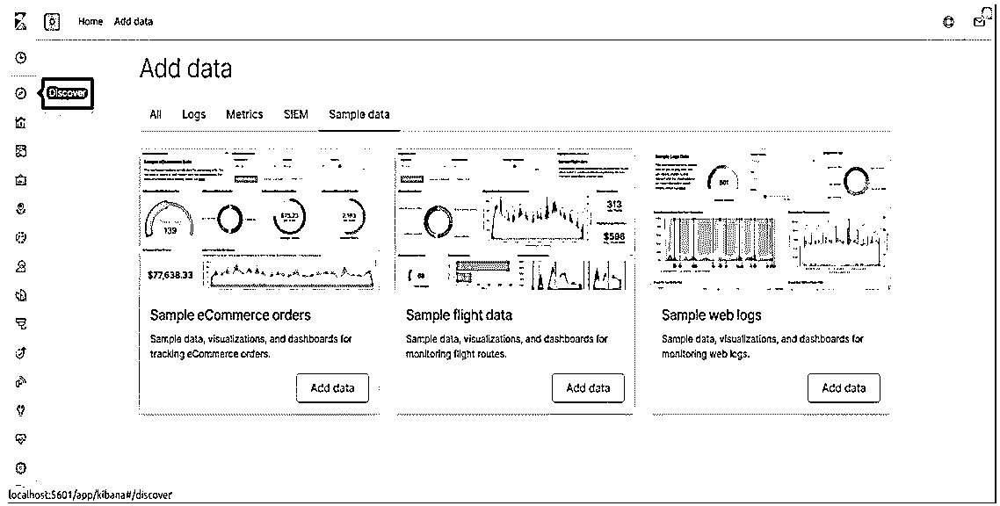
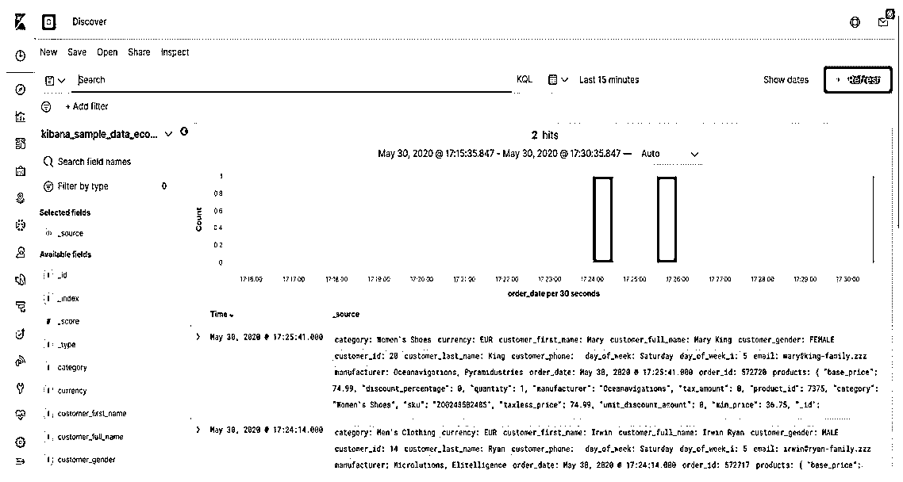
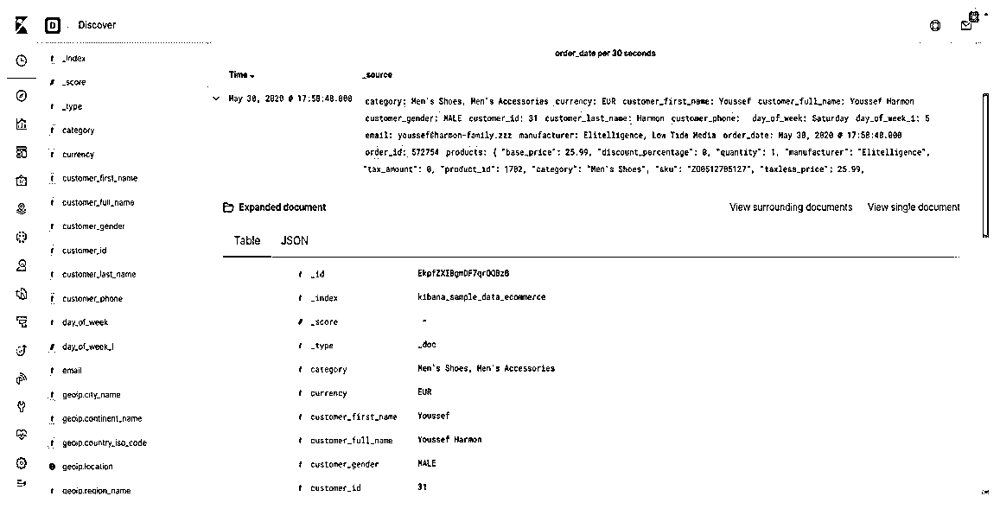
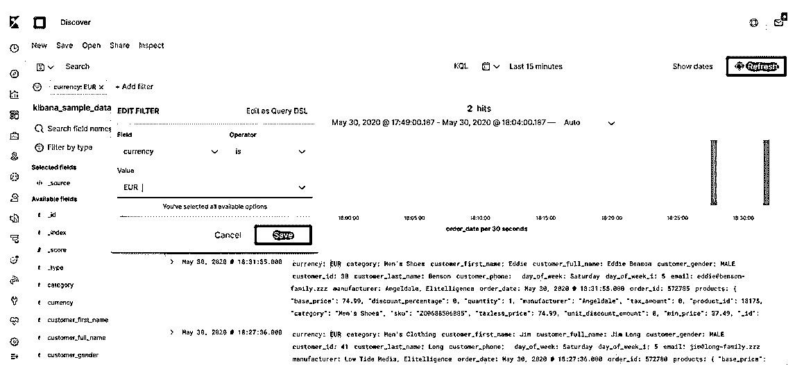
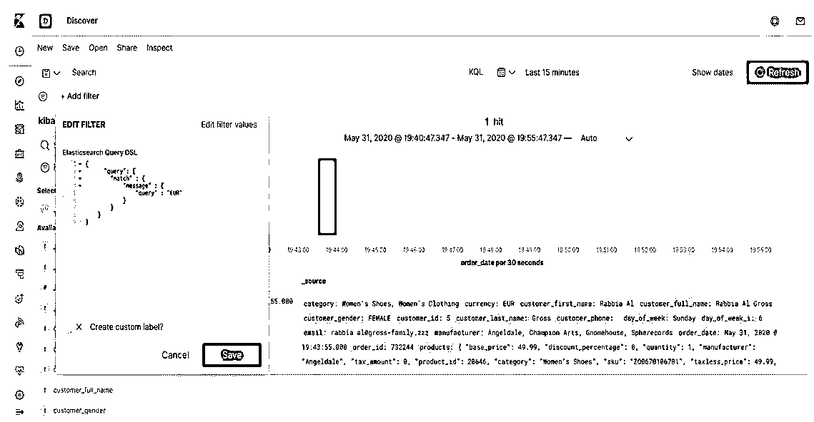
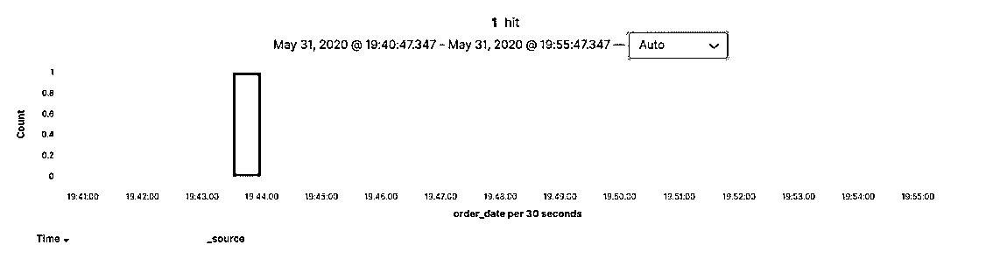

# Kibana Query

> 原文：<https://www.educba.com/kibana-query/>

## 基巴纳查询简介

下面的文章提供了 Kibana 查询的概要。Kibana query 帮助我们探索我们的大数据，以转换有用的信息。弹性搜索为我们的数据建立了索引，但是仅仅建立数据索引是不够的。我们必须挖掘数据，找出所有这些数据的意义。因此，我们可以借助弹性搜索查询来做到这一点，但这不是用户友好的，因此 Kibana 在这种情况下解决了用户友好的查询问题。在 kibana 中，我们可以在可视化中使用搜索查询和点击选项。

### 基巴纳发现

Kibana Discover 是一种方法，我们可以在单击选项的帮助下使用 Kibana 查询。

<small>Hadoop、数据科学、统计学&其他</small>

要打开 Kibana 查询 discover，我们必须遵循以下步骤:

1.首先，如果你像这样使用 Ubuntu，运行弹性搜索:

**电子地图路径搜索/bin$。/elasticsearch**

然后它会显示弹性搜索运行如下。我们必须在启动 Kibana 之前启动弹性搜索，因为 Kibana 使用来自弹性搜索的数据。

*

* 

2.开始弹性搜索后，我们必须开始基巴纳。如果你使用的是 Linux/Ubuntu，过程和上面一样。

**基巴纳之路/bin $。/基巴纳**

在 Kibana 运行之后，您可以进入任何浏览器并运行 localhost:5601，您将会看到下面的屏幕。

在 Kibana 中，在左手边，我们可以看到一些工具栏，还有第一个选项 Discover。只需点击它，我们将看到 Kibana 查询的发现屏幕。

在 Kibana discover 中，如果您没有自己的数据集，我们可以看到一些加载的样本数据。我们在这个博客中使用了相同的样本数据。

在上面的屏幕中，我们可以看到两个主要的概念，它们是 _source 和 Time。时间，我们显示插入索引数据的确切日期和时间，而 _source 将以 JSON 格式显示所有这些数据。

在上面的屏幕中，每一行的时间选项前都有一个箭头符号，如果我们展开它，我们将得到两种格式的所有数据 JSON 和 Table，如下图所示。

*

* 

除了以上两个展开的文档，还有两个选项卡，如下所示:

1.  查看周围的文档。
2.  查看单个文档。

当您点击视图周围的文档时，它将以 JSON 格式显示所有数据。

单个文档的视图将只详细显示特定的数据。

除了上述信息，我们在发现窗口中还有一个搜索框。在其中，我们可以搜索特定的数据信息，在搜索框下方有一个筛选选项，如果我们单击它，将显示一个小窗口，其中有两个选项，标签和文本，如下所示:

**编辑过滤查询:**

在上面的屏幕中，我们已经展示了 Kibana discover 中可用的过滤器选项。如果我们有非常大的数据，我们想过滤代表一些信息的大数据，那么我们可以使用上面的方法，这是用户友好的。在这里，我们试图寻找货币欧元；之后，所有 EUR 都以黄色突出显示。

**查询 DSL:**

可以看到多了一个选项:Edit as query DSL(域特定语言)。有了这个 DSL 查询选项，我们可以使用我们的搜索来寻找更具体的数据需求。下面的截图展示了我们如何在 Kibana 中使用 elastic search 的 query DSL，根据我们的要求得到更准确的结果。

除了上述信息，Kibana discovers 还有一个直方图选项，我们可以在这里看到所有这些数据，以及它们被插入索引的时间，如下面的屏幕截图所示。

我们还可以设置即将用于索引的数据的刷新率，以便在特定时间片之后，我们可以在直方图中获得数据的详细信息。

### KQL 嵌套查询

Kibana 也有嵌套查询的功能，我们可以借助 KQL 的特殊语法来实现。但是嵌套查询将需要额外的思考来编写那些嵌套查询。

此外，在考虑嵌套查询时，嵌套查询还需要两件更重要的事情，如下所示:

*   仅来自单个嵌套的嵌套查询的搜索结果。
*   来自自身也是嵌套的大型文档的嵌套查询的搜索结果。

### Kibana_query 的示例

下面是提到的例子:

#### 示例#1

该示例属于第一类，其中项目本身是嵌套的，每个文档都有自己的详细信息。

**代码:**

`{
"items_name": "Fruits and Vegetables",
"itemName": [
{
"name_": "Orange",
"stock_": "13",
"categoryName": "fruits"
},
{
"name_": "apple",
"stock_": "12",
"categoryName": "fruits"
},
{
"name_": "cucumber",
"stock_": "19",
"categoryName": "vegetables"
},
{
"name_": "potato",
"stock_": "15",
"categoryName": "vegetables"
}
] }`

要在单个嵌套中访问所需的文档，我们必须编写这样的查询:

**代码:**

`itemName:
{
name_   :       apple
and
stock_ > 10
}`

#### 实施例 2

嵌套字段在另一个嵌套字段的内部。

这是嵌套字段具有嵌套项的另一种方法。例如，下面给出了它，为了访问它们，我们必须像这样编写查询。

**代码:**

`{
"nestedlevel1": [
{
"nestedlevel2": [
{
"properties1": "val",
"properties2": "val2"
},
{
"properties1": "val3",
"properties2": "val4"
}
] }
] }`

要从上面这样的嵌套中提取所需的文档，我们必须像这样编写查询:

**代码:**

`nestedlevel1.nestedlevel2:
{
properties1 :val and
properties2 :val2
}`

### 结论

Kibana 直接从 discover 中提供了许多特性，我们可以非常容易地编写查询，并立即可视化查询结果。除了以上还有很多选项，难度很大。通过运行应用程序，我们可以了解更多快捷方式，也可以使用 Kibana 中的选项来运行查询。

### 推荐文章

这是基巴纳查询的指南。这里我们分别讨论对 kibana 查询、kibana discover、KQL 嵌套查询和示例的介绍。您也可以看看以下文章，了解更多信息–

1.  [基巴纳可视化](https://www.educba.com/kibana-visualization/)
2.  [什么是基巴纳？](https://www.educba.com/what-is-kibana/)
3.  [弹性搜索备选方案](https://www.educba.com/elasticsearch-alternatives/)
4.  [IPS 工具](https://www.educba.com/ips-tools/)

