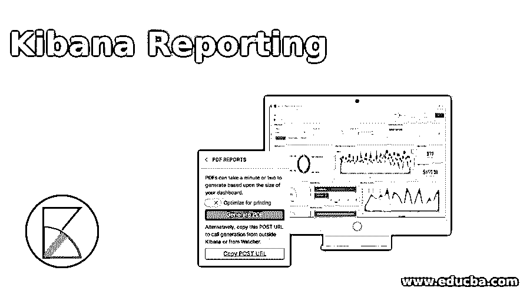
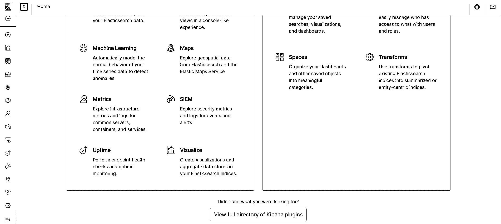
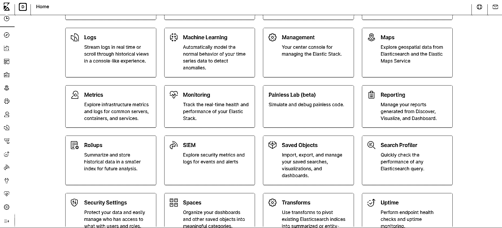
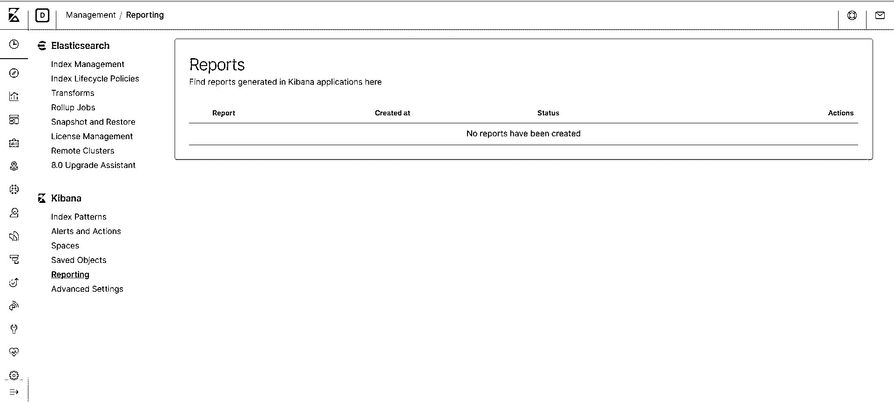
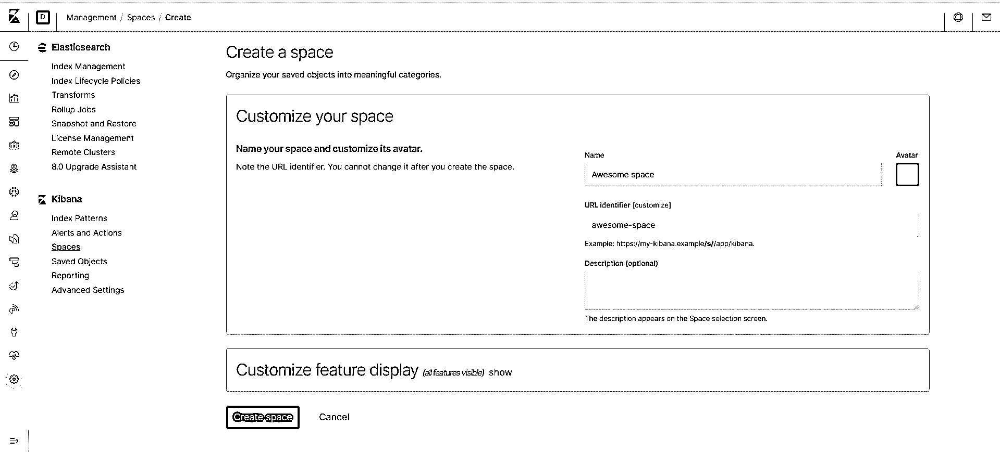
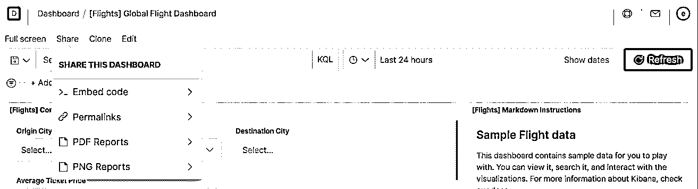
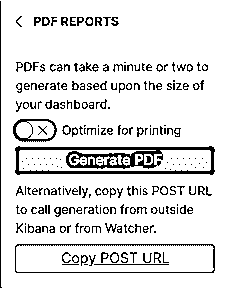
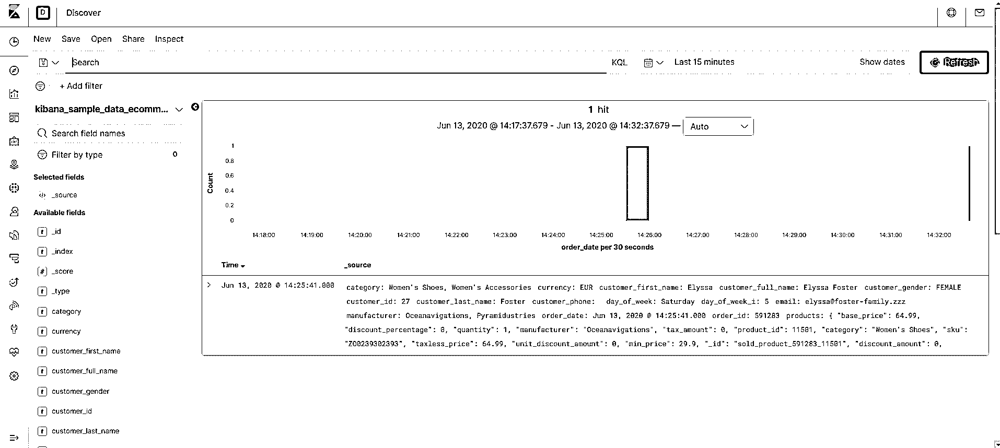
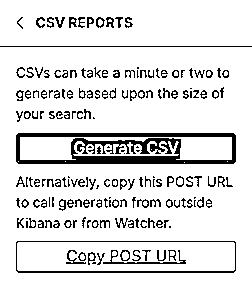
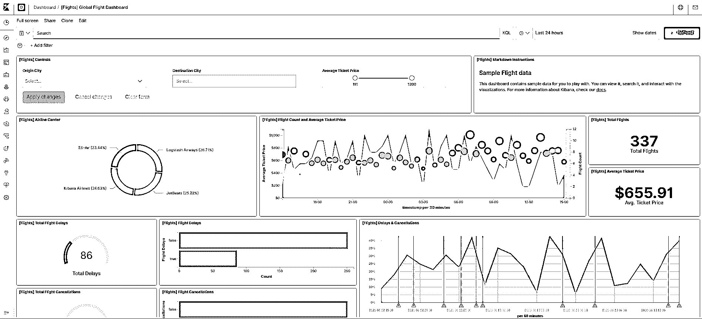

# 基巴纳报道

> 原文：<https://www.educba.com/kibana-reporting/>

## 基巴纳报告简介

您可以生成适当格式的报告，包括 Kibana 仪表板、数据可视化和其他工具，使您的报告对数据更有意义。我们还可以根据图像和 pdf 格式保存我们的项目，这取决于您的要求，如 PNG 或 PDF。我们不仅可以自动生成，也可以手动生成。在这篇博客中，我们将手动和自动进行这两种生成。除此之外，我们还可以在脚本和观察器的帮助下生成报告。Kibana 报告通过在一个地方查看所有数据，使我们的分析更加强大。

### Kibana 报告工具

要找到哪里有 Kibana 报告工具，我们必须遵循以下步骤:

<small>Hadoop、数据科学、统计学&其他</small>

**1。**打开 Kibana，它会带你进入 Kibana 的第一页。

**2。**然后转到 Kibana 页面的底部，你会看到加载更多的方法，如下图所示:

**3。**点击上面的链接(查看 Kibana 插件的完整目录)后，会显示 Kibana 可以做的所有方法和工具。

**4。**现在，我们必须查看 Kibana 报告选项，如下面的屏幕截图所示。

**5。**点击后，我们将得到一个报告窗口，在这里我们可以添加我们的 Kibana 仪表板，可视化等。

**6。**我们可以从报告窗口左侧的空白处创建一个新报告，如图 3 所示。点击后，我们将得到一个新的窗口的名称，以创造空间的手段，在这里我们可以填写报告所需的所有细节，如下所示截图。

**7。**在空间窗口(图 4)中，我们可以看到，在右侧有一个名称选项，我们可以在其中填写报告的名称。我们还可以添加与报告相关的图像，当您单击 Avtar 选项时，您会在下拉列表中看到一个选项，如更改颜色、上传图像等。它们也是 URL 的一个选项，告诉我们可以使用 Kibana 提供一个链接，或者可以通过点击它来创建自己的自定义。在 URL 下面，有一个描述选项，告诉你关于报告的信息。

### 基巴纳报告的特点

下面有一个自定义功能显示选项，它提供了不同种类的工具图表、可视化等的所有细节。我们可以用在报道中。

#### 1.报告许可

要在 Kibana 中生成报告，您必须拥有创建报告的特权，我们称之为 resporting_user，并且您还拥有访问您想要创建报告的索引数据的特权，否则数据将不会显示。

#### 2.创建手动报告

我们也可以手动创建报告。要创建报告手册，我们必须遵循以下步骤:

1.  索引您的数据并在 Kibana 主仪表板中访问该索引。
2.  单击工具栏中的共享选项卡选项。
3.  我们可以根据自己的需求选择选项:

*   如果我们想制作一个可视化的报告和图表，那么我们可以选择 Pdf 或 image 选项。
*   我们也可以将整个画布转换成 pdf 格式。
*   我们也可以选择 CSV 选项。

4.  完成所有需求后，只需点击生成选项。
5.  现在，我们可以将该文件保存在本地系统中的任何位置。

#### 3.报告的大小

我们生成 pdf 或图像形式的报告的大小取决于我们生成的方式。如果我们使用 canvas，那么它必须在创建报表之前根据需求确定大小。但是，如果您使用任何其他应用程序，则可能取决于该应用程序的大小，例如，如果我们想减小报告大小，我们可以减小浏览器的大小。

#### 4.自动创建报告

我们还可以通过 HTTP 使用 POST 创建一个报告(在脚本的帮助下)。我们可以为 PDF 或 CSV 格式。

**为 PDF 创建帖子链接的步骤:**

1.  转到基巴纳的可视化，并选择时间过滤器选项。对于绝对时间，我们必须使用时间过滤器选项。
2.  现在，Kibana 工具栏将显示如上所示的共享选项(图 5)。我们必须选择一个 PDF 选项并创建一个 PDF 链接。
3.  现在复制下面截图中的链接。

图 6: PDF URL 链接

#### 5.为 CSV 创建帖子链接的步骤

1.  我们必须从搜索选项加载数据，对于绝对时间，我们可以使用时间过滤器选项。顶部左侧工具栏中提供了“发现”选项。

2.  现在，Kibana 工具栏将显示如上所示的共享选项(图 5)。我们必须选择 CSV 选项并创建一个 CSV 链接。
3.  现在复制下面截图中的链接。

#### 6.使用脚本

我们还可以通过脚本生成 PDF 和 CSV 的自动链接。这个脚本请求一个 POST 链接，并将获得 JSON 格式的结果，还包含一个下载报告的链接。要通过链接获得报告，我们必须在脚本本身中给出 get 请求。

**举例:**

**卷曲** **\**

**代码:**

`-XPOST \
-u elastic \
-H 'kbn-version: 7.7.1' \
'http://localhost:5601/api/reporting/generate/csv?jobParams=...'`

这里 kbn-version 告诉我们目前使用的是什么版本。和-u elastic 将检查用户创建报告的授权许可。XPOST 基本上是为了贴吧。

**最终报告结果:**

在我们完成了所有的报告活动之后，我们的报告将会是这样的。我刚刚上传了保存的项目。您可以看到许多保存的项目，其选项显示在图 3 左侧。

### 结论

Kibana 报告选项非常棒，可以在一个地方可视化所有事情以进行决策。它有很多特性，你可以通过上面提到的方法来探索。Kibana 还有另一个选项，可以使用 Watcher 自动创建报告。为此，我们必须将 Watcher 证书链接到 Kibana，以便它可以访问 Watcher。

### 推荐文章

这是基巴纳报道指南。在这里，我们讨论对 Kibana 报告及其工具的介绍，以及不同的特性和示例。您也可以浏览我们推荐的其他文章，了解更多信息——

1.  [引导程序中的图像滑块](https://www.educba.com/image-slider-in-bootstrap/)
2.  [自举搜索框](https://www.educba.com/bootstrap-search-box/)
3.  [引导程序块引用](https://www.educba.com/bootstrap-blockquote/)
4.  [自举容器流体](https://www.educba.com/bootstrap-container-fluid/)

