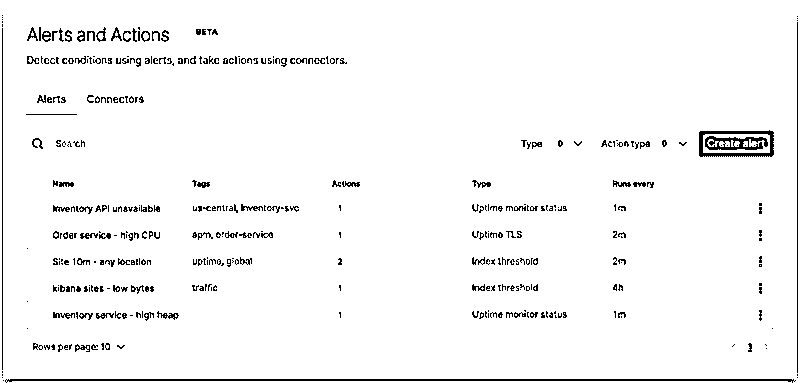
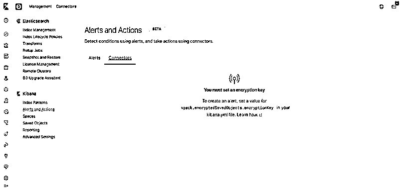
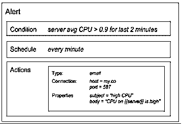
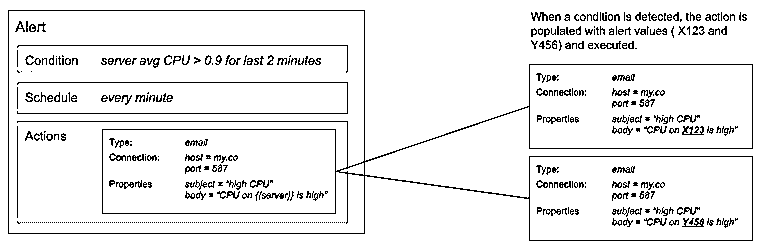
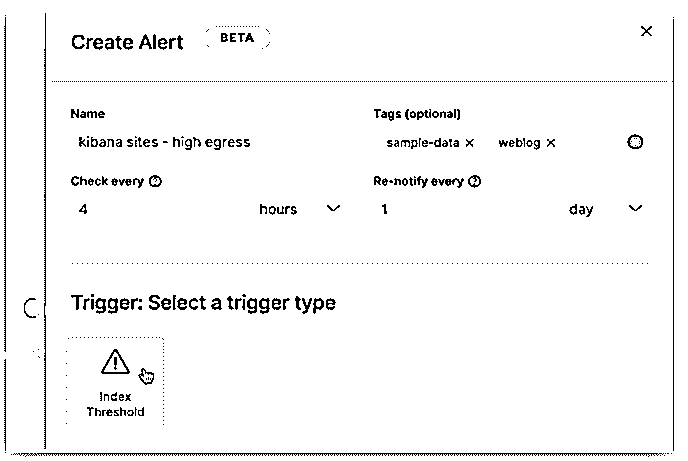
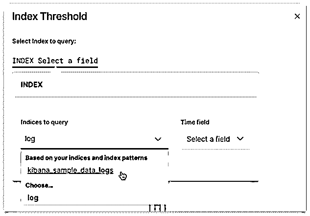
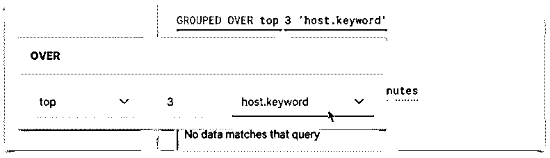
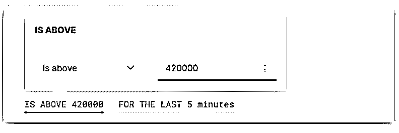
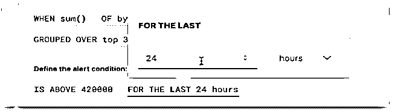
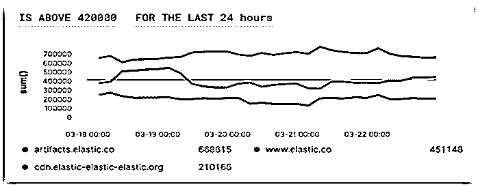

# Kibana Alert

> 原文：<https://www.educba.com/kibana-alert/>

## 基巴纳警报简介

Kibana alert 是一个新功能，在我写这篇博文的时候，它还处于测试版。警报是一种技术，可以在满足某些特定条件时发出通知。我们可以在 Kibana 的不同应用程序中使用这一功能，以便管理层可以查看数据流的所有活动，如果出现任何错误或系统发生问题，管理层可以采取快速行动。动作是与在后台运行的 Kibana 第三方应用一起工作的服务。应用程序将是电子邮件通知，添加日志信息到服务器等。

<small>Hadoop、数据科学、统计学&其他</small>

### 如何获得 Kibana Alert 的选项？

Kibana 警报选项在报告选项下可用。当我们点击这个选项时，如下图所示。我们可以看到基巴纳山下的警戒和行动。

激活警报需要遵循三个主要步骤。详情如下:

*   **条件:**我们要在什么条件下检查条件？
*   **计划:**何时必须检查特定条件以获取警报？
*   **动作:**当条件满足时，必须执行什么动作？

**例如:**如果我们有很多服务器，并且我们希望获得任何服务器的 CPU 使用率超过 90%的警报，那么我们可以创建一个警报，如下图所示。此后满足特定条件，它将发送电子邮件相关的警报。

警报的所有上述步骤简要解释如下:

#### 1.情况

Kibana 使用服务器后端的 javascript 方法来检测条件。在 javascript 方法的帮助下，Kibana 可以通过 elasticsearch 查询或在 elasticsearch 中的数据处理过程中检测不同类型的条件，以获得快速警报。Kibana 还会发出警报，不仅针对单个系统，还可以针对外部系统以及集群发出警报。

所有这些检测方法都被组合在一起，保存在一个名为 alert of Kibana 的包中。用户可以在不知道对用户隐藏的检测技术的情况下使用这些方法，而只是显示不同的参数来控制检测方法。

#### 2.日程安排

该时间表基本上是针对条件必须检查以执行动作的时间。这个时间会从几秒到几天。

#### 3.行动

动作是与 Kibana 第三方服务集成的功能，当特定条件满足时采取动作。

定义警报时，我们必须选择想要使用的警报类型。主要的警报类型如下:

*   **电子邮件:**所有的提醒都会发送到电子邮件。
*   **索引:**用于索引数据。
*   **服务器日志:**这种类型会通过消息给出日志的信息。

除了上面的主要类型，还有一些其他类型，比如 Slack、webhook 和 PagerDuty。

**例子**

在服务器警报类型期间，我们可以将服务器与电子邮件正文进行映射，如下图所示(正文)。当满足特定条件时，Kibana 执行警报对象，并根据警报的类型，尝试通过该类型传递消息，如下所示使用电子邮件类型的示例。

### Kibana 警报和先决条件的设置

默认情况下，没有警报激活。如果您想要激活，您必须遵循以下步骤:

**例子**

在本例中，我们将使用内置于 Kibana 中的 Kibana 样本数据。我们只想检测服务超过 420K(字节)的前三个站点。要创建警报，我们必须转到 Kibana 的管理站点，填写警报的详细信息，正如我们从下面的屏幕截图中看到的，我们填写的警报每 4 小时检查一次，在 24 小时内不应执行超过一次。

现在，在填写完所有细节后，单击 Trigger 选项来设置触发阈值。

#### 1.指数阈值

索引阈值将显示我们可以使用的所有索引数据名称。比如，在下面我们可以看到我们选择了 Kibana 样本日志数据。选择特定的指数后，我们必须从右边选择时间，如下图所示。

#### 2.When 子句

现在，我们必须找出数据传输字节数超过 420K 的前三个网站，为此，我们必须使用 aggregation sum()方法并从可用字段列表中选择字节数。

#### 3.分组子句

对于基于字节的前三个网站的警报，我们可以在 host.keyword 的帮助下选择数字 3。

#### 4.门槛条款

我们将使用此窗口设置阈值，因为我们希望顶级站点在 24 小时内传输的字节数超过 420K，如下图截图所示。

#### 5.时间条款

下面的窗口显示了我们如何设置窗口。我们根据我们的要求选择 24 小时。

最终结果会显示如下:

最后预览的结果持续 24 小时有超过 420K 字节

### 结论

基巴纳警报是基巴纳提供的最好的功能，但它仍处于测试版本。由于警报系统，Kibana 警报将有助于尽快发现错误。Kibana alert 还具有更新警报、创建警报的连接器，并且还作为一个集中式系统工作，有助于将 Kibana alert 与第三方系统集成。Kibana 警报检测条件，然后触发操作。但实际上，这两种情况都是独立起作用的。

### 推荐文章

这是基巴纳警戒指南。在这里，我们也讨论了介绍和如何获得选项的基巴纳警报与例子。您也可以看看以下文章，了解更多信息–

1.  [格拉法纳 vs 基巴纳](https://www.educba.com/grafana-vs-kibana/)
2.  [基巴纳可视化](https://www.educba.com/kibana-visualization/)
3.  [什么是基巴纳？](https://www.educba.com/what-is-kibana/)
4.  [弹性搜索备选方案](https://www.educba.com/elasticsearch-alternatives/)

