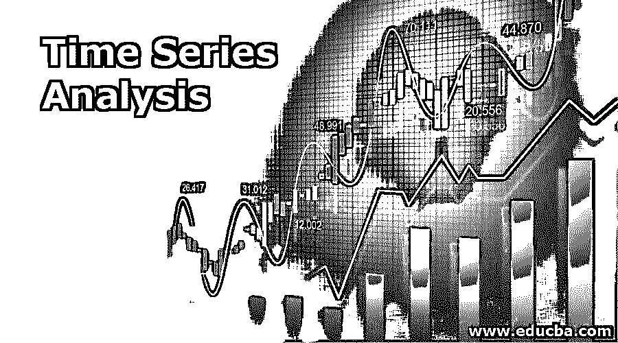
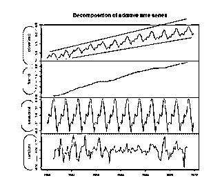
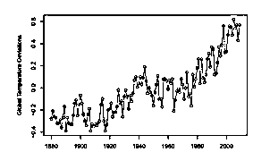
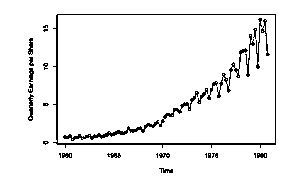

# 时间序列分析

> 原文：<https://www.educba.com/time-series-analysis/>

## 时间序列分析导论

在特定时间段内记录的一系列数据点称为时序数据**。**时间序列分析是一种分析时间序列数据并从中提取有意义的统计信息和数据特征的技术。分析的主要目标之一是预测未来价值。当用极其复杂的时间序列分析进行预测时，会涉及到外推。但是，预测值以及与之相关的不确定性估计会使结果变得非常有价值。

<small>Hadoop、数据科学、统计学&其他</small>

时间序列分析有助于达到同样的目的。

### 什么是时间序列分析？

时间序列分析是一种统计方法，用来分析给定时间段内的过去数据，以预测未来。它由间隔相等的有序数据序列组成。为了理解时间序列数据和分析，让我们考虑一个例子。考虑一个航班乘客数据的例子。它记录了一段时间内的乘客数量。

**探索性分析:**

第一步是进行探索性分析，通过绘制乘客数量与时间的线形图进行分析。图 1 显示了 y 轴上的乘客计数和 x 轴上的时间，其中每个时间间隔可视为一年。

仔细观察下图，可以得出以下观察结果。

**1。趋势**:一段时间内观察到的上升或下降模式。在这种情况下，观察到逐渐增加的潜在趋势。即乘客的数量在一段时间内增加了。

**2。季节性**:指周期性模式。在一定时间间隔后重复的类似模式。在航空乘客的例子中，我们可以观察到一个循环模式，它有一个特定的高点&，一个低点，在整个区间都是可见的。

**3。异方差**:指一段时间内偏离平均值的非恒定方差或变化偏差。在下图中，方差在一段时间内持续增加。

图 2 显示了我们上面讨论过的航空公司乘客数据和分解组件(在左边突出显示)的图表。即:

*   趋势
*   季节性
*   异方差性(红线显示的是**异方差性)**

### 时间序列分析的重要性

大量的时间序列数据是从各个领域产生的。因此研究时间序列分析有很多应用。让我们试着理解时间序列分析在不同领域的重要性。

1.  **经济学领域:**预算研究、普查分析等。
2.  **金融领域**:广泛应用于金融领域如了解股市波动、收益管理、了解市场波动等。
3.  **社会科学家** **à:** 一段时间内的出生率或死亡率，并且可以与他们感兴趣的计划一起到来。
4.  医疗保健:流行病学家可能有兴趣知道过去几年中被感染的人数。就像在目前的情况下，研究人员可能有兴趣了解在一段时间内受冠状病毒影响的人。在一段时间内追踪的血压可用于评估药物。
5.  **环境科学:**环境时间序列数据可以帮助我们解释过去几年气温的上升。曲线图显示了一段时间内的温度数据

6.  **销售预测**:了解销售数字预测，公司业绩。该图显示了收入与时间的关系。

需要时间序列分析来根据主要依赖于时间的过去数据值预测未来。研究人员和管理人员用它来预测销售、价格、政策和生产。

### 为什么我们需要时间序列分析？

在不同时间点收集的时间序列数据违反了传统统计模型的假设，因为相邻数据点之间存在相关性。时间序列数据缺口的这一特征是相邻数据点独立且同分布的主要假设之一。这就需要一种系统的方法来研究时间序列数据，这种方法可以帮助我们回答由于存在时间相关性而出现的统计和数学问题。

时间序列分析在统计学、经济学、地理学、生物信息学、神经科学等领域有着广泛的应用。它们之间的共同联系是提出一种复杂的技术，该技术可用于在相邻信息相关的给定时间段内对数据进行建模。

在时间序列中，时间是自变量，目标是预测。

进行时间序列分析的一些主要原因可以归纳如下:

1.  **特性:**解读特性。特征如趋势(增加或减少)、季节性(循环模式)&可变性(异方差)
2.  **预测:**这是进行时间序列分析最重要的原因之一。例如，时间序列可以帮助我们预测股票价格。因为我们不仅想知道价格是上涨还是下跌，还想知道价格上涨或下跌的幅度。
3.  **推论:**众所周知，很难预测准确的未来。因此，预测值和误差范围(不确定性)可以视为更好的结果。借助时间序列分析，我们可以对模型参数进行置信区间&假设检验

### 结论

原始的决定是基于直觉和常识做出的。一个系统的、协作的方法来做出一个有数据支持的决定是一个真正的游戏规则改变者。具有广泛的应用。它已经成为最重要的研究领域之一。它在理解时间序列数据的潜在结构方面起着至关重要的作用，有助于提取有意义的统计和特征信息，并因此在数据支持下做出决策。

### 推荐文章

这是时间序列分析指南。在这里，我们讨论介绍和什么是时间序列分析，为什么我们需要它及其重要性。您也可以浏览我们推荐的文章，了解更多信息——

1.  [免费数据分析工具](https://www.educba.com/free-data-analysis-tools/)
2.  [数据分析技术的类型](https://www.educba.com/types-of-data-analysis-techniques/)
3.  [数据分析 vs 数据分析](https://www.educba.com/data-analytics-vs-data-analysis/)
4.  [数据分析的类型](https://www.educba.com/types-of-data-analysis/)

