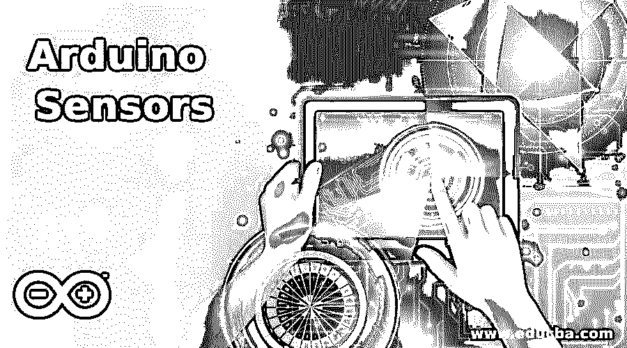

# Arduino 传感器

> 原文：<https://www.educba.com/arduino-sensors/>

## Arduino 传感器简介

基于电子设备的开源平台易于使用和更换硬件，Arduino 板在传感器的帮助下读取输入，并在传感器内置软件的帮助下通过激活电机来显示输出，用户可以编写并使用代码将其上传到物理板，并在 IDE 的帮助下在系统上运行，这种平台称为 Arduino 传感器。

### Arduino 传感器列表

Arduino 传感器列表如下:

<small>Hadoop、数据科学、统计学&其他</small>

#### 1.火焰红外传感器

该传感器用于检测燃烧的光谱辐射，燃烧产生的水可在红外光谱范围内检测到。在火焰红外传感器的帮助下，还可以检测到任何有机物质的燃烧。用两种红外频率探测火焰，用电荷耦合器件分析火焰。这些传感器也被称为视觉火焰探测器。从火焰中检测到热量的存在，并触发警报。

#### 2.光敏电阻传感器

帮助确定设备中是否有光的光敏传感器称为光敏电阻传感器。它也测量光的强度，被称为光敏电阻。电阻器的灵敏度根据设备上检测到的光的波长而变化。光电导的原理被用于传感器中，并且传感器的电阻随着设备中光强度的增加而降低。模拟输入馈入 Arduino 板，结果从传感器获取。

#### 3.土壤湿度传感器

介电常数借助于介质中的电容来测量。当我们考虑土壤时，它含有水分，在土壤中测量介电常数，从而产生与水的介电常数成比例的电压，这可以检测土壤中是否存在水。因此，可以验证土壤中的水分。必须将该传感器插入土壤中，并在传感器中以百分比水平报告含水量。

#### 4.速度传感器

它是一个传感器，用于根据车轮的转动来测量车速。检测驱动轮的速度，并将该信息发送到发动机控制单元，并对速度进行管理，以使车辆高效行驶。磁旋转速度在装置中测量，并产生电压，这适用于汽车和航空工程领域。借助速度传感器测量车辆的转速和实际速度。

#### 5.麦克风传感器

声音信号在麦克风传感器的帮助下被检测并转换成电信号。当检测到声波时，板振动，移动板之间的距离改变，这有助于注意到电容的变化。这些变化被转换成电信号。传感器不是用来检测声音，而是用来检测产生的声音的强度。处理这些声音将产生设备所需的数字信号，因此系统产生输出。

#### 6.无源蜂鸣器传感器

声音在麦克风中被检测到，并在电位计的帮助下被调节。电位计中提供了一个设定点，当声音超过设定点的限制时，输出将被发送到 Arduino 板并显示在屏幕上。声音可以在音调的帮助下产生，听到音调的频率和持续时间可以在设备中设置。蜂鸣器需要一个放大器来再现它听到的声音并对其进行操作。

#### 7.数字热传感器

一个简单的电路用来读取器件中的温度并给出输出。几个器件连接在一条总线上，可以使用 Arduino 板中的一个引脚更新结果。数字热传感器基于单个有线传感器，产生的输出与摄氏温度的电压成线性比例。二极管两端的电压有助于在传感器中产生输出电压，因为系统中的电压和温度成正比。

#### 8.MQ-2 气体传感器

电化学原理在气体传感器中起作用。传感器的电阻随着传感器检测的各种气体的浓度而变化。在可变电阻器的帮助下形成分压器电路，这用于检测设备的灵敏度。响应时间更快，并且对设备具有高灵敏度。模拟电阻由器件作为输出产生。

#### 9.SW-20 运动传感器

这使用红外光来检测设备中的运动，并在 Arduino 板中产生光传感器输出。为设备设置警报，输出信号引脚连接到运动传感器的数字引脚，以了解传感器的变化。器件中使用两个电位计来设置时间和检测变化。它们是灵敏度调节和延时调节。用户可以使传感器更灵敏或根本不灵敏。

#### 10.旋转编码器传感器

也称为轴传感器，这有助于将轴的角位置转换为设备上的电输出。装置中使用了绝对和增量编码器来设置信号。模拟或数字信号都可以作为设备的输出。用户可以将该传感器与其他设备结合使用，以提高设备的功能。

不同类型的传感器有助于改善电子行业中其他设备的应用，因此可以提高处理速度和功能。雨水报警器和门报警器是可以在日常生活中使用的传感器的一些例子。此外，距离测量和家用电器控制可以在 Arduino 传感器的帮助下完成。

### 推荐文章

这是 Arduino 传感器指南。在这里，我们还将讨论 Arduino 传感器的介绍和列表，以及详细的解释。您也可以看看以下文章，了解更多信息–

1.  [Arduino 盾牌](https://www.educba.com/arduino-shields/)
2.  [树莓 Pi 3 vs Arduino](https://www.educba.com/raspberry-pi-3-vs-arduino/)
3.  [树莓派 vs Arduino](https://www.educba.com/raspberry-pi-vs-arduino/)
4.  [物联网板](https://www.educba.com/iot-boards/)

