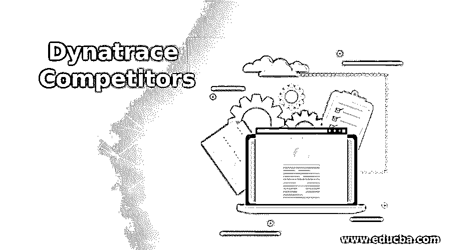
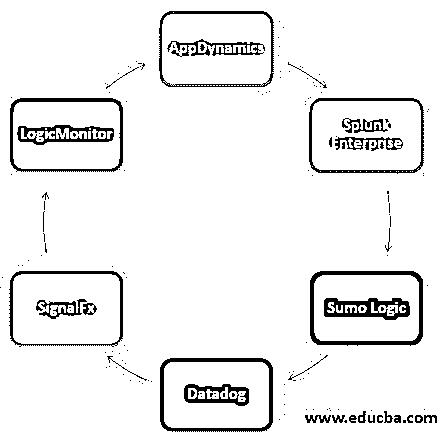

# Dynatrace 竞争对手

> 原文：<https://www.educba.com/dynatrace-competitors/>

## Dynatrace 竞争对手简介

Dynatrace 是一种工具，用于向组织的 IT 团队提供 APM(应用性能管理)、对[云基础架构](https://www.educba.com/cloud-infrastructure/)的监控、AIOps(人工智能操作)、DEM(数字体验管理)。Dynatrace 能够监控软件性能，并提供真实用户监控、综合监控和网络监控功能。

### Dynatrace 竞争对手列表

在下一节中，将提到 Dynatrace 的一些竞争对手:

<small>Hadoop、数据科学、统计学&其他</small>

#### 1.应用动力学

AppDynamics 是一个用作性能管理工具的应用程序，用于监控服务器并制定指标，以便可以持续监控服务器的健康和性能。AppDynamics 支持代码级细节监控。应用程序还会通过计算服务器的趋势性能来找出瓶颈。使用 AppDynamics 可以轻松找出所有与服务器性能相关的问题。

#### 2.Splunk 企业版

Splunk Enterprise 是一个应用程序，可帮助搜索、可视化和分析从业务和 IT 基础设施收集的数据。Splunk enterprise 从应用程序、网站、设备和传感器收集数据。数据索引操作由 Splunk Enterprise 完成。Splunk Enterprise 中的搜索操作非常快，因为应用程序会处理大量数据，而且该工具能够非常快地检索数据。该工具提供了一个交互式仪表板，其中有一个搜索框、图表和字段，它们向用户显示结果。当用户发起任何搜索查询时，应用程序还能够向用户发送警报。

#### 3.相扑逻辑

Sumo 逻辑工具是一种用于云平台的日志管理工具，帮助组织出于安全目的、IT 操作和其他操作的目的管理其日志数据。与其他类似工具相比，该应用程序的设置非常简单，并且该平台易于用户使用。该工具支持的另一项功能是分析服务，可帮助组织管理大数据，并通过分析大数据提供适当的结果。Sumo 逻辑工具能够发现性能瓶颈，从而提升软件应用程序的性能。该工具对组织非常有用，因为该工具支持基于云的应用程序，这些应用程序使该工具受到欢迎，并保持对其他竞争对手工具的竞争优势。

#### 4.数据狗

Datadog 是一种用于基于云的应用程序的监控工具，也用于监控服务器、数据库和提供其他服务。Datadog 应用程序使用 SaaS 平台来提供其功能。事件监控是用于监控云应用程序性能的工具提供的主要功能。性能指标可以由工具生成。该工具支持多种操作系统，如 Windows、Mac、Linux，这使得该工具很受欢迎。该工具为用户提供了定制的仪表板来显示图形，从而可以实时监控数据。组织的 IT 团队可以拥有基础架构的单一视图。当工具中报告了任何问题时，用户会收到电子邮件和短信通知。

#### 5.信号 Fx

SignalFx 是一款基于 SaaS 的类型监控工具，客户使用它来分析、自动化和可视化从应用程序、容器、微服务和功能中生成的数据。该工具能够在出现任何问题时通过短信或电子邮件发送警报。在该工具中，有一个流架构，其中度量数据分为两种形式，一种是人类可读的形式，另一种是时间序列值。该工具是一个非常强大的工具，因为它能够在一秒钟内处理数百万个数据，并针对任何与数据相关的问题发送警报。该工具能够发现软件应用程序的性能瓶颈。

#### 6.逻辑监视器

LogicMonitor 工具是一种基于云的工具，用于监控基于云的数据中心、物理设备和网络元素的性能。该工具提供了一个交互式仪表盘，用于监控所有系统状态和问题的实时性能。该工具用于从网络、连接的服务器收集性能相关数据，然后用户可以轻松地对其进行监控。LogicMonitor 工具能够使用电子邮件、SMS 或语音邮件发送警报。该工具还能够发现连接的设备并捕获信息，以便对连接的设备进行性能监控。

#### 7.扎比克斯

Zabbix 是一种监控工具，作为开源工具提供，因此可以对包括服务器、网络、云服务和虚拟机在内的 IT 组件进行监控。XML 类型组件用于工具配置。Zabbix 工具支持不同类型的操作系统，如 Unix、Unix、Mac OS、Solaris 和其他操作系统。该工具监视统计数据，如 CPU 负载、磁盘空间、网络利用率和其他统计数据。Zabbix 代理需要安装在机器上，并监控统计数据，以便发现问题并加以解决。

#### 8\. PagerDuty

PagerDuty 是一种事件管理应用程序，它有助于向 IT 团队发送可靠的通知、通过随叫随到的时间安排、问题通知和其他功能，以便能够识别基础架构问题并轻松修复。该工具能够通过分析可能影响组织业务运营的事件来帮助组织。该工具还能够生成警报并向 IT 团队发送警报，以便对问题采取适当的措施。

### 结论

Dynatrace 软件是一款功能强大的工具，用于监控网络和应用程序性能，并发现问题以便解决。组织可以使用 Dynatrace 工具的几种替代方法来监控应用程序并找到性能瓶颈，以便解决问题并提升组织所用软件应用程序的性能。

### 推荐文章

这是 Dynatrace 竞争对手指南。在这里，我们还讨论了 dynatrace 竞争对手的介绍和列表，并给出了解释。您也可以看看以下文章，了解更多信息–

1.  [JMeter vs LoadRunner](https://www.educba.com/jmeter-vs-loadrunner/)
2.  [Spring Boot 执行器](https://www.educba.com/spring-boot-actuator/)
3.  [网络营销工具](https://www.educba.com/internet-marketing-tool/)
4.  [Azure 云服务](https://www.educba.com/azure-cloud-service/)

