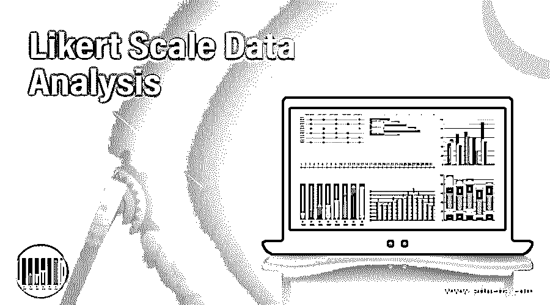

# 李克特量表数据分析

> 原文：<https://www.educba.com/likert-scale-data-analysis/>

## 李克特量表数据分析简介

企业必须不断寻求流程、产品线、客户服务和品牌形象的转变，才能在这个体系中茁壮成长。数据在实现最终目标的转型过程中扮演着重要角色。企业不能用主观和道听途说的信息来进行这项工作。他们必须从所有利益相关者那里收集有关其当前产品、服务、环境和竞争的客观信息，以开始这一旅程。

调查、问卷和访谈是获取所有利益相关方反馈的一些渠道。反馈中的响应可以是定量数据或非定量数据。必须对这两种类型的数据进行分析，以获得有用的见解。这些见解将用于推动业务转型。

<small>Hadoop、数据科学、统计学&其他</small>

数据分析可以通过多种方式进行，即,

*   描述性分析仅仅通过观察结果并采取行动，
*   诊断分析以研究根本原因并纠正、
*   研究数据和预测未来的预测分析，
*   提出行动计划的说明性分析。

类似的调查和问卷作为心理测验，用于测量人们在工作选择、晋升和特殊任务方面的技能、知识、品质和能力。

李克特量表是测量和分析调查和测试中的回答的方法。在这篇文章中，让我们研究李克特量表的特点。

### 什么是李克特量表数据分析？

*   该量表广泛用于测量研究调查或能力倾向测试中对问卷的回答。默认情况下，它也被称为评定等级，尽管也有其他评定等级。这个量表是由心理学家伦西斯·利克特发明的，因此以他的名字命名。该量表有助于使用获得的响应调查测量员测试的潜在现象，并得出结果。这一尺度中的另一个维度是用于捕捉响应的设计或格式。
*   调查过程涉及单项或单个问题的设计、每个单项的答案选项列表，参与者必须选择其中一个答案。调查的参与者在回答 Likert 项目或问题时，表明他们对一系列回答的满意或不满意/赞成或不赞成/同意或不同意的程度。
*   响应列表将主要是在负极端和正极端之间对称的范围，并且在正极端和负极端都有许多间歇值，包括中性值。响应集将包含 5 或 7 个组件。它将具有相同数量的正面和负面响应(对称)。
*   每个 Likert 项目都有自己的一套专门为该项目设计的响应，无论是正面还是负面，响应的范围都是等距的(平衡的)且高度相关。这些响应与每个行项目成对出现，它们是离散的、非数字的。当所有问题的答案合并在一起时，类似的范围将失去意义。

李克特量表广泛应用于商业、社会科学、统计学、心理学和市场营销。

### 它是如何工作的？

每个李克特项目都是一个简单的陈述，参与者必须评估该陈述，并根据主观或客观选项填写回答，以表达他对李克特项目的同意或不同意程度。该问题的目的可能是在各种类别下获得回答。下面列出了各种类别下可能的回答

| **类别** y | **可能的反应** |
| **1** | **2** | **3** | **4** | **5** |
| 协议 | 强烈反对 | 反对 | 也不 | 同意 | 非常同意 |
| 质量 | 很穷 | 贫穷的；贫困的 | 公平的 | 好的 | 优秀的 |
| 同意 | 强烈拒绝 | 拒绝 | 也不 | 赞同 | 强烈赞成 |
| 表演 | 远低于标准 | 在一般水平以下 | 平价 | 超过 | 远远高于 |
| 质量 | 远低于水平 | 低于水平面 | 可接受的 | 超过 | 远远高于 |
| 频率 | 从不 | 难得 | 好几次 | 频繁地 | 总是 |
| 重要 | 一点也不 | 稍微 | 重要的 | 更大的 | 非常 |
| 满意 | 一点也不 | 稍微 | 感到满意的 | 更大的 | 非常 |
| 强度 | 没有人 | 非常温和 | 温和的 | 高的 | 严峻的 |
| 意识 | 一点也不 | 稍微 | 知道的 | 更大的 | 极端的 |
| 熟悉 | 一点也不 | 稍微 | 熟悉的 | 更大的 | 极端的 |

李克特量表主要是两极的，它有负值，正值和中性值。在某些情况下，使用不带中性值的偶数值标度，这被称为强制选择法。

这种 Likert 标度几乎没有可能产生偏差结果的失真。参与者可以

*   遵循中心倾向偏见，跳过极端值，因为害怕被贴上极端主义者的标签，也担心下一个问题会有更多
*   由于机构的头脑，总是同意陈述
*   可能总是不同意，因为害怕去而采取守势
*   可能给出不正确的答案，担心被评价为
*   提供错误答案，意在被评价为软弱
*   由于支持某项事业的社会压力而选择不正确的答案

### 如何进行数据分析？

*   调查问卷完成后，可以单独分析每个项目的回答，或者分析一组项目的回答。李克特量表提供了一个通用的测量单位来组合一组项目，它被称为总结性量表。李克特量表中的回答不是数字，它们应该是对称和平衡的，因此多个问题的回答可以在一个通用的量表中进行组合。
*   可以对收集的数据进行参数检验，特别是方差分析检验，如果遵循正态分布周期，可以进行 2 样本 T 检验。如果响应不符合正态和连续分布，可以进行非参数检验，如 Mann-Whitney 检验。
*   使用中位数或众数而不是平均值对回答进行总结，因为这些数据是有序的。由于数据不是连续的，观察结果以条形图而不是直方图显示。

### 重要

*   在大多数情况下，调查参与者不能选择是或否，也不能选择数字。对一个实体的感知或体验或意见或感觉的程度被认为是调查中的响应。因此，由李克特量表得出的定量数据可以毫无困难地进行分析。
*   由于其具有中性值的否定和肯定响应的均匀分布以及在其肯定和否定侧的响应中的相等距离，给予 Likert 很大的分组优势，可以一起分析项目组的响应。
*   匿名和自我管理的问卷消除了社会偏见，伪造好的和伪造坏的回答，可以确保自由、无偏见的回答。如果坚持参与者的姓名和身份，调查结果就会有偏差。

### 结论

李克特量表通过设计引人注目的问题和深思熟虑的回答来促进无偏见的数据收集。这些数据可以进一步用于获得洞察力和明智的决策。

### 推荐文章

这是李克特量表数据分析指南。这里我们讨论什么是李克特量表数据分析，如何分析数据，与重要性。您也可以浏览我们的其他相关文章，了解更多信息——

1.  [纵向数据分析](https://www.educba.com/longitudinal-data-analysis/)
2.  [了解商业分析师](https://www.educba.com/what-is-the-role-of-a-business-analyst/?source=leftnav)
3.  [Flexbox 初学者必备](https://www.educba.com/flexbox-properties/?source=leftnav)
4.  [预测分析工具](https://www.educba.com/predictive-analytics-tool/?source=leftnav)

