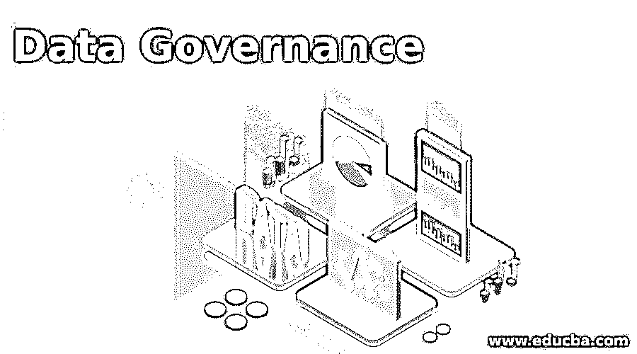
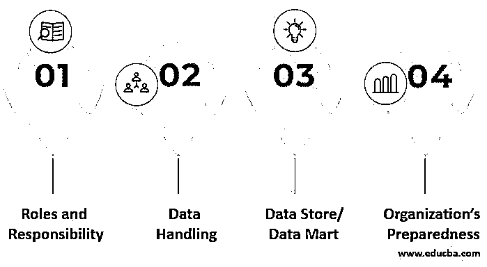

# 数据治理

> 原文：<https://www.educba.com/data-governance/>

## 数据治理的定义

数据治理可以定义为利用数据促进组织实现其目标所涉及的各种活动的集合。这些活动包括组织的实践、每项活动的专门角色、要遵循的法规政策和条款等。当这些活动受到控制时，数据治理被认为是通过获得最大的数据处理效率而实现的。这一过程有助于启动数据管理技术和相关任务，以保证在整个组织中横向处理的数据的性能和数据安全性，这可以在任何时间和任何情况下应用。

### 数据治理的组成部分

数据治理组件是基于一些常规问题挑选的，比如谁、为什么、什么、何时、如何等等。以下是与所述问题相关的类别，

<small>Hadoop、数据科学、统计学&其他</small>

#### 世卫组织——组织中的人

*   用户组章程
*   升级层次结构
*   角色结构
*   数据管理员
*   决策专家

#### 为什么–目标

*   实现既定目标
*   使命和愿景

#### 什么——关注的焦点

*   量化因素
*   财政支援
*   控制性规划
*   数据管理方法

#### 何时–活动

*   数据分析
*   工艺计划
*   计划的实施
*   数据管理过程
*   记录流程进度

当这些组件协同工作时，给定组织就有了高效的数据治理。在这些组件中的每一个组件下，可以有许多人、角色和执行的操作。除此之外，在元数据存储库、数据分析工具、数据清理工具、数据挖掘工具、数据管理活动等的帮助下，可以在技术上实现数据治理。

在数据治理中执行的混合过程坚持组织的策略、过程监控、数据清理、数据剖析、数据提取、数据分析、数据处理等。这些较小的流程对组织的数据治理率产生了较大的影响，因为在大多数情况下，每个活动都是相互依赖的。

### 数据治理流程

在使用数据科学技术的地方，控制良好的数据治理方法是机构绩效的重要组成部分。它有助于将多个数据治理组件串联起来，这仅仅意味着对任何和所有数据治理组件有贡献的所有次要活动。此流程中涉及的人员/角色，如制定重要决策的业务专业人员，负责强调数据治理下要处理的数据的细节。

业务专业人员的战略能力将在组织中的数据治理实施中发挥关键作用。数据治理方法可以简单地解释为信息管理过程，它对组织的效率有更大的意义。

### 数据治理挑战

在机构中构建和应用数据治理流程是一项令人生畏的艰巨任务。除了合适的管理团队之外，数据治理还需要完全可行的计划，以及严格按照计划执行的能力，不能有任何偏差。在组织中使用数据治理技术时观察到的一些常见问题是，

#### 1.角色和责任

在上述组织中，很难确定处理数据部门指定职责的人员的不适当角色。构建数据治理程序涉及人员处理、将相应人员置于合适的角色、数据访问级别、每个人的责任等。最高级别是组织的首席数据官，在这个技术不断发展的数据世界中，这已经成为一种常规做法。

#### 2.数据处理

在许多数据治理应用程序中观察到的一个主要问题是，数据是从多个数据源收集的，并不是所有的数据源都将被清理和处理。重要的是收集无垃圾数据，以保持组织产生的数据治理方法的效率。

#### 3.数据存储/数据集市

数据治理的另一个巨大障碍是划分能力，这在许多数据库中是没有的。在大多数情况下，数据权限由数据库管理员或所有者管理，其中访问权限是根据处理数据的人员的角色提供的。当权限未按要求设置时，必须在出现要求时进行验证和更新。这又涉及到团队成员以及他们与其他团队成员或团队协作的能力。

#### 4.组织的准备状态

当组织获得数据治理的好处，并决定在自己的组织中实施时，他们很可能只关注外部因素。同样重要的是，要审视本组织在当前情况下正在实施的内部做法。应该修改工作模式，以适应即将到来的变化以及数据治理的执行。在进行数据治理规划的同时，应重新检查研究所的现有传统，并保持平台开放，以将数据治理产品放置到位。

### 优势

数据治理有助于组织处理他们自己的数据，由于以下原因，它将成为一种有利的技术。

*   在组织中采用数据治理方法可以即兴发挥公司的数据管理能力，同时保持内部数据的质量和价值。
*   来自不同领域和部门的数据分组有助于所有未来的进程。
*   确定人在数据管理中的地位和责任
*   允许外围数据贡献分配
*   维持严格的一致性协议
*   对数据监管和数据治理中操作的数据消费进行建模
*   帮助整理杂乱无章的数据并控制数据管理的成本

### 结论

总之，数据治理有助于明确在企业中执行数据治理所需的每个角色和任务的位置。当通过接受审议来设计数据治理配置时，公司在数据的管理方面的轻率一劳永逸地得到了解决。

### 推荐文章

这是数据治理指南。在这里，我们还将讨论定义和数据治理组件以及流程和挑战。您也可以看看以下文章，了解更多信息–

1.  [数据质量工具](https://www.educba.com/data-quality-tools/)
2.  [元数据管理工具](https://www.educba.com/metadata-management-tools/)
3.  [什么是数据工程？](https://www.educba.com/what-is-data-engineering/)
4.  [什么是数据湖？](https://www.educba.com/what-is-a-data-lake/)

