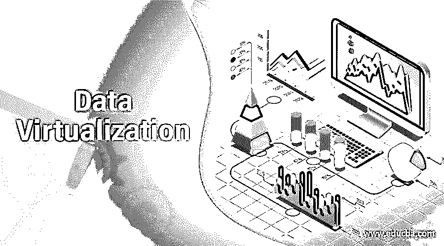

# 数据虚拟化

> 原文：<https://www.educba.com/data-virtualization/>

## 数据虚拟化简介

数据虚拟化提供了一个管理异构数据源的平台，无需了解数据的存储格式和存储位置，只需虚拟地将所有相关数据组合成有意义的视图，无需复制或移动数据，并以所需的方式实时呈现给用户。

该模型取代了数据仓库过程的提取/转换/加载层(ETL ),没有存储层，并且仅向用户提供来自其虚拟组合的任何来源的相关数据，从而完全满足安全标准/治理要求。

<small>Hadoop、数据科学、统计学&其他</small>

在虚拟化环境中，允许传统数据库、数据仓库、数据湖、数据集市等多个数据源按原样运行，数据仍存储在一个位置，供用户通过虚拟化层使用，从而在组织中实现单一真实来源策略。

在本文中，我们来研究虚拟化的工作原理及其应用/用途。

### 数据虚拟化是如何工作的？

数据虚拟化通过虚拟地集成组织拥有的多个数据源和用户，充当它们之间的接口。这些功能可以用五个步骤来解释，它们是

#### 数据抽象层

*   数据的复杂性，如协议、格式、依赖性和位置，对用户是隐藏的。
*   提供所有已连接数据源的单一虚拟视图
*   根据身份认证策略，可以访问任何来源的数据

#### 无复制无重定位

*   没有无数据的物理存储
*   只有在需要和满足用户的任何动态需求时才提取数据
*   在没有耗时的 ETL 过程的情况下，总体开发时间是

#### 实时信息

*   逻辑视图是为所有
*   用户可以使用逻辑视图实时获得数据
*   数据转换和所需的质量检查灵活进行，没有任何延迟

#### 自助服务模式下的数据服务

*   允许用户通过虚拟连接所有内部和外部数据
*   使用户能够根据业务模型配置自己的数据模型
*   连接任何类型的数据，并提供对 IT 环境中所有数据的访问

#### 安全和治理

*   数据访问只提供给经过身份验证的用户
*   完全遵循云和内部访问的安全和治理程序
*   管理多个数据点的元数据，并提供清晰的数据可见性

### 数据虚拟化的应用

对于任何组织来说，数据虚拟化都是一项现代资产，因为它能够应对数据管理中不断增长的挑战，如缓存、查询下推、数据目录以及处理多个数据源的难题。其应用包括

#### 逻辑数据仓库

数据虚拟化为这个仓库提供了一个完美的框架。常规数据源，以及像 Hadoop、数据湖、NoSQL 数据库这样的大数据数据源，通过这种虚拟化路线进行逻辑连接，构建逻辑数据仓库。在这种逻辑结构中，用户的任何查询都被视为对单个数据库的查询。像 ODBC、JDBC、REST 和 API 这样的多种协议被用来交换来自输入源的数据。

#### 大数据分析

数据虚拟化有助于连接到大数据平台的 NoSQL 数据库、Hadoop 和数据湖，以及传统数据源和逻辑视图的创建，并使用现代可视化分析和商业智能工具来获得业务洞察力。设置此应用程序只需花费最少的时间和精力，因为它不涉及任何数据库创建和数据迁移。

#### 数据服务

这个平台简化了从各种数据源访问数据的方式和方法，而不考虑其复杂性和独特性。逻辑视图是为数据源单独创建的，并被合并到一个集成的框架中，并以这样一种方式呈现给用户，使其看起来像所有数据都来自单个数据库。数据转换、消息传递、连接和过滤器在逻辑视图创建中被考虑在内。

数据虚拟化技术被广泛部署在数据服务应用程序中，在这些应用程序中，数据从多个来源中挑选出来并呈现给用户。

#### 数据目录

该工具有助于构建现有数据资产的强大清单，作为组织的数据目录，而不必将它们迁移到新平台。该目录允许业务团队、数据分析师和数据科学家团队更快地访问数据，而数据的技术细节非常少，并加快了业务决策。

### 使用

*   数据虚拟化在构建一流的 IT 环境中发挥着关键作用
*   该平台提供了充分的灵活性，并在尽可能短的时间内交付结果。它大大加快了上市时间。
*   它为业务提供了敏捷性，使其能够蓬勃发展并应对竞争对手
*   用户不知道后端数据源及其接口的复杂性
*   高度可扩展，可以随时添加到任何新数据源的连接，而不会中断
*   云和 API 服务中的数据源可以很容易地集成到这个平台中
*   由于设计简单，这些平台易于维护
*   总拥有成本(TCO)降低。
*   在信息恢复过程中，用户有大量自助服务选项

### 优势

*   消除数据错误，因为数据一旦在许多地方使用就被存储
*   只从数据源访问数据，因此给系统增加了最小的负载
*   更快地实时访问数据
*   开发工作量小，实施时间缩短
*   不需要大的存储空间
*   增强的安全性和高度治理投诉

### 不足之处

*   用户不谨慎的查询或错误调整的查询可能会影响该平台的性能
*   在联合环境中管理变更是一个费力的过程，因为在合并任何变更之前必须考虑可能的影响
*   这个平台是一个高潜在的单点故障。我们需要建立一个强大的备份
*   任何涉及批处理的用例都可能导致
*   数据源之间的资源分配可能会遇到恶劣的天气
*   它不是存储历史快照的理想平台，而数据仓库是不错的

### 结论

大约有 10 家供应商提供数据虚拟化平台，其中一些大公司包括 IBM、Oracle、Red hat、Tibco、Informatica 和 Denodo。选择应该基于将要使用数据的应用程序、所需的性能级别和安全要求。

### 推荐文章

这是数据虚拟化指南。在这里，我们将讨论数据虚拟化的工作原理、用途以及优缺点。您也可以看看以下文章，了解更多信息–

1.  [虚拟化的优势](https://www.educba.com/virtualization-benefits/)
2.  [虚拟化的类型](https://www.educba.com/types-of-virtualization/)
3.  什么是虚拟化？
4.  [数据迁移工具](https://www.educba.com/data-migration-tools/)

