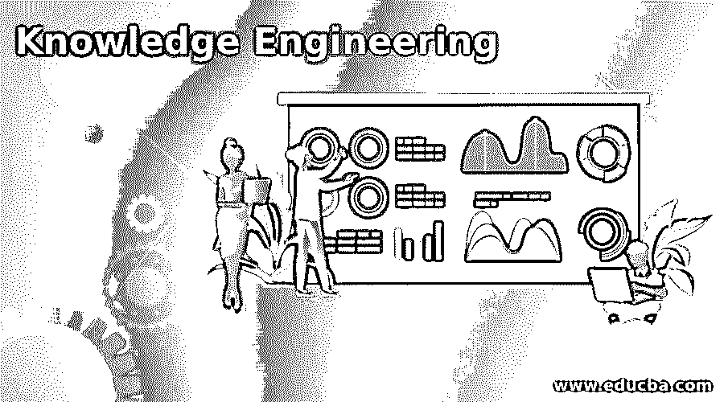

# 知识工程

> 原文：<https://www.educba.com/knowledge-engineering/>

## 知识工程导论

知识工程顾名思义就是知识工程。它不同于机械等经典工程。土木、制造或任何其他工程。工程学基本上指的是通过巧妙的工作来产生某种东西的行为。在人工智能中，我们的目标是模仿人类的智能。人类根据他/她的知识运用他/她的智慧来做决定。人类的决策系统是相当复杂的，它考虑了来自几个来源的事实、先前的经验和情感(比如同情——软决策；直觉-艰难的决定；幸福——承诺；愤怒——吵架；悲伤错误或不健康的决定)，这带来了决策中的非线性模式。

知识工程是一个研究领域，在这个领域中，我们对特定领域的所有这类思维过程进行工程设计。它可以被认为是(AI)的构建模块，AI 试图通过特定领域的专家来模仿人类的判断。

<small>Hadoop、数据科学、统计学&其他</small>

### 什么是知识工程？

简而言之，它是一个专注于为特定领域创建知识库的领域。它包括对特定领域的深入调查，学习关于该领域的所有重要概念，然后起草有意义的输出。

知识工程是一种处理信息的方法，这种信息是关于某一特定领域的专家将如何处理信息，并据此采取行动和做出决策。例如，我们希望在数学科目上实现儿童教学过程的自动化。这需要教师、学科专家的知识，以及前几批学生的数据和他们的数学成绩。

一般工作流程要做到这一点，我们需要处理元数据(所有关于数据、数据质量、内容、结构、对象和格式的内容)，以便对做出决策需要什么有一个基本的概念。一般来说，它需要解决一个问题，然后研究人类专家在做决定时会考虑的因素。人类专家会考虑许多参数，有些参数会比其他参数更重要。在考虑了所有的参数之后，人类专家利用其先前的领域经验进行排列和组合，并对所有的参数进行加权，然后做出决定。这只是发生在一些片段中，但是根据问题的复杂程度，调查整个过程需要大量的时间。

知识工程是帮助创建专家系统的基础，在专家系统中，知识被转化为计算机程序。专家系统有一个庞大而灵活的知识库，该知识库与指定如何使用知识库信息并将其应用于各种情况的机制相集成。这些专家系统还使用机器学习和深度学习算法，以便像人类一样学习。如今，这些专家系统被用于教育领域、医疗保健、金融服务、制造业等。

### 知识工程过程

不同领域的知识工程是不同的，但它遵循相同的规则/程序集，以创建专家系统。

#### 1.任务识别

这是定义要执行的任务的第一个初始阶段。在一个领域中，一个特定的问题或几个问题的组合将被采用。这项任务必须是现实的，主题专家应该对它有一个清晰的认识，以便可以进行进一步的过程。

#### 2.知识的获取

一旦问题被很好地定义，那么下一步就是收集关于问题的相关知识和信息。对于某些问题，使用必须收集的标准数据，例如，热交换器问题需要 x 温度和 y 压力下的标准蒸汽表数据，这将是焓的值。

#### 3.准备一张路线图

一旦有了目标和知识库，下一步就是准备好路线图，通过问卷和相关的知识库将目标分解成小步骤。在这里，主题专家把他的想法放在他将如何做决定和在所有阶段将考虑什么参数上。解决某些问题可能有几种方法，所有的方法都应该考虑。

#### 4.编码

现在是时候把这些知识转换成计算机语言了。在这里，通过使用不同的函数对知识进行编码，并且在某些情况下，对于特定的任务，使用算法来创建模型。这些模型能够像专家一样基于可用的参数做出决策，当然模型必须在足够多的数据上进行训练和测试。

#### 5.评估和调试

在创建专家系统的过程中，每一步都要对模型进行评估和调试，然后添加到工作流中。一旦所有的小任务都被评估，它们就被集合起来，形成一个完整的专家系统。如果存在任何问题，则再次对该系统进行类似问题的评估和调试。

#### 6.证明和解释

这里的模型是合理的给定任务和工作解释。

### 使用知识工程的好处

我们生活在一个时代，我们通过智能手机使用多个应用程序和网站，当面临任何问题时，我们会通过专家支持中心寻求解决方案，根据他们的可用性来解决问题。用知识工程创建的专家系统可以像人类专家一样立即解决问题。

知识工程的好处如下:

1.  知识工程有助于创建更好的专家系统。
2.  不同领域的知识可以组合在一起解决复杂的问题。
3.  用知识工程创建的模型是健壮的。
4.  当与 NLP 结合使用时，它们可以读取查询并提供解决方案，就像聊天机器人一样。

### 结论

在知识工程中，我们试图模仿特定领域专家的思维过程。一般的规则是在做决定之前，像专家一样设定任务，接受问题和议题。创建路线图以得出结论。为了达到目标，模型需要相应的知识、专业技能和故障排除方法，以防出现问题。用知识工程创建的模型是健壮的和高度精确的。

### 推荐文章

这是知识工程指南。这里我们讨论知识工程的介绍，一个有一些规则和好处的过程。您也可以浏览我们的其他相关文章，了解更多信息——

1.  [元数据管理工具](https://www.educba.com/metadata-management-tools/)
2.  [数据科学应用](https://www.educba.com/data-science-applications/)
3.  [什么是数据结构？](https://www.educba.com/what-is-data-structure/)
4.  [什么是数据分析？](https://www.educba.com/what-is-data-analysis/)

