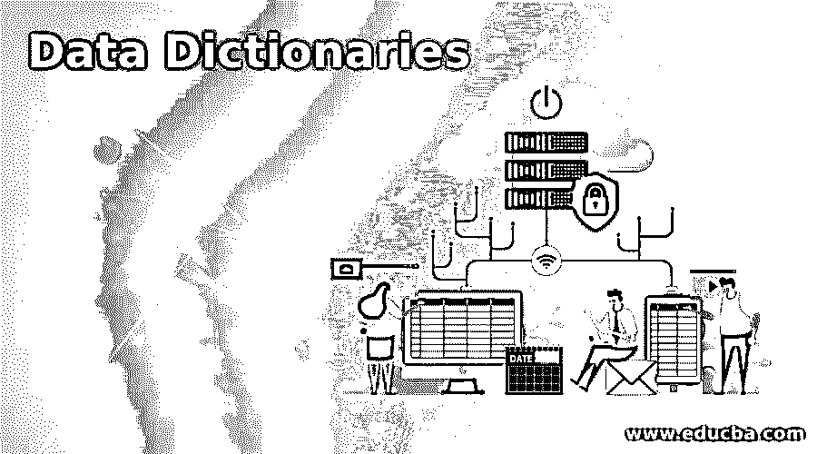

# 数据字典

> 原文：<https://www.educba.com/data-dictionaries/>

## 数据字典介绍

数据字典类似于任何其他主题字典，它保存了数据库中对象的记录。这些对象在软件技术术语中也称为“元数据”。这些对象主要是与数据所有权、数据与其他对象的关系以及对象的其他数据结构相关的记录。现在想象一下，一个没有数据库本身信息的数据库，一旦创建，可能会导致您无限期地丢失数据，因为我们在任何地方都没有存储关于数据库的信息，具有讽刺意味的是，这是数据库不可避免的一部分。

### 什么是数据字典？

现在让我们正式研究它是什么，让我们对它有一个正式的定义，以便它能在团体内很好地交流。在 IBM 计算词典中，这被定义为“一个集中的存储库，包含数据库中的数据信息，以便清楚地提及或指定含义、关系、数据来源、使用位置和格式”。这个术语可以与许多其他定义互换，最好的定义可以是 IBM 字典中下面的任何一个定义。

<small>Hadoop、数据科学、统计学&其他</small>

*   描述数据库或其集合的文档。
*   数据库管理系统的一部分，用于确定结构。
*   一个帮助扩展 DBMS 内置数据字典的中间件。

它包含有关数据库的以下信息，它们是:

数据库表名及其模式:顾名思义，存储数据的表名和它所遵循的模式就存储在这里。例如，模式可能是雇员数据库中雇员的出生日期，应该具有日期类型格式。数据库的所有者及其安全约束存储在字典中。表的存储位置、表的物理信息和数据项的别名都存储在字典中。主键属性、关于外键的信息等。这构成了表约束。像值的范围这样的约束也存储在数据字典中，例如，出生日期不能大于今天的日期。最后，可见的数据库视图也存储在这里。

### 数据字典的类型

现在让我们来谈谈不同类型的 it:

#### 1.活动数据字典

数据库管理系统的一个重要职责是确保数据库结构的变化能够立即反映在数据字典中。这种即时更新方法被称为活动数据字典，因为它们是自更新。

#### 2.被动数据字典

这些类型的字典不像活动数据字典那样有用或容易处理。每次修改数据库时，都必须手动更新数据字典以匹配数据库。该词典与数据库分开维护。现在你一定在想，如果数据库不自动更新，那还有什么用呢？答案是，除了自动更新的缺点之外，还有很多优点，如被动数据可以作为中央存储库来存储元数据，因为它们不依赖于数据库，不像主动数据字典。因此，可以同时用于实际上相同的多个数据库。此外，我们可以拥有缺少非活动数据字典的额外元数据。最后，当您在被动数据字典中获得一个具有搜索功能的友好 UI 时，这项工作就容易了。

有一些在 it 中使用的操作符，让我们来看看它们，这样，这个话题对工作世界来说就更现实了！

*   a = x + y:这意味着 x，y 数据元素包含在“a”中。
*   a = [x/y]:这意味着 x 或 y 中的任何一个元素都包含在“a”中。
*   a = x:这意味着 x 的最优柠檬包含在“a”中。
*   a = b[x]:这意味着 x 的元素的 b 次或更多次出现包含在“a”中。
*   a = [x]b:这与前面的正好相反，即 x 的元素的 b 或更少的出现被包括在“a”中。
*   a = b[x]c:这是前两者的组合，即 b 或更多次出现，c 或更少次出现的 x 的元素包含在“a”中。

### 数据字典的使用

现在，让我们看看它在现实世界中的用途，以及它在接下来的几节中带来的一些优势。

这在各种情况下都很方便，它们是:

用户可以创建所有数据项的有序列表，并帮助创建数据的快速报告，从而使数据管理变得容易。当在数据库对象上触发 DDL 时，它帮助 DDL 搜索对象。它只帮助授权用户查看表格，因此起到了安全墙的作用。它用于创建软件设计和测试用例。

### 数据字典的优势

现在，我们可以很容易地了解数据字典带来的优势，因此在本节中，让我们以指针的形式来了解这些优势，以便在决定何时使用数据字典时可以作为参考:

1.这里提供的列属性是一个有组织的综合列表。当数据库管理员从另一个人那里接管数据时，这对于他理解数据有很大帮助。

2.数据字典的建立使得可以提供容易的搜索。

3.多个程序可以利用数据字典来提供报告和文档。

4.它有助于维护数据，这样我们就不会遇到冗余数据。

5.它确保所需数据的结构在这个过程中得到简化。

6.元数据的存储有助于维护数据库的高数据完整性。

7.当软件中的设计过程开始并评估为测试而编写的测试用例时，它就派上了用场。

8.跨不同表的关系信息是作为数据字典创建过程的一部分捕获的。

### 结论

在本文中，我们已经了解了数据字典是 DBMS 不可或缺的一部分，以及围绕数据字典的基本原理。只有通过查阅数据字典才能理解数据项在 DBMS 结构中的位置。数据项获得其真实世界的含义。

### 推荐文章

这是一本数据词典指南。这里我们讨论数据字典的介绍，它是什么，不同的类型，用途和各自的优势。您也可以浏览我们的其他相关文章，了解更多信息——

1.  [集中式数据库](https://www.educba.com/centralized-database/)
2.  [MYSQL 数据库](https://www.educba.com/mysql-database/)
3.  [数据库类型](https://www.educba.com/types-of-database/)
4.  [关系数据库的优势](https://www.educba.com/relational-database-advantages/)

