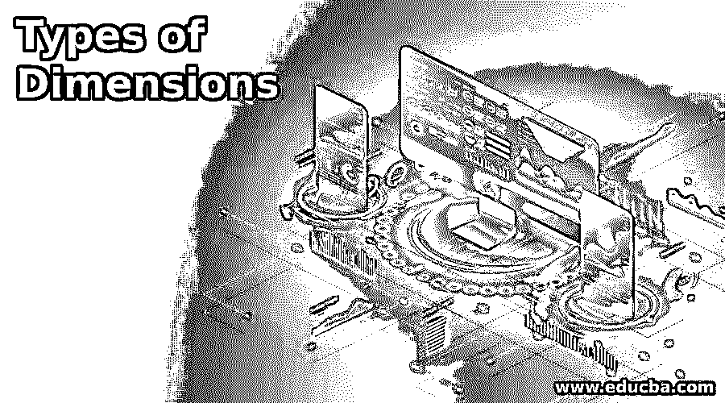

# 维度的类型

> 原文：<https://www.educba.com/types-of-dimensions/>

## 维度简介

维度表包含公司数据。事实上，在国际键关系表中，使用了维度表的主键。而维度中剩下的列是自然信息，也就是公司的对象信息。对象的大小是其外壳大小的拓扑度量。一般来说，定义物体的点需要多个坐标。例如，矩形是二维的，而立方体是三维的。物体的尺寸通常被称为“维度”在数学中，维度的定义很重要，因为几何对象的逻辑或视觉复杂性是精确参数化的。该定义应该潜在地被推广到抽象对象，并且不能被显式地可视化。例如，时间可以被看作是一维的，因为它可以被解释为只由“现在”、“将来”和“将来”组成。因为时间是一条线，一个无维度的实体，不管它有多远，有多远。

### 前 9 种维度类型

以下是尺寸的类型，解释如下:

<small>Hadoop、数据科学、统计学&其他</small>

#### 1.符合尺寸

一个维度被认为是一个符合的维度，它存在于许多地方。符合的维度可以包含在单个数据库或几个数据集市或具有几个真值表的数据仓库中。

#### 2.角色扮演维度

在角色扮演维度中，事实表中的多个国际键及其相应的属性可以添加到同一个维度中。首先，对于发货日期和装运日期，事实表可以包含国际键。但是对于外键，相同的日期维度功能是有效的，因此所有外键都添加了相同的维度表。这里的日期组件在船的到达和交付日期以及船的名称中扮演了几个角色。

#### 3.缩小的尺寸

收缩维度是另一个子集。例如，包含外部产品主数据但包含外部产品段的订单的事实表可以包含在目标事实表中，该外部产品段在产品表中，但粒度要小得多。处理不同种类颗粒情况的一种方法是创建一个较小的维度表，将作物组作为其主键。如果产品维度是 black-snow，通常会有一个不同的产品类型表，它将充当收缩维度。

#### 4.静态尺寸

静态计算不是来自原始数据库，而是在数据仓库上下文中生成的。统计维度(例如，带有状态代码的维度)可以手动加载，也可以由日期或时间维度等流程生成。

#### 5.退化维度

当维度属性存储在事实表中而不是存储在单独的维度表中时，会给出退化维度。原则上，这些是没有其他属性的维度键。在数据存储中，作为问题练习的一部分，它们还用于评估报表中累积数字的来源。这些值可用于恢复 OLTP 设备事务。

#### 6.快速变化的尺寸

经常变化的维度属性是快速变化的属性。如果您不必遵循变更，那么快速变更的属性就没有问题，但是如果您必须遵循变更，那么缓慢变更的传统方法将会产生维度的大膨胀。一种解决方案是将属性移动到它自己的维度，使用不同的外键。这个新的维度被称为快速进化。

#### 7.垃圾尺寸

具有各种特征和不相关功能的单个表阻止大量国际键出现在事实表上，这是一个垃圾因素。垃圾测量也被创建来处理容易移位的国际键。

#### 8.推断尺寸

加载现实文档时，维度记录可能尚未准备好。一种方法是为所有其他函数创建一个空替换键。从技术上讲，它应该被认为是一个成员推断，但有时它被认为是一个假定的维度。

#### 9.尺寸缓慢变化

具有易于随时间变化的性质的属性。数据仓库中改进的清晰属性历史的维护依赖于市场需要。这被认为是缓慢变化的特性，而缓慢变化的尺寸被称为特性。

### 推荐文章

这是尺寸类型的指南。在这里，我们还讨论了简介和前 9 种维度类型以及详细的解释。您也可以看看以下文章，了解更多信息–

1.  [主板类型](https://www.educba.com/types-of-motherboard/)
2.  [数据库模型的类型](https://www.educba.com/types-of-database-models/)
3.  [R 数据类型](https://www.educba.com/r-data-types/)
4.  [OLAP 的种类](https://www.educba.com/types-of-olap/)

