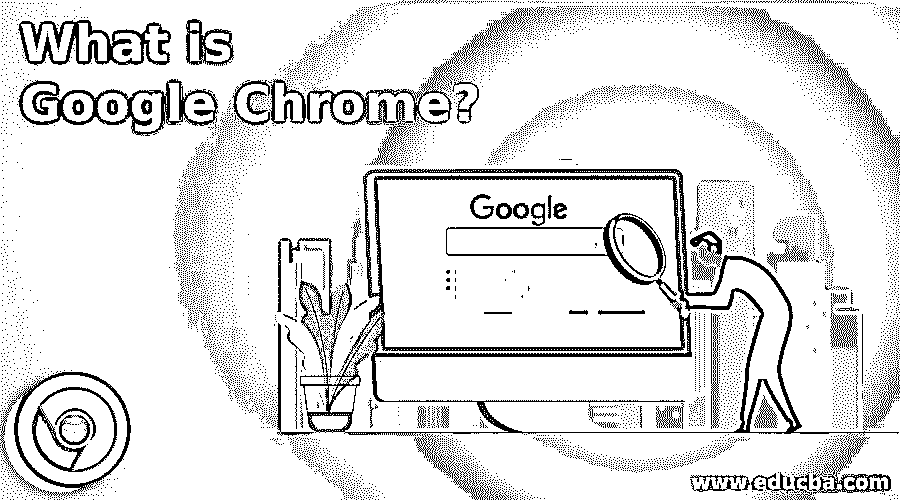

# 谷歌 Chrome 是什么？

> 原文：<https://www.educba.com/what-is-google-chrome/>

## 谷歌浏览器简介

谷歌浏览器是谷歌设计的免费网络浏览器，用于浏览互联网网站。截至 2020 年 5 月，它拥有超过 60%的网络浏览器市场份额，是世界上最受欢迎的网络浏览器选项。谷歌 Chrome 也是一个跨平台的浏览器，因此许多版本可以在许多笔记本电脑、手持设备和操作系统上运行。Statista 指出，谷歌 Chrome 是 Android 最常用的版本，在 2020 年 2 月保持了超过 32%的全球网络浏览器市场份额。谷歌 chrome 是第一个使用搜索框和地址栏的网络浏览器，其他竞争对手也紧随其后。2010 年，谷歌推出了在线商店 chrome，消费者可以在其中购买和安装基于网络的软件。

### Chrome 的特性

以下是下面给出的特征:

<small>Hadoop、数据科学、统计学&其他</small>

*   使用方便快捷安全。
*   网页也可以很容易地访问和加载，即使有大量的图形、广告和视频材料浏览几页。界面简单易用，即使对于初学者也是如此
*   它提供了自动更改，强制执行这些更改以确保安全性得到审查。
*   它在酒吧里提供搜索谷歌。
*   一定要搜吗？只打开一个新的窗口或标签，并开始在地址栏中键入您需要查找的任何内容。然后按 Enter / Go / Check，搜索结果页面就会显示出来。

跨设备的 Chrome 设置。

一定要搜吗？只打开一个新的窗口或标签，并开始在地址栏中键入你需要找到的任何内容。然后按 Enter / Go / Check，搜索结果页面就会显示出来。

你将同步你所有的书签、密码、历史记录、自动填充等等。这确保了无论你在其他机器还是笔记本电脑上使用 chrome，设置都是兼容的，并通过谷歌账户进行更新。

### 铬合金的优点

谷歌 chrome 提供了许多可以有效使用的好处，如下所示:

*   Chrome 浏览器有一个基本的用户界面，包括最常用的按钮，如前进、后退、刷新等。它还有一个搜索栏或 Omnibox，帮助用户搜索网址。
*   许多网站是用高级脚本创建的，这可能是导航缓慢的根源。Chrome 可以有效地运行这种脚本，并轻松显示动态网站。因此，它在某些情况下节省了时间，并使互联网会话具有反应性。
*   谷歌定期升级 chrome 浏览器以确保其安全。当连接到互联网时，它可以自动更改。此外，chrome 还提供了以下安全性:
*   Chrome 已经成为世界闻名的浏览器，因为它可以与 gmail 等其他谷歌应用程序结合使用。当你登录 chrome 时，你可以立即登录其他谷歌应用程序，如 adsense、gmail、analytik、谷歌广告、搜索控制台等。
*   隐姓埋名模式。

Chrome 提供了一个隐名模式私密模式选项，对应私密浏览，个人窗口，或者在私密浏览。它是一个互联网环境，防止浏览历史被保存。通常，当您访问任何网站时，页面请求的图像、内容和 cookies 都保存在您的计算机上。此外，自动完成字段可以存储任何搜索查询或填写类型。如果您不保留这些数据并关闭浏览器窗口，匿名模式会忘记保存这些数据。

Chrome 帮助用户在一个特殊的网络会话中以匿名模式扫描沙盒。它允许你暂时控制浏览器的历史和身份，因为当你关闭浏览器窗口时，你不能保存你的历史，尽管它不能保证这些信息的匿名性。

要打开一个新的匿名标签窗口，您可以在 Windows 或 Linux 操作系统上选择 Ctrl + Shift + N，在 MacOs X 上选择 Command + Shift + N。

### Chrome 的缺点

下面列出了一些缺点:

*   谷歌 chrome 浏览器比其他网络浏览器使用更多的 RAM(随机存取存储器)和 CPU。虽然浏览器是轻量级的，但高内存消耗会同时影响设备上的其他应用程序。
*   chrome 浏览器不提供定制和选项。例如，如果 chrome 浏览器窗口关闭时有几个打开的标签，系统不会询问你是关闭还是不关闭所有标签。选项卡和窗口都会立即锁定。
*   Chrome 在谷歌上没有同步选项。其他浏览器，如 mozilla firebox，可以在许多计算机上与 mozilla weave 选项同步。此功能帮助您合并家庭浏览器、office 浏览器历史桌面和首选项。

### 推荐文章

这是一个什么是谷歌浏览器的指南？.在这里，我们也讨论了谷歌浏览器的优点和缺点以及功能。您也可以看看以下文章，了解更多信息–

1.  [Alexa vs 谷歌](https://www.educba.com/alexa-vs-google/)
2.  [谷歌云存储](https://www.educba.com/google-cloud-storage/)
3.  [谷歌云打印替代方案](https://www.educba.com/google-cloud-print-alternatives/)
4.  [Azure vs 谷歌云](https://www.educba.com/azure-vs-google-cloud/)

