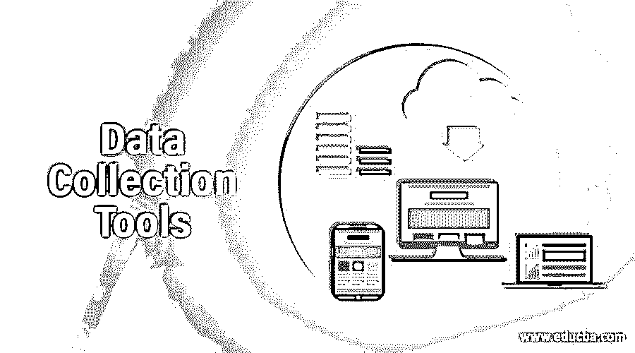

# 数据收集工具

> 原文：<https://www.educba.com/data-collection-tools/>

## 数据收集工具简介

数据收集工具可以定义为应用软件，用于在一个共同的基础上从各种数据源收集数据和信息，并为未来的分析目的设定特定的约束条件。这些工具有助于更好地理解收集的数据，这些数据可进一步用于有意义的业务相关决策过程。由此产生的分析报告和信息可用于在业务操作方面产生更大的影响，并适应来自应用系统和相关活动的组织的未来观点。

### 数据收集工具

市场上有各种各样的数据收集工具，企业可以根据自己的业务需求选择合适的工具。下面是数据收集工具使用的一些数据收集技术，

<small>Hadoop、数据科学、统计学&其他</small>

*   个案研究
*   使用数据
*   清单
*   面谈
*   小组讨论
*   调查

这些技术是数据收集工具的工作原理，并不是所有的工具都能在这些技术上发挥作用。以下是工具描述及其技术能力。

#### 1.百科全书

百科全书是一个基于网络的应用程序，可以保存大量数据，根据组织的需要，这些数据可以归入多个类别。该工具明确用于实施基于数据收集技术的案例研究。

#### 2.语法上

Grammarly 是帮助创建案例研究的数据收集工具，就像百科全书一样，用户可以验证他们文本的拼写错误和语法纠正。输入文本通常根据数据库系统中已经存储的数据和信息进行验证。一系列逻辑被实现到数据库中，以实现对传入文本的成功语法检查。这个工具免费提供，也有付费版本。

#### 3.Quetext

Quetext 是一个属于数据收集类的工具，因为它用于验证输入数据是否是抄袭的内容。剽窃只不过是复制不同的人拥有的内容并用于他们自己的需要的行为，它通常被视为一种非法行为。这个工具可供任何人免费使用。

#### 4.苏马

Suma 是另一个免费工具，以其移动性这一有利特性而闻名，并被用作数据的估计工具。理想情况下，它用于组装、组合和检查数据，以便进一步处理。出于分析原因，它还支持多个用户同时访问多个数据。

#### 5.Canva.com

Canva.com 是另一种网络工具或基于网络的应用系统，用于创建和维护清单，这是另一种类型的数据收集技术。核对表可以定义为一系列项目，这些项目可以在以后用作数据库分析的标准。这个工具允许用户实现他们关于用户界面定制的想象。

#### 6.清单

这个数据收集工具还使用了清单技术，它带有清单的内置设计模式，用户可以使用这个工具创建和管理清单。这有免费版和付费版两种，付费版比免费版有更多的好处，比如日程创建和跟踪清单。

#### 7.遗忘

这是一个轻松、简单的清单工具，它提供了更多用户友好的选项，如索引选项、高亮工具、编辑选项、操作菜单项、共享媒体等。像其他工具一样，这个数据收集工具也是免费和付费的。

#### 8.索尼 ICD ux560

索尼 ICD ux560 可以被定义为一个音频跟踪和存储应用程序，其数据的默认格式是 LPCM。这使用了采访类型的数据收集技术，在这里采访可以被定义为由个人或团体执行的收集彼此信息的活动。然后，这些信息被集中到一个数据源中，并在需要时进行检索。

#### 9.学习空间工具包

学习空间工具包也是一个基于网络的工具，它将通知用户列出焦点小组需要关注的基本文章。顾名思义，焦点小组是一种数据收集技术，用于记录特定用户群以及他们的共同兴趣或当前讨论的主题。

#### 10.谷歌表单

Google Forms 是一个基于调查技术的数据收集工具，组织/个人用户可以根据需要生成、更新、维护和结束调查。调查可以被定义为在一群人之间进行的一项活动，针对某一特定主题提交一份集体问卷。这是一个谷歌产品，所以它是免费提供给谷歌帐户的个人。该工具还提供了各种选项，用于根据需要在外观方面处理用户界面。像任何其他谷歌产品一样，该产品也允许用户与所需的联系人共享和协作内容。

#### 11.Zoho 调查

与 google surveys 类似，Zoho Survey 也基于调查类型的数据收集技术工作，并且这些功能也可以在 web 上使用。借助云功能，该产品还可以随时随地免费使用。

除了上面讨论的这些数据收集工具之外，还有一些其他的技术来执行数据收集，它们是观察、文档和记录。文档技术包括检查来自数据库系统或相关报告的活动信息的过程。这是最常用的技术，尽管它不能用作数据处理的绝对数据源。另一种技术是观察数据收集，这是一种为了查看或整理属于同一主题的信息而进行的活动。

### 结论

数据收集是将大量数据集中放置、挑选和处理的地方，其唯一目的是为了将来的分析。数据收集组可以根据它们关于数据库系统或数据源中存在的信息的定量和定性性质的特征来分类。

### 推荐文章

这是一个数据收集工具指南。在这里，我们将讨论市场上 11 种不同的数据收集工具。您也可以看看以下文章，了解更多信息–

1.  [数据字典工具](https://www.educba.com/data-dictionary-tools/)
2.  [Java 中的数据类型](https://www.educba.com/data-types-in-java/)
3.  [数据库中的数据存储](https://www.educba.com/data-storage-in-database/)
4.  [数据库测试工具](https://www.educba.com/database-testing-tools/)

