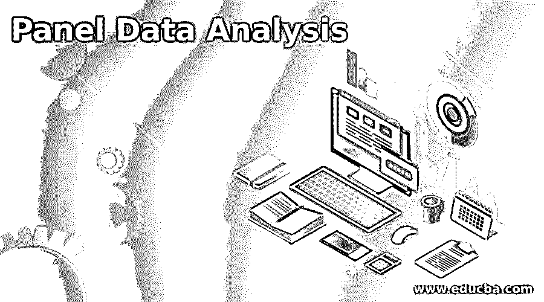

# 面板数据分析

> 原文：<https://www.educba.com/panel-data-analysis/>

## 面板数据分析简介

下面的文章提供了面板数据分析的大纲。面板数据是时间序列数据集(如与日期相关的股票价格)和横截面数据集(如特定年份的城市人口)的组合。当多个年份或时间戳的横截面数据在数据集中重复出现时，称为面板数据。在某些情况下，面板数据也称为具有时间序列的横截面数据或纵向时间序列数据，通常通过对大量横截面数据单元(如政府记录、会计记录等)进行长期观察，从数据集提取或获取的数据。

### 什么是面板数据分析？

面板数据通常分为两类:

<small>Hadoop、数据科学、统计学&其他</small>

#### 1.平衡面板数据

当具有时间序列的横截面数据以固定的周期时间间隔重复其自身的模式时，它被称为平衡面板数据。这里，我们在时间间隔的每个固定时段都有相同的数据集。

**举例:**

我们有这 5 个城市 2001 年的时间序列数据集和这 5 个城市 2002 年的数据集。

#### 2.不平衡面板数据

当具有时间序列的横截面数据在固定的时间间隔内不重复其自身的模式时，它被称为平衡面板数据。在不平衡的面板数据中，一些横截面数据在一个时间间隔内缺失，它没有相同的横截面集，它包含不同数据集的不同横截面集。

**举例:**

我们有 2001 年 5 个城市的时间序列数据集和 2002 年 3 个不同城市的数据集。

使面板数据和普通数据不同的一些关键点。

*   面板数据可以控制我们无法观察、测量或分析的变量。
*   随时间变化但在数据集组中不变的变量。

### 面板数据分析的优势

下面是提到的优点:

*   面板数据包含数据组的广义、公共和个体行为。
*   面板数据包含额外的信息，额外的可变性，以及比统计知识或横截面知识更多的属性。
*   可以找到面板数据，并实时应用纯统计或横截面知识无法实现的数学效果。
*   面板数据将最大限度地减少估计偏差，这种偏差是由于将群体汇总到一个统计数据中而产生的。
*   从不同来源提取数据后，研究人员遵循的第一步是清理数据并检查面板数据的质量。
*   因为它被认为是面板数据已经隐含地很好地安排了截面和时间序列变量，并得到数据的固定和/或随机效应的存在。否则，数据被简单地(或物理地)安排在面板数据格式中，但在经济分析意义上不会被认为是面板数据。
*   最重要的方面是数据分析或数据测量单位的一致性，这意味着数据集中的每个观察值都被同等对待和加权。
*   一些需求看起来是自我驱动的，但是通过分析研究它经常是间隔的。如果每个观察在许多意义上是不等价的，那么基于这些数据的任何分析都可能是不充分和不可靠的。

### 面板数据分析的步骤

该步骤与其他数据分析过程非常相似，都是在分析之前仔细描述数据的维度。在许多数据分析过程中，这一点经常被忽略，但这一数据描述对于分析人员了解数据和分析策略、质量和属性非常重要、有用。在面板数据分析和模型部分应该如下。

*   通过消除或移除冗余实体来清理数据，并通过检查数据是否被测量或以可靠和一致的方式来分析数据。
*   如果面板数据中使用了不同的时间段间隔，则尝试重新排列或汇总数据以提高一致性和维度。如果数据中有多个缺失值，决定是否需要通过忽略一些有用的信息来使用平衡面板数据，或者以方法和计算复杂化的速度将所有用户信息保留在不平衡面板数据中。
*   观察和检查面板数据的属性，包括它包含的实体数量、用同一组数据和间隔间隙重复的时间段数量，需要找出平衡和不平衡面板信息，以及固定和旋转面板信息。之后，尝试找出适合这些属性值的模型。
*   我们必须警惕的是，如果多空面板数据，有一万或更多的时间周期，只有 3 个实体或一个两年的短面板数据，有一千个实体记录。
*   尝试在固定的时间点以固定的时间间隔分离和分析数据，例如使用年度数据或月度数据或每日数据。

### **面板数据分析是如何工作的？**

*   面板数据分析从更简单的模型开始，我们可以尝试普通的最小二乘模型方法，而不是像单向效应模型那样的固定或随机数据模型，而不是双向模型；而不是效果模型而不是线性数据模型；诸如此类。
*   不要试图使用你的面板数据不支持的复杂模型，如组织不良、离散数据集长短面板、非结构化数据等。

### 结论

面板数据分析是一种分析二维面板数据的统计方法。面板数据是多个主体(实体)在不同时间间隔(一般等间隔)的观察(行为)的集合。它也被称为截面时间序列数据，因为它是时间序列数据和截面数据的组合。

### 推荐文章

这是一个面板数据分析指南。这里我们讨论一下入门，什么是面板数据分析？优点、步骤和工作原理。您也可以看看以下文章，了解更多信息–

1.  [什么是数据分析？](https://www.educba.com/what-is-data-analysis/)
2.  [二次数据分析](https://www.educba.com/secondary-data-analysis/)
3.  [数据分析软件](https://www.educba.com/data-analysis-software/)
4.  [免费数据分析工具](https://www.educba.com/free-data-analysis-tools/)

