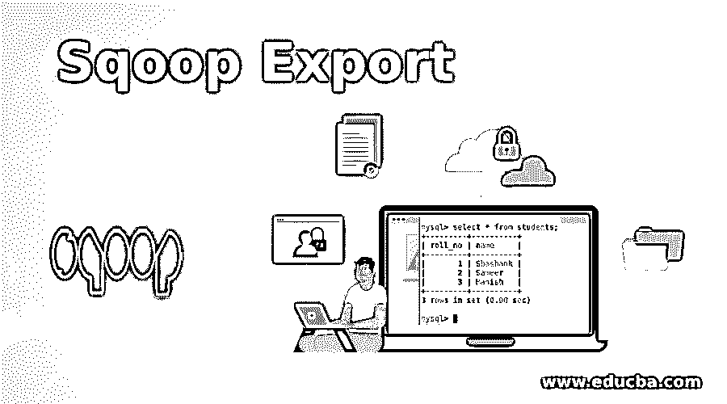
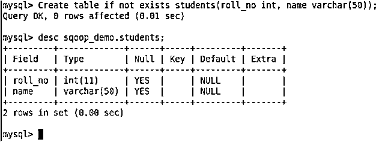
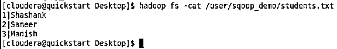
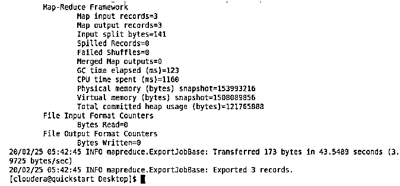
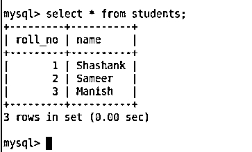

# Sqoop 导出

> 原文：<https://www.educba.com/sqoop-export/>

## Sqoop 导出简介

Sqoop export 是 Sqoop 中提供的一个命令，用于将数据导出到任何关系数据库。基本上，当需要将数据从文件加载到任何表中时，都会使用 sqoop export 命令。记录可以从存在于 HDFS 目录分隔符上的多个数据文件中摄取到表格中，分隔符可以是文件中唯一的任何分隔符，并且必须为用户所知。此外，需要获取的表必须存在于数据库中，并且表的模式必须为用户所知。

**语法:**下面是通用的 sqoop 导出命令语法:

<small>Hadoop、数据科学、统计学&其他</small>

`Sqoop export (generic-args) (export-control-args)`

上述命令中提到了两种类型的参数:

*   通用参数
*   出口控制参数

**泛型参数:**泛型参数是常见的类型，用于建立 sqoop 和关系数据库之间的连接，如 connect、username 等。以下是一些通用的论点及其意义:

**连接:** JDBC 网址将使用连接提供。

**用户名:**将使用用户名提供连接关系数据库的用户名。

**密码:**将使用密码提供连接关系数据库的密码。

**密码文件:**由于安全原因，使用 sqoop 命令提供密码可能会有风险，它将以加密形式存储在 HDFS 上，然后 HDFS 文件的路径将使用密码文件传递给 sqoop。

**-p:** 命令将用于从控制台传递文件。

**-verbose:** 命令将用于详细打印作业信息。

**导出控制参数:**这些参数顾名思义用于控制导出，如要导出的列、要导出的文件所在的导出目录、输入空字符串、输入非空字符串等。这些是出口管制论据。将使用导出控制参数 update-key，update-mode 来决定是插入还是更新。下面提到了一些常用的导出参数及其说明:

**列:需要将列的列表**导出到表中。

**export-dir:**HDFS 上存放数据文件的目录。

**m，–num-mapper:**用于将数据导出到表格的映射器的数量。

**表格:需要导出的**表格。

**更新模式:**更新模式可以是仅更新或允许插入。此参数将用于在更新关键字匹配时更新值，或者在更新关键字不匹配时插入记录。

**update-key:** 用于更新记录的列。键可以是一列，也可以是用逗号分隔的多列。

**input-null-string:** 列值为空时插入或更新的字符串。

**input-null-non-string:** 列值为 null 时要插入或更新的值。

### Scoop 中的导出命令是如何工作的？

Sqoop 首先从源文件中读取数据，然后根据块大小将数据分成多个块。这是由 sqoop 在内部管理的。然后 sqoop 根据 sqoop 命令在 sqoop 和关系数据库之间建立连接。建立连接后，Sqoop 基本上准备插入语句以将数据加载到表中。如上所述，有两个参数 update-mode 和 update key，如果 update mode 为真，则 sqoop 基于 update-key 准备 upsert 语句，否则它准备 insert 语句开始表。Sqoop 首先准备一组语句和数据库上的 shoots 来更新记录。

### Sqoop 导出示例

下面举几个例子

**创建用于演示目的的数据库和表格:**

`Create database if not exists sqoop_demo;
Use sqoop demo;
Create table if not exists students( roll_no int, name varchar(50));`

**样本创建表:**

**HDFS 的样本数据:**

【sqoop 导出前:表为空。

从学生中选择*；

**导出数据的 Sqoop 命令:**

`sqoop export
--connect "jdbc:mysql://quickstart.cloudera:3306/sqoop_demo" \
--username root \
--password cloudera \
--table students \
--export-dir /user/sqoop_demo \
--input-fields-terminated-by '|' \
--input-lines-terminated-by '\n'
--num-mappers 1`

【Sqoop 导出后:成功导出 3 条记录。

**MySQL 截图:**

从学生中选择*；

### Sqoop 中导出的优势

*   Sqoop export 是一个非常熟练的工具，可以从任何格式的文件中导出数据，可以是 csv、tsv、orc 或 parquet 等。
*   可以使用 JDBC 连接将数据加载到任何关系数据库中。它将数据加载到使用分隔符分隔的表中。
*   在加载字符串或非字符串时，Sqoop 也可以处理空字符。它通过从本地群集以分布式方式启动 map-reduce 来使用导出数据。
*   需要在 export-dir 参数中提供 HDFS 目录，可以使用 sqoop 导出选定的列。
*   如果提供了更新模式，可以使用 sqoop 将数据合并到表中。Update-key 可用于通过 upsert 更新现有数据。
*   可以声明映射器的数量，以便导出关于集群配置的数据。
*   使用 sqoop 可以进行多行插入。

### 结论

将数据从本地集群 sqoop 接收到关系数据库表是一种常用工具。它可以接收 Hadoop 支持的几乎所有不同文件格式的数据。此外，命令易于学习和执行。无需为数据接收编写复杂的 sql 查询。此外，它通过启动 map-reduce 任务来插入数据，以便快速接收数据。

### 推荐文章

这是一个 Sqoop 导出的指南。在这里，我们讨论了 Sqoop Export 的例子，以及它的优点和工作原理。您也可以看看以下文章，了解更多信息–

1.  [Sqoop 命令](https://www.educba.com/sqoop-commands/)
2.  [Sqoop 面试问题](https://www.educba.com/sqoop-interview-questions/)
3.  [MySQL 子查询](https://www.educba.com/mysql-subquery/)
4.  [SQL 中的 BETWEEN](https://www.educba.com/between-in-sql/)

