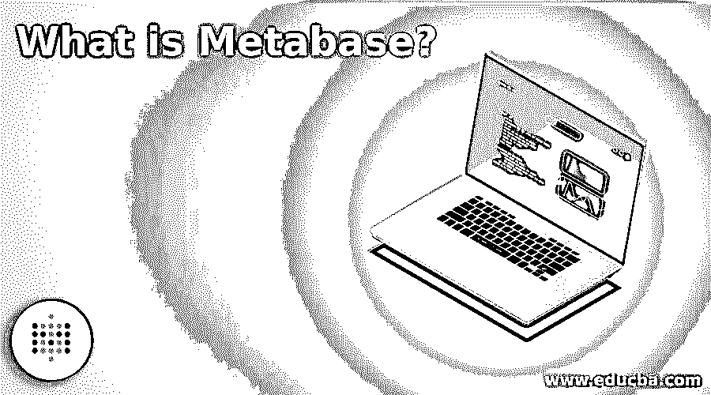

# 什么是元数据库？

> 原文：<https://www.educba.com/what-is-metabase/>

## 元数据库简介

以下文章概述了什么是元数据库？也称为元数据或元数据库，这是一个开源的商业智能工具，用于存储有关数据的数据，或者用于特定目的，以及来自不同来源的所有配置信息。关于数据的问题可以很容易地得到澄清，并可以根据用户的需求制成任何格式，以便可以从这些元数据中制作数据的表格、图表或任何可视化表示。由于它是开源的，任何人都可以通过下载和修改代码来使用它，以便更新该工具。

### 什么是元数据库？

*   一种共享数据并从工具内的分析中得出不同结论的工具称为元数据库。该工具不需要 SQL 或任何其他编码，任何人都可以通过提出任何问题或总结数据来得出有意义的结论。可以对数据应用过滤器，并且可以在工具的整个表或可视化中浏览所需的数据，以便可以很容易地从表中找到信息。很容易创建图形和表格，使浏览数据的人对可视化有意义。
*   很容易在表格中制作基于颜色代码的图表或过滤器，以便用户可以很容易地掌握数据的概念。可以对数据应用基于区域的过滤器。当数据很复杂，普通的图形和表格很难理解数据时，可以通过用户界面使用查询来构建数据并帮助用户。SQL 接口帮助用户了解复杂的数据。可以在工具中设置警报，以便当数据失控时，可以向组织中的所有团队成员发送警报。

### 元数据库的使用

*   数据可以是用户需要的任何格式，无论是图形、表格还是任何可视化表示，因此元数据库是业务中的一个常用工具。
*   当用户有任何与数据相关的问题或澄清时，他们可以将其发布在仪表板上，这样任何看到问题的用户都可以查看这些问题并做出响应。或者，他们可以稍后回来查看仪表板中的详细信息。借助仪表盘，该平台可以轻松地在团队内部分享关于数据的问题或见解。
*   从主页或仪表板上可以找到不同形式的表格，如果用户觉得有吸引力，他们可以在数据中使用相同的表格。此设置保存为自动设置，用户也可以将其合并到报告中。可以设置一个区域来查看仪表板或表格和图形，用户可以在指向团队成员的链接中共享这些信息。这有助于每个人在需要时更新表格，并使表格更具互动性。
*   元数据库的一个重要用途是，用户可以将该工具与其他数据库连接，并且可以在仪表板中看到列表。这有助于从不同的数据库中收集数据，并在可视化的帮助下形成大致相同的结论。

### 元数据库的重要性

*   作为一种商业智能工具，元数据库在共享数据并使其为对等体所知方面起着重要的作用。代码是免费提供的，因此可以进行修改并以其他方式使用它，以使数据以更好的方式被理解。仪表板有助于共享数据并得出相同的结论。
*   如果用户提出的问题数量更多，可以为这些问题创建查询，以便以这样的方式安排问题，使得重要的和有时间限制的问题被首先回答。所提问题的副本可以在指向元数据的查询的帮助下创建，以便可以从相同的元数据收集答案。
*   一个理想的商业智能解决方案必须是友好的，并且在任何地方都可以使用，这样利益相关者就可以在会议中使用，而不需要任何相同的知识。这有助于他们寻找一个简单而有效的商业智能解决方案，因此元数据是一个理想的解决方案。它比大多数其他工具都快，甚至在功能较少的手机上也可以使用。这有助于用户以简单的方式理解数据流。

### 优点和缺点

下面给出了元数据库的优点和缺点:

<small>Hadoop、数据科学、统计学&其他</small>

*   使用元数据库不需要太多的技术知识。这使得用户可以查看仪表板中的任何信息，并对其进行澄清。
*   应用程序的部署并不总是需要的，因为仪表板中的条目可以很容易地安排。分析使数据变得不那么复杂，图表使它看起来更适合业务演示。
*   可以很容易地将数据库添加到元数据库中，并且通过加密的细节使连接变得安全。这可以由管理员控制，并且可以存储详细信息，以便该工具正常运行，而无需询问加密详细信息。
*   说到缺点，用户应该在将数据映射更新到工具之前进行数据映射。数据应经过整理并输入工具。
*   当数据变得复杂时，SQL 是必不可少的，没有系统中的查询它就无法工作。此外，基本版本在 Windows 中不可用，除非升级，否则只能在 mac 系统中使用。
*   如果不进行数据映射，就无法轻松地从任何数据库中集成数据。连接器是可用的，但是需要后台工作来使工具有效地工作。
*   企业版基于服务器定价，价格为 10000 美元，拥有所有特权和商业许可证。如果该工具必须在业务中使用，最好使用企业版。

### 推荐文章

这是什么是元数据库的指南？这里我们讨论一下简介，什么是元数据库，用途，重要性，优缺点。您也可以看看以下文章，了解更多信息–

1.  [元数据管理工具](https://www.educba.com/metadata-management-tools/)
2.  [什么是元数据？](https://www.educba.com/what-is-metadata/)
3.  [SQL 中的元数据](https://www.educba.com/metadata-in-sql/)
4.  [数据迁移工具](https://www.educba.com/data-migration-tools/)

