# MariaDB AWS

> 原文：<https://www.educba.com/mariadb-aws/>

## MariaDB AWS 简介

今天，AWS (Amazon Web Services)有能力提供服务，帮助您构建具有改进的灵活性、可靠性和可伸缩性以及合理的云计算便利设施的文化应用程序。

*   因此，MariaDB 通过 MariaDB SkySQL 呈现在 Amazon AWS 上，这是在 Amazon EC2 平台上使用 MariaDB AMI 或从 AWS Marketplace 使用 Amazon 的 RDS 工具时数据库可用的选项之一。
*   MariaDB SkySQL 为服务器 MariaDB 提供了针对关键任务作业的企业级拓扑，由 MariaDB 直接提供支持。在 AWS 上，您可以在几分钟内启动一个 MariaDB 数据库。

### 使用 MariaDB AWS

*   部署 MariaDB AWS，可以提高监管者和自我保证能力，以稳固地组织您的业务，拥有当今可获得的最受保护和最灵活的云计算位置。
*   作为 AWS 的客户，您将得到 AWS 数据中心的帮助，以及一个旨在保护您的个性、证据、程序和索赔的网络。
*   在这款 AWS 的帮助下，用户可以使用我们的包容性功能和便利设施，提高满足主要安全和协议要求的能力，如安全保护、数据位置和隐私。
*   在这里，您只需要为用户使用的设施支付报酬，允许系统化的物理安全工作，以便可以将重点放在扩大和改造业务上。
*   使用 Amazon RDS，用户可以在几分钟内组织可访问的 MariaDB 云数据库，并具有预算精通和可调整大小的硬件功能。由于云中积累了成千上万的用户，像 AWS 这样的供应商可以实现更大规模的成本削减，这可以转化为少量的工资即付费用。

### MariaDB AWS 的主要特性

*   Amazon RDS 创建了在云中配置、控制和测量服务器 MariaDB 分布的宁静。
*   用资本成本换取可变成本——您可以只为自己运营的计算资产付费，而不是在消费之前为数据中心和服务器进行大量投资。
*   AWS 使用户能够选择操作系统、web 应用程序平台、编程语言以及他们需要的其他服务。这个 AWS 提供了一个虚拟环境，允许用户加载应用程序所需的软件和便利设施。
*   Amazon RDS 为 MariaDB 服务器提供了 10.5、10.4、10.2 和 10.2 版本，这意味着用户当前已经实现的脚本、工具和声明可以应用于 Amazon RDS。
*   提供自动化管理，包括数据库的预配置参数；监控和指标，以观察数据库实例部署、内存利用率、计算、存储、数据库实例容量和 I/O 活动连接的关键操作指标；确认数据库事件通知；自动软件修补，以确认为数据库提供燃料的 MariaDB 软件是最新的。
*   提供快速和可预期的性能，包括通用存储(SSD ),提供每 GB 3 IOPS 的稳定标准，并进一步提供高达 3000 IOPS 的容量；调配的 IOPS (SSD)为每个 MariaDB 数据库实例提供高达 64TB 的存储以及 80000 IOPS。
*   提供备份和恢复，包括数据库记录和事务日志的自动备份，其默认开启；数据库快照，用于创建用户启动的数据库实例的备份。
*   提供按钮式扩展，包括存储和 IOPS，具有额外的存储，运行时零停机；数据库实例类扩展计算和内存资源，支持向上或向下分配。
*   提供由多 AZ 部署组成的复制，以提高数据库实例的可用性和持久性；读取副本创建它很简单，可以弹性地排除具有读密集型数据库作业的唯一数据库实例的能力限制。
*   提供隔离和安全性，包括通过利用 AWS KMS(密钥管理服务)实现的密钥来加密 MariaDB 数据库；可以在我们自己的虚拟网络中隔离数据库实例，并通过行业标准编码的 IPSec VPN 关注当前的 IT 基础架构。

### 部署 MariaDB AWS 的步骤

让我们探索用户在 AWS RDS 上安装 MariaDB AWS 的步骤:

<small>Hadoop、数据科学、统计学&其他</small>

*   通过登录 AWS 帐户或创建新帐户来安装 MariaDB AWS。之后，转到 AWS 管理控制台。

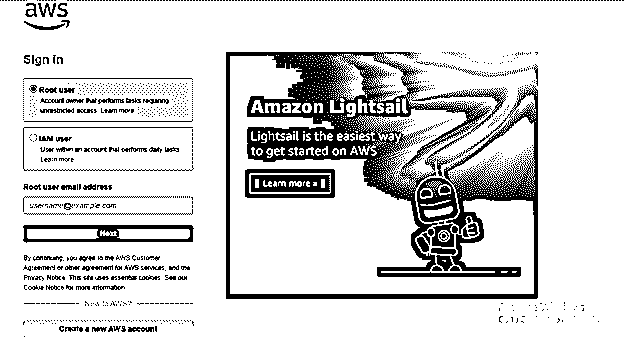

*   您将在 AWS 管理控制台中找到数据库部分，在这里选择 RDS 将显示 AWS RDS 控制台。

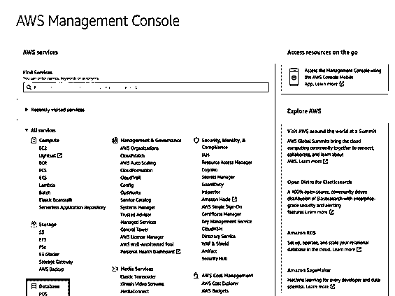

*   接下来，您需要选择想要在中创建 AWS MariaDB 实例的区域，可以从 AWS RDS 控制台的右上角访问该区域。

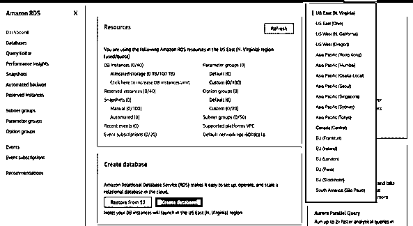

*   在“Create Database”部分下，单击“Create Database”按钮创建数据库。

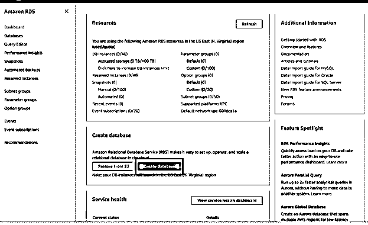

*   在初始部分下面，可以选择“简单创建”或“标准创建”选项。选择第一个选项“轻松创建”, AWS 将自动配置所有与安全、备份等相关的设置，而选择下一个选项“创建数据库”,用户需要手动创建所有这些设置。

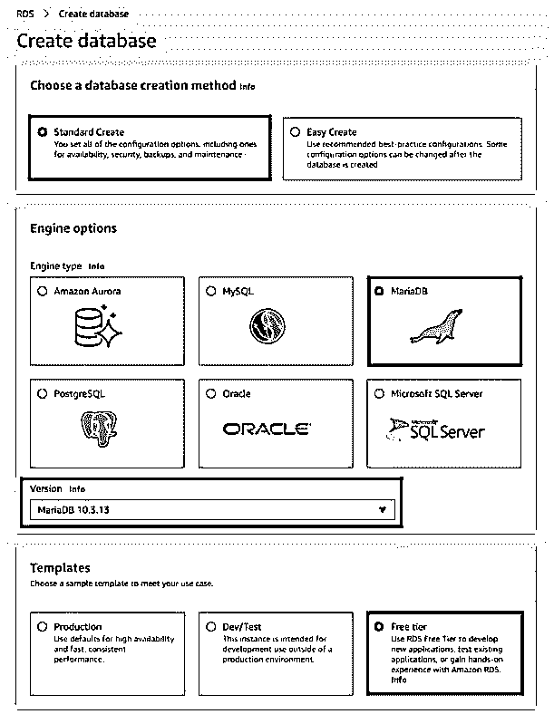

再次在引擎选项下，选择 AWS MariaDB 和部分版本，您可以根据需要选择当前版本或另一个版本。最后，在模板部分，用户可以选择开发一个生产实例，方法是选择选项生产作为任何模板，选择开发/测试实例作为开发环境，或者如果有人想了解 MariaDB AWS 如何运行或测试应用程序，可以选择模板自由层。最终评级取决于用户创建的实例的类型。

*   插入适当的数据库实例标识符，主用户名和密码用于 MariaDB AWS 实例。
*   根据需要，选择适当的数据库实例大小类。您可以在这里找到支持的实例类列表及其定价。

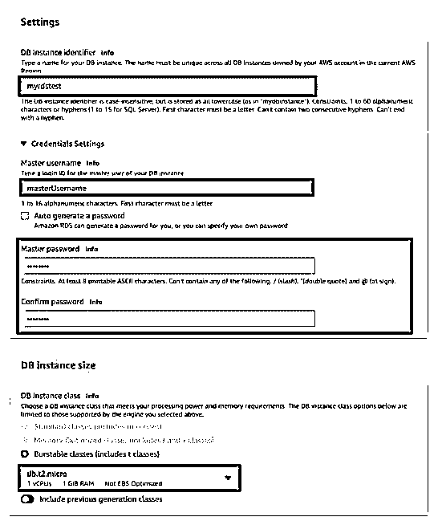

*   要分配空间，请选择存储部分下的存储类型，并确认自动缩放已启用。

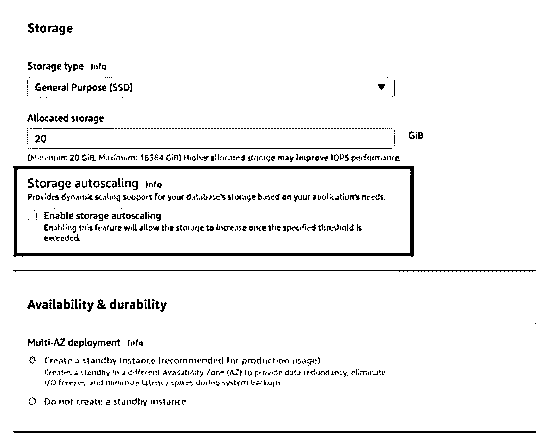

*   接下来，选择安全和连接选项，确认允许公共访问。

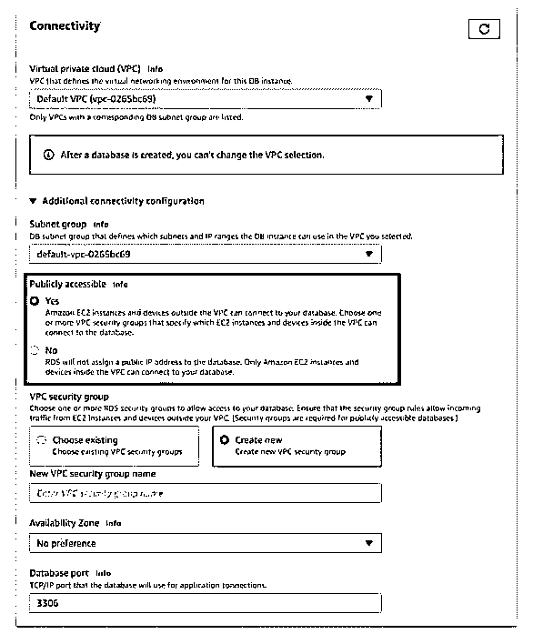

*   使用“创建数据库”按钮，将显示所选实例类型的预期费用。如果不需要更改，请单击创建数据库向前移动。

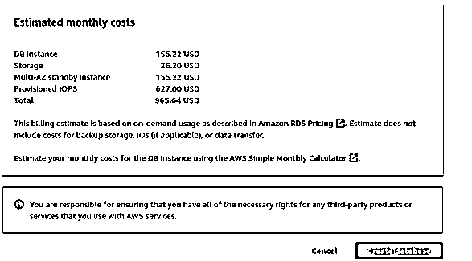

*   在 AWS 上，现在 MariaDB 实例将在几分钟后启动，然后您可以在按钮 View DB Instance Details 上查看完整的事实。

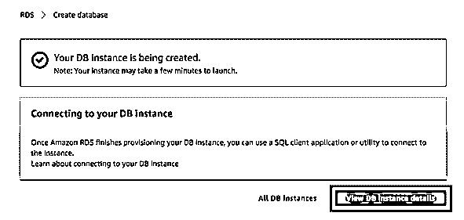

*   在这之后，您需要在一个本地系统上设置一个 SQL 客户机，它将连接到 MariaDB AWS。

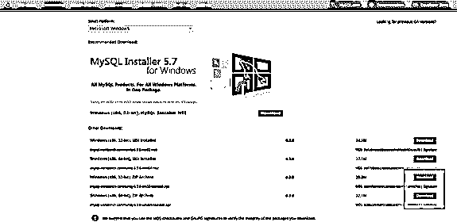

*   在本地系统上配置 MySQL Workbench 来启动它。
*   单击顶部菜单栏中的数据库，选择连接到数据库。

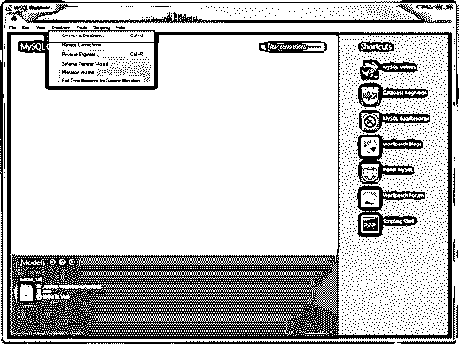

*   出现一个对话框，询问要连接的数据库的信息。

*   在 MariaDB AWS 的一个实例和 MySQL Workbench 之间创建了一个连接。因此，现在可以对其执行查询。

### 结论

*   在 Amazon AWS 上，可以使用 MariaDB SkySQL 访问云数据库服务。
*   通过 MariaDB AWS，人们可以优化业务价值，最大限度地降低成本，提高速度、弹性和效率。
*   MariaDB AWS 还揭示了发展前景，更快地发明并在安全合规的情况下做出卓越的判断——在单个集成的仓库中稳固地存储、分类和探索您的全部数据。

### 推荐文章

这是 MariaDB AWS 的指南。这里我们详细讨论用户在 AWS RDS 上安装 MariaDB AWS 的步骤。您也可以看看以下文章，了解更多信息–

1.  [MariaDB 变更表](https://www.educba.com/mariadb-alter-table/)
2.  [MariaDB 列表表](https://www.educba.com/mariadb-list-tables/)
3.  [MariaDB 复制](https://www.educba.com/mariadb-replication/)
4.  [MariaDB 导入 SQL](https://www.educba.com/mariadb-import-sql/)

