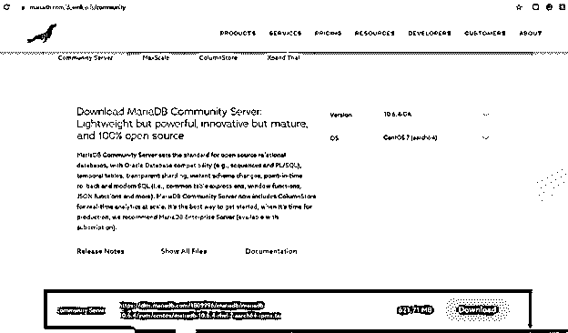
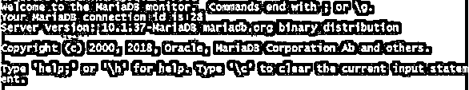

# MariaDB 客户端

> 原文：<https://www.educba.com/mariadb-client/>

## MariaDB 客户端简介

MariaDB 客户端是一个基于命令行的工具，用于客户端和 MariaDB 服务器之间的通信和交互，该服务器还包含 MariaDB Sky SQL 的数据库 MariaDB 服务。MariaDB 客户端与多个平台兼容，包括用于分布式 SQL 的 MariaDB 平台、智能交易(也称为 HTAP)、用于分析和交易的 MariaDB 平台。

除了命令行 MariaDB 客户端，还有许多其他工具可以作为 MariaDB 服务器的客户端，我们将在这里看到。在本文中，我们将了解 MariaDB 中可用的其他客户端工具列表、安装过程、连接到客户端以及使用一些客户端命令。

<small>Hadoop、数据科学、统计学&其他</small>

### 什么是 MariaDB 客户端？

MariaDB client 是数据库用户从客户端与 MariaDB 服务器建立连接和交互的工具。传统客户端是命令行工具，在命令行工具中，在命令提示符下键入命令来执行各种操作。除此之外，市场上还推出了许多工具，它们提供了出色的图形用户界面、智能编辑器、自动补全工具、语法检查器和许多其他功能，可以轻松地在 MariaDB 数据库服务器上执行操作。

### 安装 MariaDB 客户端

可以使用下面列出的各种方法来安装客户端。使用 YUM in Cent 操作系统和 RHEL 进行安装

为了在存储库中配置 YUM 的包，我们需要执行下面列出的命令

*   安装 yum–

*   使用以下命令从 MariaDB 存储库设置的 url 获取数据

*   回应并检查内容–

*   授予和分配设置 MariaDB 存储库的权限–

*   运行已安装的安装程序，完成配置–

*   安装客户端和相关的必需软件包

在 windows 操作系统中使用 MSI 安装客户端–

*   导航到链接，然后在链接的下载页面中搜索 MariaDB 的企业部分或 MariaDB 上的 community server 选项卡。

*   从页面上提供的版本下拉列表中选择所需版本。
*   根据您系统的属性，从页面上的操作系统下拉列表中选择 MS Windows 32 位或 64 位选项。
*   要下载 MSI 软件包，请单击下载按钮。
*   运行下载的文件。
*   单击“next ”,然后同意协议，再次单击“next ”,然后选择所有需要安装的组件。
*   如果您只需要安装标准软件包，那么取消选择所有其他软件包，然后点击安装。
*   该过程完成后，单击 Finish。

**连接 MariaDB 客户端**

当您在 MySQL 客户端和 MariaDB 服务器之间建立连接时，使用的默认命令如下所示

`mysql`

键入上述命令后，从配置文件中获取的默认参数如下

`Host os localhost`

User 是 windows 平台上 ODBC 的登录名或 Unix 的登录名。

**密码未作为参数**传递

客户端和服务器之间建立了连接，但是该连接没有连接到服务器上的特定数据库。–port =端口号地址，或者-P portNumber 可用于指定任何其他端口，如果不使用默认的 3306 端口地址，则可使用该端口进行连接。

**例如，当我们使用下面的命令-**

`mysql -h 235.26.8.108 -u payal -p password educbaDatabase -port 3000`

执行上述命令的输出如下所示，其中已经与配置在 3000 端口号的 MariaDB 数据库服务器建立了连接

用户 payal 将被认为提供的密码将被考虑在内，需要到达并建立连接的端口地址将是 3000，它应该是空的，在执行该命令之前可以使用。将与之建立连接的数据库是存在于我们的 MariaDB 数据库服务器中的 educbaDatabase。或者，也可以通过用大写 P 选项指定端口号来使用上述命令，如下所示

`mysql -h 235.26.8.108 -u payal -p password educbaDatabase -P 3000`

这导致了相同的输出和执行，如下所示

### MariaDB 的其他客户端工具

下表重点介绍了一些应用程序及其用法和功能——

| **MariaDB 客户端工具** | **描述** |
| **SQLyog 社区版** | 一个管理、创建和维护 MariaDB 数据库的工具。 |
| **DBeaver** | 它是一个 Java 图形用户界面客户端，非常方便，因为它可以跨所有数据库和平台工作，并且是免费的。 |
| **dbForge studio** | 我们可以开发我们的 MariaDB 数据库，它用于数据库的管理，被认为是一个通用的 MariaDB 客户端工具。 |
| **HeidiSQL** | 它在 Windows 操作系统上工作，支持 MySQL 和 MariaDB 的使用。 |
| **Navicat** | 它被用作 MariaDB 的前端图形用户界面。 |
| **黑板加** | 它是 MariaDB 客户端的一个现代的本地客户端，用于多个数据库。 |
| **月球建模器** | 通过使用这个用于 MariaDB 数据库的数据库设计工具，我们可以绘制 ER 图并可视化我们的数据库。 |
| **数据库工作台** | 这个环境支持许多数据库，MariaDB 就是其中之一。它用于开发数据库。 |
| **满腹牢骚** | 为了在 Mac 操作系统下管理 MariaDB 数据库，可以利用 MariaDB 客户端平台进行查询。 |
| **oclotusmariadb 客户端** | 它是专门为在 Linux 操作系统中管理和开发 MariaDB 数据库而设计和创建的。 |
| **续作 pro** | 该平台在 mac 操作系统上工作，并被用作数据库管理工具。 |
| **Php 我的管理员** | 这是一个基于 web 的管理工具，用于 MariaDB 数据库。 |
| **销售人员** | 这个工具是一个命令行界面，包括突出显示语法和自动完成功能。 |
| **omniDB** | 这是用于管理 MariaDB 数据库的集成开发环境，完全基于浏览器。 |
| **养蜂人工作室** | 这个平台可以跨操作系统工作，包括 Windows、Linux 和 Mac，是一个完全免费的开源客户端。 |
| **瓦伦蒂娜工作室** | 它是免费提供的，包括在 Windows、Linux 和 Mac 操作系统上运行的高级客户端功能支持。这在高级商业版本中也是可用的。 |
| **数据库可视化器** | 用于 MySQL、PostgreSQL、MariaDB 等数据库。它是一个跨平台的通用数据库，支持 MariaDB 客户端工具。 |

### 结论

MariaDB 客户端是一个用于与 MariaDB 客户端交互的工具，传统上以命令行格式提供。然而，许多新工具正在进入市场，它们提供了出色的用户界面和许多其他丰富的功能。

### 推荐文章

这是一个 MariaDB 客户端的指南。这里我们讨论 MariaDB 中可用的其他客户端工具的列表，安装过程，连接到 MariaDB 客户端。您也可以看看以下文章，了解更多信息–

1.  [MariaDB 变更表](https://www.educba.com/mariadb-alter-table/)
2.  [MariaDB 列表表](https://www.educba.com/mariadb-list-tables/)
3.  [MariaDB 与](https://www.educba.com/mariadb-with/)
4.  [MariaDB 创建用户](https://www.educba.com/mariadb-create-user/)

