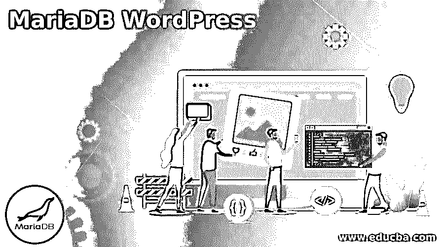
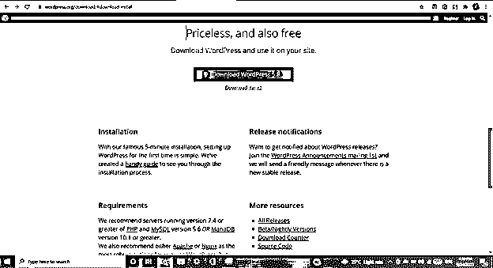
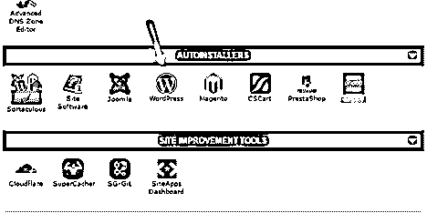
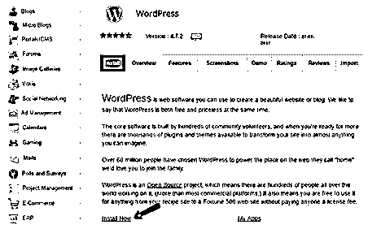
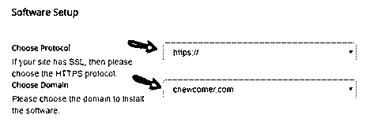
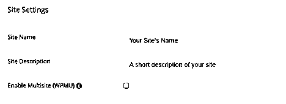
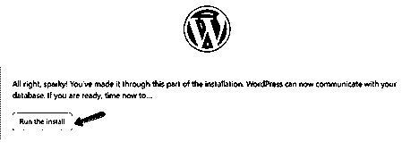

# MariaDB WordPress

> 原文：<https://www.educba.com/mariadb-wordpress/>

## MariaDB WordPress 简介

当在 WordPress CWS 开发和管理的应用程序或网站中使用 MariaDB 数据库时，使用 MariaDB WordPress。虽然有许多可用的数据库可供你使用，但你完全可以选择在你的网站上连接由 WordPress 管理和创建的数据库，它可以是云或本地或远程的，MySQL，MariaDB 或 PostgreSQL。

在这篇文章中，我们将看看 WordPress 的安装和下载过程，了解它的设置和运行，并简要讨论 WordPress 中的 MariaDB。

<small>Hadoop、数据科学、统计学&其他</small>

### 什么是 mariadb WordPress？

MariaDB WordPress 只不过是使用 MariaDB 数据库和用 WordPress 创建的应用程序。让我们来了解一下这两种技术。

MariaDB 是开发人员使用的最流行的关系数据库之一。这个数据库在过去的 30 年里一直在市场上销售，并且是完全开源的。MariaDB 的特性包括模式管理、实时监控、可伸缩的基础设施、准确完整的数据传输、完全自动化和实时数据传输设施。

另一方面，WordPress 是一个用于管理和创建网站的工具，它是完全开源的，正在成为在线市场上最流行的博客管理和网站管理系统之一。WordPress 的一些功能包括发布工具、用户管理、媒体管理、创建自己网站的灵活性、针对 SEO 的优化、简单性、易于安装和升级。

### 下载 WordPress

WordPress 的下载和安装既可以手动完成，也可以使用自动安装程序，如 cPanel、fantastic、mojo marketplate、quickinstall 和 softaculous。对于初学者，你可以使用自动安装程序下载并安装 WordPress。

对于专业人士来说，这是手动安装 WordPress 的指南，需要 5 分钟。为了下载最新版本的 WordPress 软件包，你必须首先从链接 https://WordPress.org/download/#download-install 中找到存档文件或文件夹，如下图所示

### 如何安装运行 WordPress？

让我们从两个方面来看安装过程

第一种方法是使用自动安装程序。

在你的自动安装程序中搜索 WordPress 图标或符号，它可以是上面列出的安装程序中的任何一个。屏幕看起来有点像这样——

第二步——点击 WordPress 图标来安装它，在下一页你可以看到一个安装按钮，不管你将使用哪个自动安装程序

选择的地方可能不同，但你一定会找到它。

步骤 3–您必须输入与您的域和协议相关的详细信息。如果您有 SSL 证书，您可以使用 https://或者您可以只使用 http://作为您的协议。你可以将域名留空，因为如果你这样做的话，WordPress 将被安装在你的域的主目录中，而不是其他目录或嵌套目录中。屏幕将如下所示

步骤 4–您必须提及与站点设置相关的详细信息，如站点名称、描述和复选框，以启用或禁用多站点 WPMU，如下所示

第五步——你必须创建一个有用户名和密码的用户，并被视为 WordPress 的管理员帐户。请务必记住这些凭据，因为它们在将来会很有用。

第 6 步–完成上述所有步骤后，您只需点击安装按钮。你可以导航到已安装的 WordPress，只需导航到你的 domain.com/wp-admin 的名字来登录 WordPress。

### 手动安装 WordPress

步骤 1-上传下载的解压缩文件–

您将需要一个 FTP 应用程序，如 FileZilla 或任何其他可以用来上传文件的应用程序。当你从上面显示的链接和屏幕上下载了 WordPress 之后，你可以提取并解压文件，然后上传到 public_html 文件夹或者一个类似于你的网站文件夹中的目录。

步骤 2–打开 cPanel–

与此同时，文件正在上传，你可以打开 cPanel，在那里你可以选择 MySQL for Maria db database with WordPress use 选项，并通过输入其名称创建一个新的数据库。

步骤 3–创建一个 MySQL 用户，您可以使用它来访问您创建的数据库。这可以通过简单地传递用户名和密码来完成。

步骤 4–记住，您必须将您创建的用户添加到您创建的数据库中，并为其分配所有权限。

步骤 5–输入您首选的语言，并输入您创建的数据库和用户详细信息。

第 6 步——在完成上述所有步骤后，你会看到一个如下所示的屏幕，上面有运行安装选项，点击它你就可以运行 WordPress 了。

要了解更多细节，你可以参考这个链接。

为 WordPress 数据库设置 MariaDB

如果您有一个现有的 WordPress 系统，并且您想将关系数据库管理系统从 MySQL 更改为 MariaDB，那么您将需要导出完整的 MySQL 数据并将其导入到 MariaDB 数据库中。数据库的迁移可以通过以下提到的步骤进行–

*   使用 backup 命令或 mysqldump 命令备份 MySQL 数据库。此后，您必须使用 mysqld stop 命令停止 MySQL 服务器。
*   应该使用 yum remove mysql 命令卸载 MySQL 客户端、服务器和相关的库。
*   为 MariaDB 创建一个远程存储库文件，从 wordpress 安装并连接到它。

MariaDB 与 WordPress 的设置与 MySQL 与 WordPress 的设置相同。如果你之前已经在你的系统上安装了 MariaDB，你可以简单地创建数据库，然后将该数据库的所有权限分配给你的 MariaDB 的用户，以便在你的 WordPress 网站上使用该数据库，如下所示

授予 educba_database 上的所有权限。*到由“samplePassword”标识的 payal @ localhost

### 结论 MariaDB WordPress

MariaDB WordPress 在使用 WordPress 平台创建的应用程序和网站中使用 WordPress 工具中的 MariaDB 数据库。我们已经看到了安装和运行 WordPress 以及在其中使用 MariaDB 数据库的步骤。

### 推荐文章

这是 MariaDB WordPress 的指南。这里我们讨论 WordPress 的安装和下载过程，了解它的设置和运行。您也可以看看以下文章，了解更多信息–

1.  [MariaDB 变更表](https://www.educba.com/mariadb-alter-table/)
2.  [MariaDB 列表表](https://www.educba.com/mariadb-list-tables/)
3.  [MariaDB 加密](https://www.educba.com/mariadb-encryption/)
4.  [MariaDB 导入 SQL](https://www.educba.com/mariadb-import-sql/)

