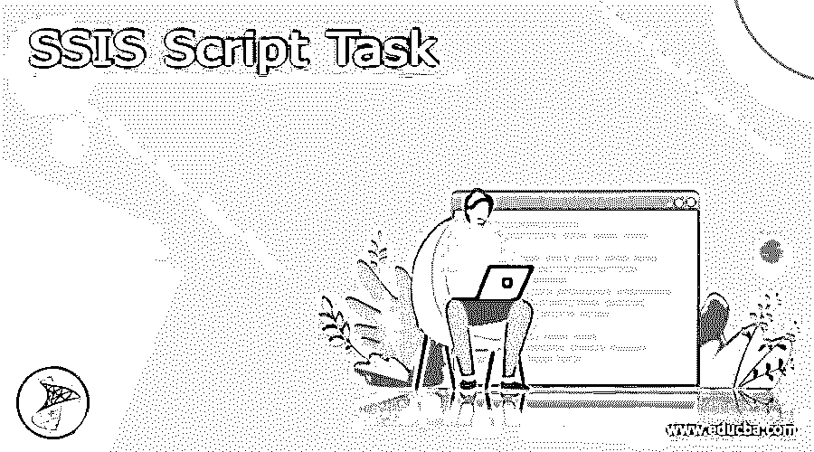
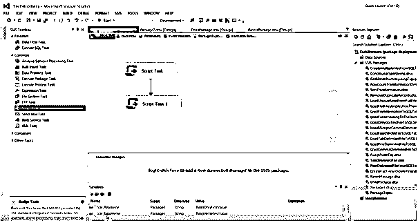
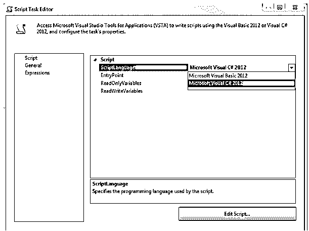
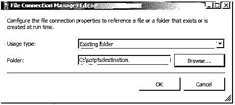

# SSIS 脚本任务

> 原文：<https://www.educba.com/ssis-script-task/>

## SSIS 脚本任务的定义

SQL Server Integration Services(SSIS)是一组用于执行数据连接的工具。它用于简化数据存储和解决复杂的业务问题。脚本任务使编码能够执行 SQL Server Integration Services 的内置任务和转换中无法访问的各种功能。脚本活动可以将功能集成到单个脚本中，而不是大量的任务和修改。

### SSIS 的剧本任务是什么？

扩展 SSIS 功能的最有趣的工具之一是 SSIS 脚本任务。我们可以使用脚本作业，用 C#或 VB 编写新功能。脚本任务(最著名的是 SSIS 脚本任务)使用脚本来增强包的功能。此外，它还执行 Integration services 任务没有涵盖的职责。数据流任务、数据准备任务、工作流任务、SQL Server 任务、Analysis Services 职责、维护任务、自定义任务和脚本活动是不同的 SSIS 任务。

<small>Hadoop、数据科学、统计学&其他</small>

脚本作业可用于指定的目标:

1.可以使用内置连接类型不支持的其他技术来访问信息。例如，脚本可以使用活动目录服务接口(ADSI)从活动目录中检索和收集用户名。

2.为每个包装建立一个生产力计数器。例如，当复杂或低效的作业正在运行时，脚本可以构造刷新的性能计数器。

3.确定某些文件夹是空的还是包含某一行，然后根据该数据改变包中的控制流。例如，如果数据包含零行，一个变量的值被设置为 0，并且优先约束计算该值，则文件系统作业不能复制该文件。

Integration Services 支持项目部署模型和旧包部署模型。使用项目部署方法，可以将他们的应用程序部署到 Integration Services 服务器上。现在编写脚本，我们已经将连接管理器添加到脚本组件中。Microsoft Visual C# 2010 或 Microsoft Visual Basic 2010 都是选项。选择左边的“脚本”标签，然后选择“编辑脚本”按钮，如下所示。

### 如何使用 SSIS 脚本任务？

脚本任务在包的控制流中使用。如果开箱即用的数据流任务中没有提供所需的功能，则可以将脚本任务用作整体实用程序组件。在控制结构中，使用脚本任务。当我们需要使用运行时程序逻辑来管理包的执行或执行一项任务(如获取或更新包内的变量)时，就会用到它。

IDE 中的脚本任务只有一个类，即 Script Main。将我们希望运行的代码放在入口点函数 Main()中。对其他函数或类的调用可以作为代码的一部分。每当我们出于某种原因需要更改入口点函数的名称时，在编辑器的 Script 选项卡上的入口点字段中输入名称。我们可以看到添加到项目中的汇编组件的集合，以及在 VSTA 联合生成的类脚本 Main 中设置的命名约定。脚本任务在某一点执行整个交付工作流中的程序代码。它只执行一次，直到我们将它放入循环容器或事件处理程序中。任务是活动的集合，我们将有许多类型的工作来完成各种类型的劳动。执行 SQL 任务是最常见的 SSIS 任务之一。这用于对关系格式的数据库运行 SQL 查询。

从 SSIS 的脚本任务运行 SSIS 包的步骤

–记下 SSIS 命名空间。

–仅使用 msdb 连接，访问 SSIS 目录。

–设置子包将获得的任何设置。

–选择包应该以同步模式还是异步模式运行。

接下来，打开脚本任务编辑器，如下所示:

### SSIS 脚本任务示例

使用 VB NET 脚本语言，了解如何在 SSIS 软件包的脚本任务中使用变量。

`Public Sub Main()
Dim fname As String
Dim Source As String
fname = Dts.Variables("User: Filename").Value.ToString()
Source = Dts.Variables("User::SourceFolder").Value.ToString()
Dts.Variables("User::FileFullPath").Value = Source + fname
MessageBox.Show(Dts.Variables("User::FileFullPath").Value.ToString())
// code
Dts.TaskResult = ScriptResults.Success
End Sub`

#### 实施例 2

让我们看看如何使用 C#代码在 SSIS 包中添加作业并执行它们。在这个例子中，我们将以编程方式构造包，并将文档从根目录复制到目标文件夹。

下一步是双击任务并设置属性，如下所示。dbdemo。系统文件任务会将备份复制到脚本目标文件夹。这个规则的一个例外是在脚本的开始，一旦我们包含适当的行来定义适用的名称空间。第一行是名称空间，后面是文件连接语句。

`using Microsoft.SqlServer.Dts.Tasks.FileSystemTask;
try
{
String sourcePath = @"C:\scripts\dbdemo.bak";
String destinationPath = @"C:\scriptsdestination";
Package myP = new Package();
Executable myExecutable = myP.Executables.Add("STOCK:FileSystemTask");
TaskHost myT = myExecutable as TaskHost;
myT.Properties["IsSourcePathVariable"].SetValue(myTaskHost, false);
myT.Properties["IsDestinationPathVariable"].SetValue(myTaskHost, false);
ConnectionManager myConn = myPackage.Connections.Add("FILE");
myConn.Name = "dbdemo.bak;
myConn.ConnectionString = sourcePath;
myConn.Properties["FileUsageType"].SetValue(myConn, DTSFileConnectionUsageType.FileExists);
myT.Properties["Source"].SetValue(myT, myConn.Name);
ConnectionManager myDestCon = myP.Connections.Add("FILE");
myDestCon.Name = "scriptsdestination";
myDestCon.ConnectionString = destinationPath;
myDestCon.Properties["FileUsageType"].SetValue(myDestCon, DTSFileConnectionUsageType.FolderExists);
myT.Properties["Destination"].SetValue(myT, myDestCon.Name);
myT.Properties["Operation"].SetValue(myT, DTSFileSystemOperation.CopyFile);
myT.Properties["OperationName"].SetValue(myT, "Copy File");
myT.Properties["OverwriteDestinationFile"].SetValue(myT, true);
DTSExecResult res = myP.Execute();
Dts.TaskResult = (int)ScriptResults.Success;
}
catch (Exception ex)
{
Dts.Events.FireError(18, "Failed Process", ex.ToString(), "", 0);
Dts.TaskResult = (int)ScriptResults.Failure;
}`

上面的代码创建了一个包含连接和流的包。随后将文件任务添加到相应的包中。接下来，将变量指定为 false。接下来，创建一个连接名和一个源路径来自动创建一个连接。最后，选择“执行包”以显示一条消息。

### 结论

SSIS 脚本作业及其在我们的集成服务包中的应用是本次研究的主题。此外，我们展示了这两种脚本特性的一些应用。脚本任务是完成日常任务的一个非常流行和有效的工具。我们学习了如何处理变量，如何用 try… catch 管理失败，以及如何在本文中使用循环。

### 推荐文章

这是一个 SSIS 脚本任务指南。在这里，我们讨论的定义，什么是 SSIS 脚本任务，以及如何使用 SSIS 脚本任务，以及例子和输出。您也可以浏览我们推荐的其他文章，了解更多信息——

1.  [SSIS](https://www.educba.com/ssis/)
2.  [塔伦德 vs SSIS](https://www.educba.com/talend-vs-ssis/)
3.  [SSIS 面试问题](https://www.educba.com/ssis-interview-questions/)
4.  [Google Now 助手](https://www.educba.com/google-now-assistant/)

