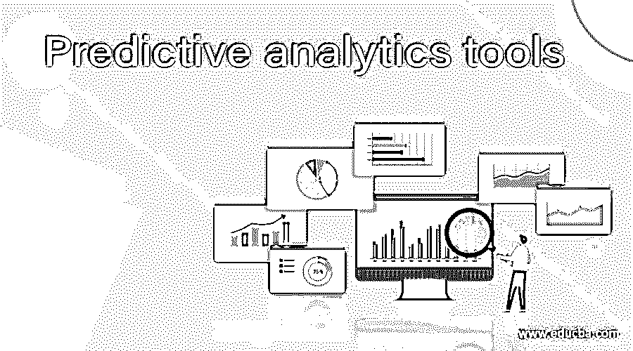

# 预测分析工具

> 原文：<https://www.educba.com/predictive-analytics-tools/>

## 预测分析工具简介

预测分析是数据分析的一个分支，基于历史和当前数据，对未来进行预测。这里的“未来”可以是下一分钟，一小时，一天，一个月，一年或者 10 年。用于进行预测分析的工具被定义为预测分析工具。这些可以是适用于本地机器的软件，也可以是作为云服务提供的软件。统计建模在这里被用来绘制洞察力，它保持尖锐的精度。预测分析是数据挖掘、大数据、统计建模和机器学习等所有数据相关操作发挥作用的地方，这些工具有助于使用实时数据实时实施这些操作

### 预测分析工具

有各种各样的工具，使用这些技术和操作可用的数据，可能是历史的或当前的。从中得出对未来的预测，这有助于制定前进的战略和计划。预测分析遍布法律、汽车、环境、学术研究和航空航天等领域。

<small>Hadoop、数据科学、统计学&其他</small>

我们理解了预测分析的基本含义。接下来是如何进行预测分析，其中第一步是选择最适合我们使用的工具。市场上有许多可用的工具。现在，让我们来看看目前行业中用于预测分析的一些顶级工具。

**1。IBM SPSS:**

SPSS 是社会科学统计软件包的缩写，这个工具用于非常广泛的数据分析。这个工具是 SPSS Inc .在 1968 年推出的，但是后来被 IBM 收购了。该工具用于市场、教育、卫生、政府机构等。用于数据分析和对未来可能性的估计。这一工具常用于分析调查中积累的数据。这是一种有助于预测分析的方法。该工具有四个关键功能，即统计、建模器编程、文本分析和视觉设计。虽然第一个功能有助于数据的统计分析，但 modeller 是开发人员如何在 SPSS 工具的帮助下设计和创建分析模型。文本分析功能有助于分析调查，并以一定的精确度得出未来可能性的结论。最后，可视化设计有助于将收集到的数据以饼图、条形图等可视化形式进行组合。

**2 .表**

Tableau 是一个以其分析能力和预测模型而闻名的工具。预测模型是在 Tableau 中实现的，在 Tableau 的帮助下，用户能够利用可用的历史和当前数据进行非常精确的预测。该界面非常用户友好，简单的拖放技术可用于创建可用数据的可视化表示。Tableau 的分析完全附加到前端，从而为初学者提供易用性。

**3 .Alteryx**

Alteryx 是另一个世界知名的工具，用于预测分析。它为用户提取、转换和加载数据提供了一个友好的界面。这个工具通常与 Tableau 结合使用，在 Tableau 中，Alteryx 转换并准备好可用的数据。这些数据作为输入发送到 tableau，tableau 反过来提供数据的可视化，并帮助预测未来趋势。因此，虽然 Alteryx 用于数据分析，但 Tableau 提供了数据的适当表示。Tableau 和 Alteryx 的界面都很简单，执行小任务时不需要任何专业帮助。

**4。SAS 分析**

SAS 是一个强大的商业智能软件，有助于报告、预测分析和可视化。它有许多很好的功能，如交互式仪表盘、洞察力、可视化数据探索、与微软工具的轻松集成。该工具非常敏锐地保持了数据的一致性，并使用该工具的相关组件(如安全性和共享元数据)进行集中管理。

**5。SAP 分析云**

该软件即服务(SaaS)工具也简称为 SAC，结合了规划、预测分析和计划的功能和属性。这个工具是 2015 年创建的，只是为了做规划。后来实现了商业智能层，随后在工具中引入了预测分析功能。这个工具有助于数据可视化和以报告为中心。对于预测，该工具中实施了一些人工智能技术，如聚焦重要特征，指出不符合模式的事情，利用当前数据预测未来，达到良好的精度水平。该工具实现了使用智能发现进行分析的机器学习。

**6。RapidMiner**

RapidMiner 是另一个工具，它专注于非程序员的数据分析。它提供了一个独立于平台的低代码接口，可以在许多操作系统上运行，如 iOS、Windows 等。它提供了数据可视化、数据分析、数据清理的基本属性。除此之外，它还提供了各种各样的机器学习技术，有助于预测分析。这是一个在单一平台上提供所有属性的工具。它允许用户创建机器学习的模型，然后将它们部署到 web 上，这样他们就可以在任何需要的时候从手机或桌面上访问它。这个工具对于没有编程知识的人来说非常有用。因此，它被分析师和研究人员广泛应用于研究领域。

因此，在本文中，我们了解了什么是预测分析，以及当前行业中的一些顶级工具。其目的是向最终用户提供基本概念，即预测分析意味着什么，以及如何根据历史数据观察来预测好的(或坏的)结果。根据上面列出的各种工具的功能，用户可以决定哪一种工具最适合他们，并使用相同的工具来分析他们的数据以进行预测。

### 推荐文章

这是预测分析工具指南。在这里，我们将讨论什么是预测分析，以及当前行业中的一些顶级工具。您也可以看看以下文章，了解更多信息–

1.  [预测分析技术](https://www.educba.com/predictive-analytics-techniques/)
2.  [预测建模](https://www.educba.com/predictive-modeling/)
3.  [什么是预测分析？](https://www.educba.com/what-is-predictive-analytics/)
4.  [网络分析工具](https://www.educba.com/web-analytics-tools/)

