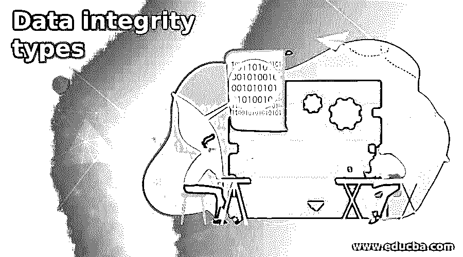

# 数据完整性类型

> 原文：<https://www.educba.com/data-integrity-types/>

## 数据完整性介绍

数据完整性处理数据维护。术语数据完整性将确保数据在其整个生命周期中保持一致和准确。设计正确的数据完整性生命周期模型是一项复杂而关键的任务。在这种情况下，各种过程会进入画面，如设计阶段、实施阶段、机器或系统的利用，如处理能力、读取或写入数据、存储等。为了确保这一点，数据完整性应该是一致的或者具有良好的数据质量。我们还需要做数据质量检查。但是在数据完整性方面，在处理数据级的任何事情之前，数据验证是强制性的。

### 数据完整性的类型

当我们说数据完整性时，我们需要确保数据应该是一致和准确的，即使它将在多个流程下流动。当用多个进程处理它时，数据应该更清晰，并且它将保存相同的值或保存有意义的数据。

<small>Hadoop、数据科学、统计学&其他</small>

数据完整性有不同的类型。根据项目或应用程序的需要，我们需要选择我们需要选择的数据完整性技术的类型。第一种数据完整性是物理完整性。第二种类型的数据完整性是逻辑完整性。物理和逻辑的完整性只不过是过程的集合。它还包括方法。它还将在关系数据库和分级格式中强加数据可靠性。

1.  #### Physical data integrity

在物理完整性方面，它是对数据准确性和完整性的保护。这将有助于检索和存储。当自然灾害来临时，如停电、黑客破坏数据库工作和功能、自然灾害来袭或物理数据完整性将受到损害。在某些情况下，其他问题的主机将无法处理应用程序程序员、数据处理经理、系统程序员、内部审计员等将帮助获得准确和正确的数据。在物理数据完整性方面，一般来说，我们不使用任何自动化的方式来实现数据完整性。我们主要集中在验证数据的物理帮助上。由此能够实现物理数据的完整性。在进行物理完整性检查时，由于人为错误，我们可能无法实现物理数据完整性。因此，我们需要优先考虑逻辑数据完整性，或者我们需要使用一些自动化来实现数据完整性。

2.  #### Logical data integrity

逻辑数据完整性将有助于保持数据不受影响。我们可以在 RDBMS 或不同的关系数据库中以不同的方式使用逻辑数据完整性。在物理数据完整性方面，由于数据的不一致性，有很多变化。但是在逻辑数据完整的情况下，数据出错的机会就少了。在这里，我们得到了一致性和价值数据。因此，当我们获得大量数据或者传入数据的频率太高时，我们需要使用逻辑数据完整性。这将有助于保持数据的一致性，并保持数据帐户，即使它将在输入数据流程生命周期下与不同的数据流程一起处理。

有四种不同类型的逻辑数据完整性，即

1.  实体数据完整性
2.  参考数据完整性
3.  域数据完整性
4.  用户定义的数据完整性

**实体数据完整性**

在逻辑数据完整性中，实体数据完整性基于主键的形成。这将有助于识别独有的价值点，并有助于识别数据片段。它还将确保数据不会多次列出(不会超过一次迭代)。没有应该为空的字段值。它将处理关系系统。它将按照表格格式存储数据。我们还可以链接不同的实体，并以不同的方式使用它们。

**参照数据完整性**

在引用完整性中，引用进程的顺序将有助于确保数据是一个存储，并且它将以统一的方式使用。完整性规则将被植入数据库格式。它还将确保数据级别上的添加、删除、适当更改。在相同的定义规则中，它还将包括有助于确保数据精确的约束，它将消除数据重复条目，禁止访问数据(它将执行作为和/或的操作),如果它不应用它。

**域名完整性**

在完整性领域，它将有助于收集一定数量的过程，这些过程将加强每一部分数据的完整性和正确性。它将在域级别进行数据检查。在概念中，域是由列级保存的满意值(它将包含满意值)。它还将包括约束条件。它还将包括限制数据类型、格式、到达、数量等的其他措施。

**用户定义的数据完整性**

用户定义的数据完整性将包括由客户端或最终用户形成的约束和规则列表。这将有助于创建符合需求或要求的规则。在某些情况下，引用、域完整性、实体等不能保护数据。因此，我们需要定义自己的策略和计划来保护数据。这就是我们使用用户定义的数据完整性的原因。

### 结论

我们已经看到了带有适当解释的“数据完整性”的未切割概念。数据完整性用于确保数据的正确性和一致性。即使要通过多个流程进行处理，数据也应该是一致的。有两种主要类型的数据完整性，即物理和逻辑完整性。

### 推荐文章

这是数据完整性类型的指南。在这里，我们讨论“数据完整性”的未切割的概念和适当的解释。您也可以看看以下文章，了解更多信息–

1.  [什么是数据泄露？](https://www.educba.com/what-is-data-breach/)
2.  [在数据结构中展开树](https://www.educba.com/splay-tree-in-data-structure/)
3.  [MariaDB 创建数据库](https://www.educba.com/mariadb-create-database/)
4.  [Trie 数据结构](https://www.educba.com/trie-data-structure/)

