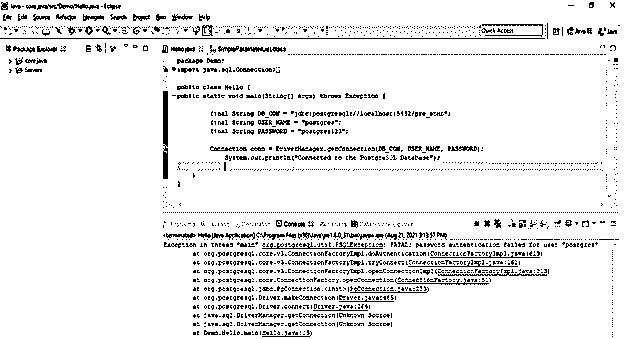
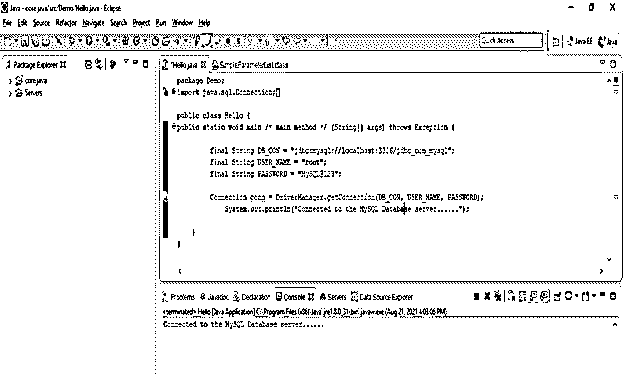
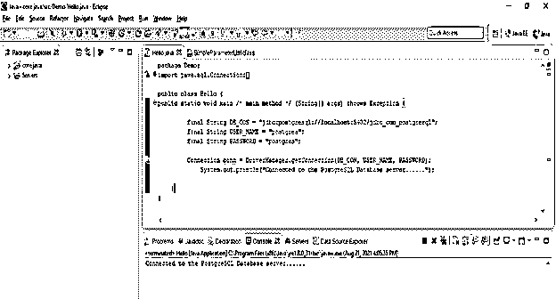
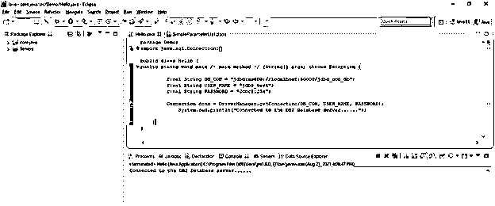

# JDBC 连接字符串

> 原文：<https://www.educba.com/jdbc-connection-string/>

## JDBC 连接字符串介绍

JDBC 连接字符串也称为 JDBC URL，它将指示数据库如何连接远程数据库服务器。使用连接字符串连接到数据库服务器后，连接将打开两个小时，两个小时后，它将与数据库服务器断开连接。在创建任何数据库的连接字符串时，主机名、数据库名、用户名、密码、单词和驱动程序名都是重要的参数。连接字符串是在 java 应用程序和数据库服务器之间建立连接的重要参数，JDBC URL 的连接字符串格式对于不同的数据库是不同的。

**语法:**

<small>Hadoop、数据科学、统计学&其他</small>

下面是连接字符串的语法。

*   【MySQL 数据库的 JDBC 连接字符串—

`Database_url = Jdbc:mysql://host_name/database_name
Database_driver = com.mysql.jdbc.driver
Database_username = name_of_user
Database_user_password = password_of_user`

*   【PostgreSQL 数据库的 JDBC 连接字符串—

`Database_url = Jdbc:postgresql://host_name/database_name
Database_driver = org.postgresql.driver
Database_username = name_of_user
Database_user_password = password_of_user`

*   **SQL server 数据库的 JDBC 连接字符串—**

`Database_url = Jdbc:microsoft:sqlserver//host_name:port_no/database_name = name_of_database
Database_driver = com.microsoft.jdbc.sqlserver.SQLServerDriver
Database_username = name_of_user
Database_user_password = password_of_user`

*   **DB2 数据库的 JDBC 连接字符串—**

`Database_url = Jdbc:as400://host_name/database_name;
Database_driver = com.ibm.as400.access.AS400JDBCDRIVER
Database_username = name_of_user
Database_user_password = password_of_user`

**JDBC 连接字符串的参数描述语法。**

*   **数据库 URL–**这就是用于将 java 应用程序连接到数据库服务器的数据库 URL。我们需要为不同类型的数据库使用不同的 URL。该参数包含数据库主机名的信息；数据库主机名就是数据库服务器的 IP。它还将包含数据库端口和数据库名称的信息。
*   **数据库驱动程序—**这是使用连接字符串连接数据库服务器时的一个重要参数。我们需要为不同的数据库定义不同的数据库驱动程序。这将包含数据库服务器的驱动程序信息。
*   **数据库用户名–**使用连接字符串连接到数据库服务器时，该参数也很重要。这是我们用来连接数据库服务器的数据库用户。我们使用的用户有权限连接到数据库服务器。如果没有连接权限，它将无法连接到数据库服务器。它将发出权限被拒绝的错误。
*   **数据库用户密码—**这是我们在连接字符串中使用的数据库用户的密码。我们需要在连接字符串中定义用户的正确密码，错误的密码会导致错误，即身份验证失败。

### 连接字符串在 JDBC 是如何工作的？

*   众所周知，数据库 URL、数据库驱动程序、数据库用户和数据库用户密码是创建连接字符串时的重要参数。
*   要连接数据库服务器，我们需要一个正确的连接字符串密码。
*   连接字符串中不接受不正确的密码。
*   下面的示例显示了我们需要正确的用户密码来使用连接字符串连接数据库服务器。
*   在下面的例子中，我们使用用户名作为 Postgres，密码作为 postgres123。但 postgres123 是用户 postgres 的错误密码。因此，它不会连接到数据库服务器，它会显示一个错误，因为使用用户作为 Postgres 的身份验证失败。

**代码—**

`public class Hello {
public static void main /* main method */ (String[] args) throws Exception {
final String DB_CON = "jdbc:postgresql://localhost:5432/pre_stmt";
final String USER_NAME = "postgres";
final String PASSWORD = "postgres123";
Connection conn = DriverManager.getConnection (DB_CON, USER_NAME, PASSWORD);
System.out.println ("Connected to the PostgreSQL Database");
} }`

*   在上面的示例中，我们使用 PostgreSQL 数据库来测试使用连接字符串到数据库服务器的连接。
*   我们使用数据库名称作为 pre_stmt 来检查数据库连接。
*   在为数据库服务器创建连接字符串时，我们需要使用正确的驱动程序类。
*   要将 java 应用程序连接到任何数据库服务器，我们需要加载 jar 文件。例如，要连接 MySQL 数据库，我们需要加载 mysqlconnector.jar 文件。
*   没有数据库连接器，我们无法连接到指定的数据库。当通过连接字符串连接到数据库服务器时，它将显示错误。
*   要连接 PostgreSQL 数据库服务器，我们需要 PostgreSQL-connector _ version . jar 文件。
*   我们需要按照应用程序使用的 java 版本加载指定的数据库驱动程序版本。

### 例子

以下示例显示了如下连接字符串。

**JDBC 连接字符串连接到 MySQL 数据库服务器—**

*   下面的例子显示了连接到 MySQL 数据库服务器的连接字符串如下。
*   我们使用用户名作为 root，密码作为 MySQL@123，数据库名作为 jdbc_con_mysql。

**代码:**

`public class Hello {
public static void main /* main method */ (String[] args) throws Exception {
final String DB_CON = "jdbc:mysql://localhost:3306/jdbc_con_mysql";
final String USER_NAME = "root";
final String PASSWORD = "MySQL@123";
Connection conn = DriverManager.*getConnection*(DB_CON, USER_NAME, PASSWORD);
System.out.println("Connected to the MySQL Database server......");
}
}`

**JDBC 连接字符串连接到 PostgreSQL 数据库服务器—**

*   以下示例显示了连接到 PostgreSQL 数据库服务器的连接字符串，如下所示。
*   我们使用用户名作为 Postgres，密码作为 Postgres，数据库名作为 jdbc_con_postgresql。

**代码:**

`class Hello {
public static void main /* main method */ (String[] args) throws Exception {
final String DB_CON = "jdbc:postgresql://localhost:5432/jdbc_con_postgresql";
final String USER_NAME = "postgres";
final String PASSWORD = "postgres";
Connection conn = DriverManager.*getConnection* (DB_CON, USER_NAME, PASSWORD);
System.out.println ("Connected to the PostgreSQL Database server......");
}  }`

**JDBC 连接字符串连接到 DB2 数据库服务器—**

*   以下示例显示了连接到 DB2 数据库服务器的连接字符串，如下所示。
*   我们使用用户名作为 jdbc_test，密码作为 Jdbc@1234，数据库名作为 jdbc_con_db。

**代码:**

`public class Hello {
public static void main /* main method */ (String[] args) throws Exception {
final String DB_CON = "jdbc:as400://localhost:50000/jdbc_con_db";
final String USER_NAME = "jdbc_test";
final String PASSWORD = "Jdbc@1234";
Connection conn = DriverManager.getConnection (DB_CON, USER_NAME, PASSWORD);
System.out.println ("Connected to the DB2 Database server......");
}
}`

### 结论

连接字符串用于从 java 应用程序连接到指定的数据库服务器。我们需要数据库主机名、数据库名、数据库用户名、数据库用户密码和数据库端口号，以便使用连接字符串连接数据库服务器。我们需要一个数据库驱动程序来连接指定的数据库。

### 推荐文章

这是一个 JDBC 连接字符串的指南。在这里，我们将讨论连接字符串在 JDBC 是如何工作的，并给出示例和输出。您也可以看看以下文章，了解更多信息–

1.  [甲骨文的 JDBC 驱动程序](https://www.educba.com/jdbc-driver-for-oracle/)
2.  [JDBC 司机](https://www.educba.com/jdbc-driver/)
3.  [PostgreSQL JDBC 驱动程序](https://www.educba.com/postgresql-jdbc-driver/)
4.  [JDBC 建筑](https://www.educba.com/jdbc-architecture/)

