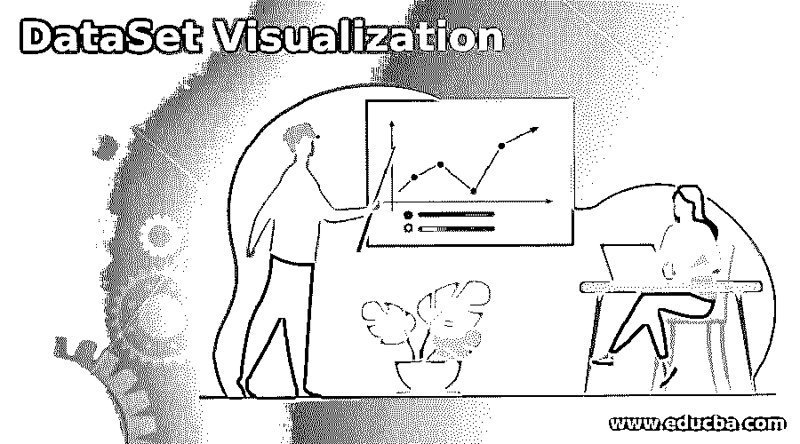
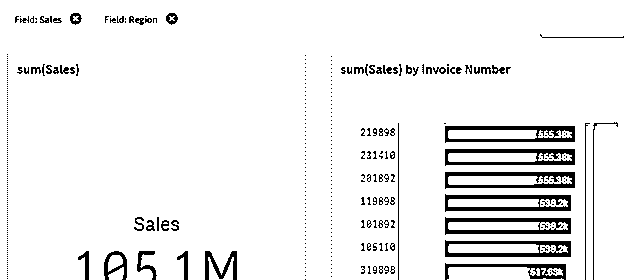
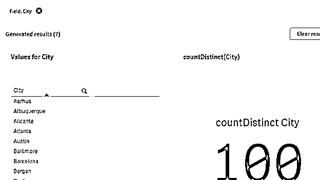
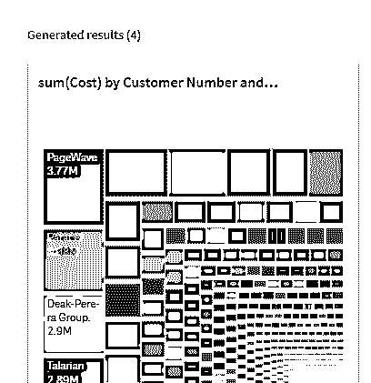

# 数据集可视化

> 原文：<https://www.educba.com/dataset-visualization/>

## 数据集可视化简介

数据集可视化是包含数据细节的数据的图形表示。这是用来分析数据，可以使用视觉元素，这是用来分析大和大量的处理数据，并尝试计算出结果。

通过数据可视化，我们可以有一组图案和颜色来帮助更容易和舒适地区分数据，通常，它就像一门艺术，使环境更容易，并允许具有特定功能的用户处理数据。

<small>Hadoop、数据科学、统计学&其他</small>

这种数据集可视化提出了许多处理海量数据的技术和工具，这些数据的加载和处理变得相对容易。这是可视化大数据并从中获益的最重要工具。

在本文中，我们将尝试分析使用数据集可视化的各种方法及其特性。

让我们试着更详细地了解数据集可视化。

### 数据集可视化的方法和类别

让我们试着理解数据可视化中的各种类别和方法。该方法包括用于数据可视化的各种步骤

1.  对比图
2.  条形图
3.  线条图
4.  圆形视图
5.  时间表
6.  文本表格
7.  瀑布图
8.  地图
9.  桌子
10.  指示器

可视化可以进一步分类为

**太阳穴:-**

当数据集是线性和一维的时，使用这种类型的可视化技术。这就像我们将会有一个线性的相关性，可以用数据可视化。时间部分的一些示例包括:-散点图、时间线、线形图。

**分级:-**

处于特定层次或顺序的数据集属于这种可视化技术。可视化有一定的顺序，定义了数据集连接方式的特征。分层部分的一些例子是:–树、环。

**网络:-**

一些数据集在聚类内或在可用于属于网络 1 类别的可视化的区域边界内以网络模式相互连接。网络部分的示例有:-文字云、矩阵图。

**多维:-**

顾名思义，多维数据集是指具有多个维度的数据集，这有点像 2D 或 3D 可视化，我们可以根据某个轴来绘制和可视化数据，显示未来的相关性。

一些例子是:-饼状图，文氏图。

**地理空间:-**

这种类型的数据集与位置数据有关，这些数据分布在不同的位置，可以相应地绘制和可视化。

这方面的一些例子是:-流量图，密度图。

### 数据可视化的重要性和职业范围

数据可视化有一个很大的职业范围，一个人可以是数据分析师，可以自由地工作，播放和可视化来自给定数据集的数据。

数据可视化工程师的需求与日俱增，可进一步分为业务分析师和数据分析师。

工程师根据提供的数据集设计和开发解决方案，并尝试从给定的数据集中识别模式。他们拥有用于进一步数据分析的各种工具和商业智能软件的知识和使用权。

BA 分析业务报告和数据分析，他们还对可视化模型方面的伟大事业做出了贡献，例如生成仪表板、构建报告、发布报告等等。他们有权创建可以提供给客户或端到端业务的仪表板。

数据分析师也有很大的职业范围，他们从事数据的报告和可视化工作，他们对从各种组织收集的数据进行分析，并尝试从中创建报告。

研究人员和数据科学家提出了各种新的可视化类型和工具，以更好地理解数据。这是提供任何复杂信息的最聪明的方式，并试图从中获得有价值的见解。

他们是业内最聪明的大脑，负责端到端的报告创建和使用数据的创建。这些数据可能非常庞大，需要各种工具和对数据的暴露。市场上有一些更智能的工具，它们的出现为数据可视化创造了一个伟大的职业生涯。一个具有处理数据的知识和机制的人可以对数据进行所有的模式分析，也可以在职业生涯中取得进步。

### 例子

有一些数据可视化工具可供使用。它提供了一种绘制数据的机制，这些数据中的列可用于分析并从中获得可视化通道。

我们将尝试分析加载到一个可视化工具中的销售数据，并尝试从各种参数中分析数据。

按发票编号显示销售总额:-

让我们尝试从销售数据中计算出不同的城市值。

按客户编号计算总数:-

这些是可以使用并可以进一步分析的数据可视化的一些示例。

### 结论

本文介绍了数据集可视化的概念。通过各种例子，我们试图理解数据集可视化的职业水平和重要性。各种方法展示了数据可视化是如何实现的，以及相关的步骤。

我们试图了解数据可视化的方法和类别，以及职业重要性如何显示这可以成为一个更好和永久的职业。

### 推荐文章

这是数据集可视化的指南。在这里，我们讨论数据可视化的方法和类别以及职业重要性。您也可以看看以下文章，了解更多信息–

1.  [火花数据集](https://www.educba.com/spark-dataset/)
2.  [机器学习数据集](https://www.educba.com/machine-learning-datasets/)
3.  [什么是数据泄露？](https://www.educba.com/what-is-data-breach/)
4.  [Teradata 联合](https://www.educba.com/teradata-coalesce/)

