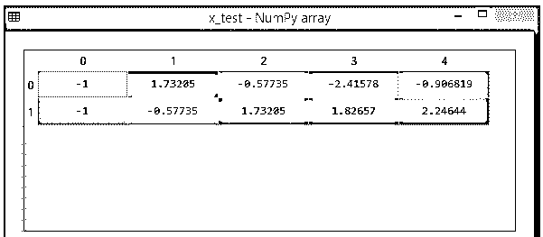

# 数据集预处理

> 原文：<https://www.educba.com/dataset-preprocessing/>

## 数据集预处理简介

在现实世界中，数据经常是不完整的:它缺少属性值，缺少相关的特定属性，或者它只包含聚合数据。错误或异常值会使数据变得嘈杂。不一致的:代码或名称不一致的。Keras 数据集预处理实用程序帮助我们将原始光盘数据转换为 tf。数据文件。数据集是可用于训练模型的数据的集合。在本主题中，我们将学习数据集预处理。

### 为什么要使用数据集预处理？

通过预处理数据，我们可以:

<small>Hadoop、数据科学、统计学&其他</small>

*   提高我们数据库的准确性。我们删除任何由于人为错误或问题导致的错误或缺失的价值。
*   应该提高一致性。当存在数据差异或重复时，结果的准确性会受到损害。
*   尽可能使数据库完整。如果有必要，我们可以填补缺失的属性。
*   数据应该是平滑的。我们使这种方式更容易使用和解释。

我们几乎没有数据集预处理工具:

1.  图像
2.  文本
3.  时间序列

### 导入数据集预处理

在 Python 中导入数据集的步骤:

1.  **导入适当的库**

每次我们建造一个新的模型，我们都需要进口熊猫和熊猫。Pandas 用于导入和处理数据集，而 NumPy 是一个包含数学运算的库，用于科学计算。

`import matplotlib.pyplot as mpt`

2.  **导入数据集**

数据集采用. csv 格式。CSV 文件是由表格数据组成的纯文本文件。文件中的每一行代表一个数据记录。

`dataset = pd.read_csv('Data.csv')`

我们将使用 pandas 的 iloc(用于修复选择的索引)来读取列，它有两个参数:[行选择，列选择]。

`x = Dataset.iloc[:, :-1].values`

让我们有以下不完整的数据集

| **名称** | **支付** | **管理者** |
| 美国汽车协会 | Forty thousand | 是 |
| 日本商务改善协会(Better Business Bureau) | Ninety thousand |  |
|  | Sixty thousand | 不 |
| 控制台控制电路(Console Control Circuits) |  | 是 |
| DDD | Thirty thousand | 是 |

如我们所见，表中几乎没有丢失的单元格。要满足这些要求，我们需要遵循以下几个步骤:

`from sklearn.preprocessing import Imputer`

接下来导入一个类

`Using not a number (NAN)
A=pd.DataFrame(np.array())
// Using Missing Indicator to fit transform.`

按训练集和测试集拆分数据集。

安装库:

`from sklearn.cross_validation import train_test_split`

`A_train, A_test, B_train, B_test = train_test_split(X, Y, test_size = 0.2)`

特征缩放

`from sklearn.preprocessing import StandardScaler
scale_A = StandardScaler()
A_train = scale_A.fit_transform(A_train)
A_test = scale_A.transform(A_test)`

**例#1**

`# importing libraries
from sklearn.preprocessing import StandardScaler
import pandas
import NumPy# link for the required dataset
url = "https://archive.ics.uci.edu/ml/machine-learning-databases/pima-indians-diabetes/pima-indians-diabetes.data"
#  parameters
names = ['sno', 'sname', 'age', 'Type', 'diagnosis', 'in', 'out', 'consultant', 'class'] dataframe = pandas.read_csv(url, names = names)
array = dataframe.values
//Array element for inputs
X = array[:, 0:8] Y = array[:, 8] scaler = StandardScaler().fit(X)
rescaledX = scaler.transform(X)
numpy.set_printoptions(precision = 3)
print(rescaledX[0:6,:])`**T2】**

**解释**

所有的数据预处理过程都组合在上面的代码中。

**输出:**

### 要素数据集预处理

1.  异常值在预处理期间被移除，并且特征被缩放到等效范围。

**数据预处理的步骤**

1.  **数据清洗:**数据中可以包含很多无用的、缺失的信息。执行数据清理是为了处理这个组件。它需要处理丢失的数据、有噪声的数据等等。数据清理的目的是为机器学习提供简单、完整和明确的示例集合。

**a)数据缺失:**当数据中的部分数据缺失时会出现这种情况。可以从多方面探索。

这里有几个例子:

忽略元组:只有当数据集很大并且一个元组中缺少许多值时，这种方法才适用。

填空:完成这个挑战有几种选择。您可以选择手动填充缺失值、使用属性平均值或使用最可能的值。

**b)有噪声的数据:**有大量噪声的数据

术语“噪声”是指大量额外的无价值数据。

数据记录的副本或半副本；对某些研究没有价值的数据段；每个变量的不必要的信息字段就是这样的例子。

可以用以下方式处理:

**宁滨的方法:**

这种方法使已经排序的数据变得平滑。数据被分成大小相等的部分，并且使用各种方法来完成该过程。

**回归:**

回归分析有助于确定哪些变量有影响。为了平滑大量的数据，使用回归分析。这将有助于关注最重要的品质，而不是试图检查大量的变量。

**聚类:**在这种方法中，需要的数据被分组到一个簇中。离群值可能不会被注意到，或者它们可能落在聚类之外。

2.  **数据转换**

我们已经开始用数据清理来修改我们的数据，但是数据转换将启动将数据转换成正确格式的过程，以便进行分析和其他下游操作。这通常发生在以下一种或多种情况下:

*   聚合
*   正常化
*   功能选择
*   [数]离散化
*   概念层次的创建

3.  **数据还原:**

数据挖掘是一种处理大量数据的策略。当处理大量数据时，分析面临着相当复杂的问题。我们采用数据简化技术来解决这个问题。其目标是提高存储效率，降低分析费用。数据缩减不仅简化和改进了分析，还减少了数据存储。

以下是数据简化中涉及的步骤:

**属性选择:**像离散化一样，可以帮助我们将数据分成更小的组。它本质上结合了标签或特质，如男/女和经理，创造了一个男经理/女经理。

**减少数量:**这将有助于数据存储和传输。例如，回归模型可用于仅采用与手头调查相关的数据和变量。

**降维:**这也有助于通过减少使用的数据量来改进分析和下游流程。像 K-最近邻这样的算法使用模式识别来合并相似的数据并使其更有用。

### 结论–数据集预处理

因此，到最后，我们已经详细了解了数据集处理技术及其库。数据集应该以这样的方式组织，它可以并行运行许多机器学习和深度学习算法，并选择最佳的一个。

### 推荐文章

这是数据集预处理的指南。这里我们详细讨论数据集处理技术和它们的库。您也可以看看以下文章，了解更多信息–

1.  [火花数据集](https://www.educba.com/spark-dataset/)
2.  [机器学习数据集](https://www.educba.com/machine-learning-datasets/)
3.  [Trie 数据结构](https://www.educba.com/trie-data-structure/)
4.  [Teradata TPT](https://www.educba.com/teradata-tpt/)

