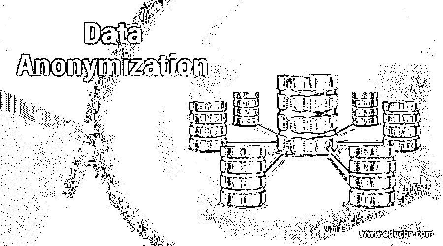

# 数据匿名化

> 原文：<https://www.educba.com/data-anonymization/>

## 数据匿名化简介

数据匿名化被描述为个人信息被不可逆转地改变的过程，在该过程中，任何人都不能被单个数据控制者间接或直接识别，也不能与第三方合作。它可以允许跨任何受限区域传输数据，并在任何部门或机构之间共享，以限制任何意外关闭的风险。在少数情况下，它允许事后匿名和分析评估。本文解释了数据匿名化的重要性、局限性和优势。

### 什么是数据匿名化？

它是通过加密或删除与任何个人相关的标识符来提取保存的数据，从而保护数据或任何敏感数据的方法。例如，用户可以通过数据匿名化技术执行个人识别信息，如安全号码、社会名称和地址，以保留信息并保持来源的匿名性。

<small>Hadoop、数据科学、统计学&其他</small>

尽管用户删除了标识符数据，但入侵者可以应用去匿名技术来追溯该过程。由于数据是通过多种资源传输的，很少有信息向公众公开，因此可以使用去匿名化方法进行交叉引用，以提取数据源和个人信息。

GDPR 策略概述了一组受约束的规则，以保存用户信息并创建对公众透明的视图。虽然 GDPR 很严格，但它允许多个企业在没有任何同意的情况下收集匿名数据，并将其用于任何目的，并无限期保存。只要组织从该信息中删除所有标识符，它就保持不变或不变。

### 数据匿名化的重要性

数据匿名化支持企业通过数据屏蔽敏感属性来管理 PII 私有数据，即使他们从客户支持、测试数据、分析见解、供应商外包的目的等中提取商业价值。此外，GDPR 的困难要求提供了一个数据类型的标准基准来保存或不管企业处理器是否存储关于欧盟公民的详细信息的 PII。GDPR 将个人数据描述为与可识别或已经识别的数据主体相关联的任何数据。

这些信息包括基本的可识别数据，如地址、姓名、身份证号码。源 web 数据包括 IP 地址、cookie 信息、位置和 RFID 标签。它还包括生物特征数据、遗传信息、政治观点、民族和种族信息、性取向和健康信息。当 CCPA 推出时，它将涵盖所有更广泛的个人信息类别。企业负责保护数据，以识别、关联、描述和链接间接或直接与特定客户或家庭功能相关的信息，并通过一些分配开展业务。

根据业务的不同，所涉及的数据类型可以是车辆号码的识别，以从移动塔传输数据，也可以在物联网家庭智能应用中启用。许多企业必须遵守行业规定的法规。保险公司 Independence health group 是一个最好的例子，它展示了一个组织如何成功地应用与医疗保健相关的数据匿名方法。该健康团体在 HIPAA 下注册，严格遵循美国医疗保健信息法规。

该组织还必须将 830 万人投保的数据保存在其中，以避免任何信任问题。无论如何，被保险人还需要与第三方数据处理合作伙伴携手合作，并使外包开发商和内部员工能够在相关数据上测试应用程序。该公司使用动态数据屏蔽流程来测试和构建高质量的应用程序，以便在没有任何未经授权的访问风险的情况下处理数据。大量数据包括出生日期、姓名和社会保障值，以通过动态数据屏蔽来识别个人和计费记录。

### 数据匿名化的优点和缺点

这是一种展示公司如何在具有复杂数据隐私标准的环境中执行和发现其保护敏感数据、个人和机密信息的责任的方法，它还取决于全球客户的位置。将敏感信息托付给行业的客户会考虑信任网站上的任何违规行为，并将他们的业务转移到另一个方向，以获得更好的结果。如果一组行业调查显示，85%的客户不准备与有任何安全问题的企业进行任何交易。只有 15%的人认为大部分组织承担了更多的责任来管理 PII 数据。

数据安全性的提高通过数据屏蔽方法指导数据匿名化过程，并对敏感数据进行分类。它提供了多种信息方法，确保了企业的类可扩展性和有效性。数据屏蔽方法和数据匿名化方法是传统安全解决方案的一部分，可以保护数据并充当数据的强大防火墙，无论数据在云上还是在本地，也可以在混合环境中。它还为 It 团队提供了最大的安全性和可见性，让他们了解信息是如何在企业中处理、访问、使用、部署和移动的。

GDPR 的过程要求网站在用户输入设备 ID、IP 地址和 cookies 等个人信息时，必须征得用户的同意。收集匿名信息并从任何数据库中删除标识符，以限制获取值的能力并将其用于用户数据。例如，这些匿名信息不适合计算营销工作或对用户体验进行任何个性化。

### 结论

数据匿名化并不是为了避免任何风险问题，而是为了提高数据质量和数据治理。凭借可信和干净的信息，用户可以优化应用程序，以保护大数据隐私和分析，并加速云的工作负载，云通过开放安全数据来管理数字数据，以实现新的商业价值。

### 推荐文章

这是一个数据匿名化的指南。在这里，我们讨论数据匿名化的重要性以及优点和缺点。您也可以看看以下文章，了解更多信息–

1.  [数据流程图](https://www.educba.com/data-flow-diagrams/)
2.  [数据库中的数据存储](https://www.educba.com/data-storage-in-database/)
3.  [集中式数据库](https://www.educba.com/centralized-database/)
4.  [Java 中的数据类型](https://www.educba.com/data-types-in-java/)

