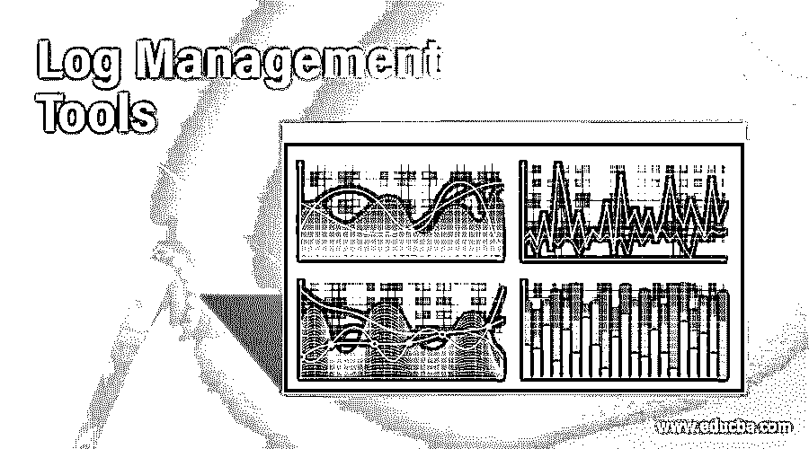

# 日志管理工具

> 原文：<https://www.educba.com/log-management-tools/>

## 日志管理工具简介

以下文章概述了日志管理工具。原木是不容易处理的，但是任何生产方法的一个重要方面仍然是重要的。如果你有一个困难的问题，使用日志管理工具比通过你的设备网络将文本文件运行成无止境的循环要好得多。日志管理的最大好处是，它允许您在一个问题中确定任何应用程序或软件错误的根本原因。

这同样适用于安全问题，下面的许多方法将帮助 IT 团队在攻击发生之前阻止它们。另一个考虑因素是您用户的全球应用程序的可视化概述——将所有这些重要信息集中在一个控制面板上会显著提高您的工作效率。最后，在选择满足您需求的最佳日志管理方法时，请检查您当前的业务流程。决定你是否仍然是一个试图从日志中删除基本细节的小企业，或者打算进入公司阶段——这将需要更有效的日志系统和生产管理软件。

<small>Hadoop、数据科学、统计学&其他</small>

### 日志管理工具列表

以下是一些日志管理工具列表

#### 1.Splunk

Splunk 提供一些产品:商务、云、大块和轻量级。Splunk Enterprise 允许您从计算机产生的数据中获取有用的战术信息。任何用户都可以轻松地发现和分享各种高效搜索、显示和预打包资料的体验。Splunk 还提供了专门的图表和仪表板，以及一个允许拖放可视文件的透视界面。

#### 2.记录节奏

LogRhythm 是日志管理和事件管理的不同方法。这意味着购买和管理两种不同的工具，而 LogRhythm 将两者集成到一个集中集成的框架中，不仅增强了日志管理，还增强了日志分析、事件管理和报告。尽管如此，LogRhythm 也提供了一个网络服务器安装处理程序。代理收集日志数据并将其发送到设备的日志管理器。它提供了结构化的日志记录，因此开发人员可以记录对象以及按属性进行搜索。

#### 3.Logscape

Logscape 是一个企业即用型大规模分析平台，旨在查看时间序列上的机器数据。如果您的系统创建数据或从外部来源删除数据，那么计算机生成的任何类型的数据都可以轻松地检查、过滤并显示在交互式仪表盘上。

#### 4\. Fluentd

Fluentd 是一个开源的数据收集器，使数据收集和处理与被使用和更好地理解数据相结合。Fluentd 在这一领域的成功已经得到了证明—其最大的用户现在从 5000 多台服务器上收集日志，每天 5 TB 的数据，在高峰时间每秒处理 50，000 条消息。所以，效率是它被使用的主要原因。此外，Fluentd 配备了一个多功能插件框架，使社区能够增长。

#### 5.灰色日志

Graylog 是一个开源程序，声称可以执行 Splunk 功能。Graylog 是用 Java 和 Ruby-on-rails web 接口编写的。Graylog 不能直接从 Syslog 文件中读取；相反，把你的信息直接发送到 Graylog 就不那么方便了。但是，与 Splunk 和类似的搜索功能一样，您可以搜索您的结果。

#### 6.斯卡利尔

Scalyr 是一名前谷歌工程师，他开发了一款服务器监控工具。它结合了日志数据、设备指标、网站监控和担忧。它不需要太多的空间。你必须在一个地方拥有这些知识。奇怪的是，控制模块也被带了进来。日志和对应用程序控制其他方面的掩饰是其他日志管理方法。

#### 7.纸色纸

Papertrail 可以添加文本日志文件和系统日志信息。web 界面提供了多功能的团队范围的访问。Papertrail 可在 45 秒内轻松启用，可在许多服务器上传播，并且易于清理。可悲的是，相对于其他竞争对手，他们的免费计划仅为 100MB /月。

#### 8.追溯

Retrace 是日志监控和警报的常用工具。它支持 NLog、log4net、logback、log4j 等日志框架。此外，它还提供全文搜索和日志跟踪。

使用这一套所有开发人员都需要的主要工具，包括日志记录、错误跟踪和代码级性能、重置代码、查找 bug 或提高应用程序性能。

### 结论

这些都是常用的工具和资源。一些解决方案是更广泛的 SIEM 网络的一部分，该网络提供更复杂的分析、长期存储和数据保护，而其他解决方案可以用作任何 SIEM 解决方案的独立设备。根据您公司的要求，您可以选择最适合您的目的的日志管理系统。

### 推荐文章

这是一个日志管理工具指南。在这里，我们讨论一些日志管理工具和资源的列表，以满足您的需要并满足您公司的要求。您也可以看看以下文章，了解更多信息–

1.  [什么是 Splunk？](https://www.educba.com/what-is-splunk/)
2.  [基巴纳替代品](https://www.educba.com/kibana-alternatives/)
3.  [Raid 日志](https://www.educba.com/raid-log/)
4.  [Laravel Errors](https://www.educba.com/laravel-error/)

