# 基巴纳指数模式

> 原文：<https://www.educba.com/kibana-index-pattern/>

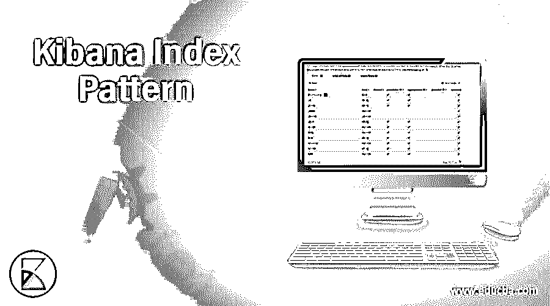

## Kibana 索引模式介绍

由于已经创建了 Elasticsearch 服务器索引，因此 Apache 日志被推送到那里，我们的下一个任务是配置 Kibana 来读取 Elasticsearch 索引数据。首先，我们希望使用其默认端口号打开 Kibana:http://localhost:5601。要将 Elasticsearch 索引数据添加到 Kibana，我们必须配置索引模式。这将是使用 Elasticsearch 数据的第一步。在本主题中，我们将学习基巴纳指数模式。

### 创建索引模式

要创建新的索引模式，我们必须遵循以下步骤:

<small>Hadoop、数据科学、统计学&其他</small>

1.  首先，单击左侧菜单中的管理链接。
2.  然后，单击“索引模式”选项卡，它就在“管理”选项卡上。这将打开一个新的窗口屏幕，如下图所示:

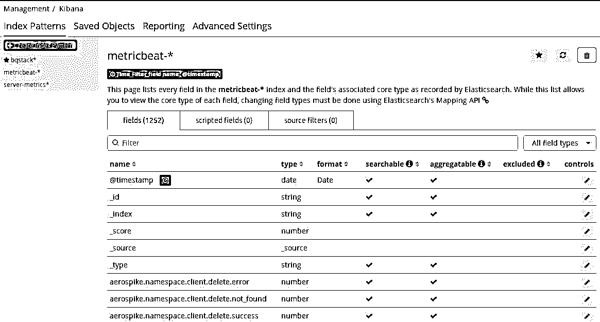

上面的屏幕截图向我们展示了基本 metricbeat 索引模式字段、它们的数据类型以及其他详细信息。这个 metricbeat 索引模式已经作为一个示例创建。

3.  现在，我们必须单击索引模式选项，它就在索引模式选项卡的下面，以创建一个新的模式。这将打开如下所示的新窗口屏幕:

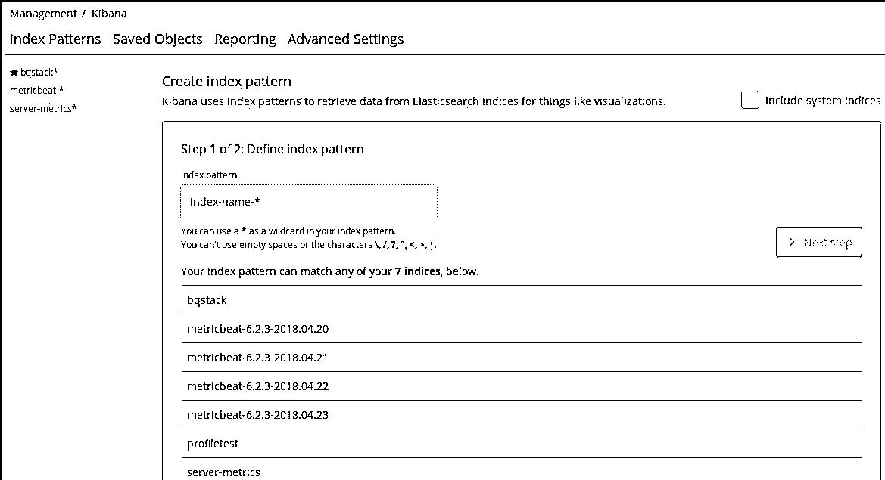

前面的屏幕截图显示了索引创建模式的第 1 步(共 2 步)。

4.  在这个屏幕上，我们需要在搜索框中提供索引名称的关键字。在搜索框下方，显示了不同的 Elasticsearch 索引名称。
5.  现在，如果您想添加 Elasticsearch 的 server-metrics 索引，您需要在搜索框中添加这个名称，这会给出成功消息，如下面的截图所示:

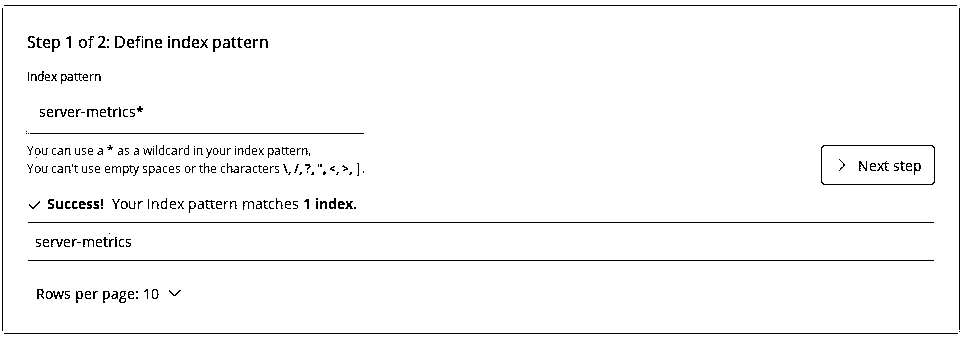

6.  点击下一步按钮进入下一步。给定的屏幕截图显示了下一个屏幕:

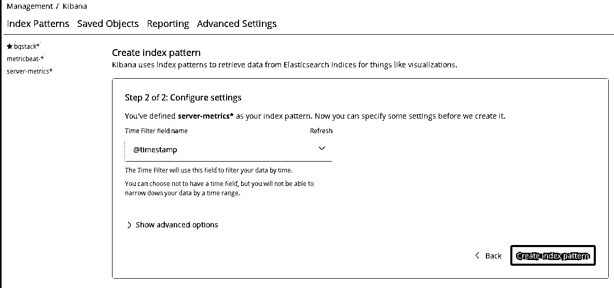

第 2 步(共 2 步)中的前一个屏幕，我们需要在其中配置设置。

7.  现在选择时间过滤器字段名称，并单击创建索引模式。这将打开以下屏幕:

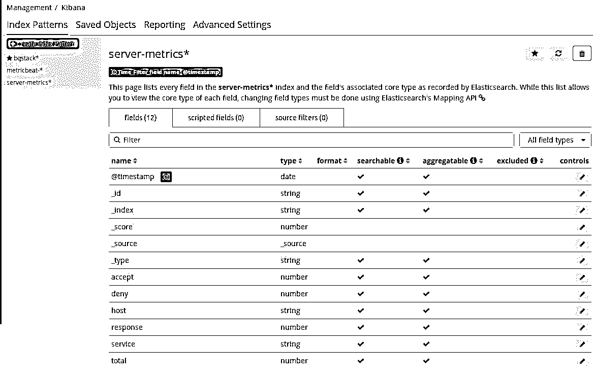

前面的屏幕截图显示了带有附加属性的字段名称和数据类型。

8.  现在我们可以使用 Kibana Discover 检查索引模式数据。因此，单击左侧菜单上的 Discover 并选择 server-metrics 索引模式。这将显示索引数据。

这样，我们可以创建一个新的索引模式，我们可以在 Kibana 中看到 Elasticsearch 索引数据。

### 设置默认索引模式。

默认情况下，Kibana 在每个选项上都显示一个索引模式，所以我们不关心在 visualize timeline、discover 或 dashboard 页面上更改索引模式。在这里，每个索引模式上都有一个星号，就在索引名称的前面。

要将另一个索引模式设置为默认模式，我们往往需要单击索引模式名称，然后单击页面右上角的星形图像链接。这可能会将选择索引模式修改为默认值:

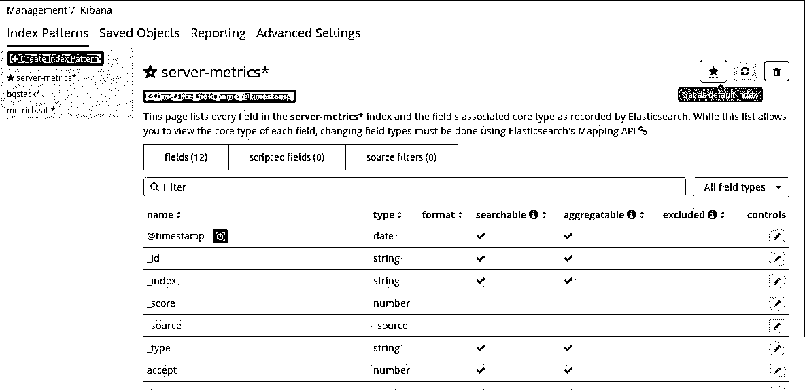

### 刷新索引模式字段

当我们添加索引模式时，Elasticsearch 索引的所有字段都被映射到 Kibana 中，因为 Kibana 索引模式扫描 Elasticsearch 索引的所有字段。然而，每当任何新字段被添加到 Elasticsearch 索引时，它都不会自动显示，对于这些情况，我们需要刷新 Kibana 索引字段。

要刷新特定的索引模式字段，我们需要单击索引模式名称，然后单击索引模式页面右上角的刷新链接:

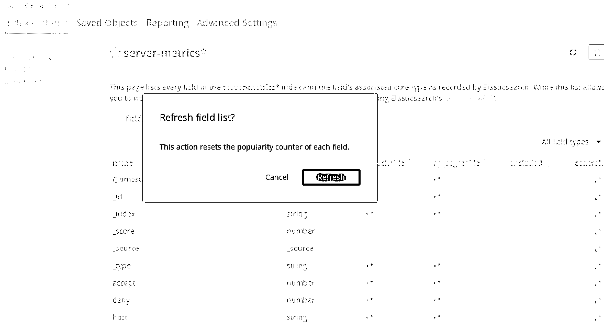

前面的屏幕截图显示，当我们单击刷新链接时，它会显示一个带有消息的弹出框。此操作将重置每个字段的流行度计数器。它还显示了两个按钮:取消和刷新。单击刷新按钮刷新字段。

### 删除索引模式

如果我们想从 Kibana 中删除一个索引模式，我们可以通过点击索引模式页面右上角的删除图标来完成。它在删除前要求确认，并在确认后删除图案。以下屏幕截图显示了删除操作:

这种删除只会从 Kibana 中删除索引，对 Elasticsearch 索引没有影响。

### 管理字段

在索引模式下，我们可以获得所有索引字段的表格视图。我们可以通过单击表格标题对值进行排序。我们有 filter 选项，通过它我们可以通过输入来过滤字段名称。在过滤文本框后，我们有一个下拉菜单来根据字段类型过滤字段；它有以下选项:

*   日期
*   线
*   数字
*   _source

在 controls 列下，每一行都有一个铅笔符号，使用它我们可以编辑字段的属性。给定的屏幕截图向我们展示了索引模式的字段列表:

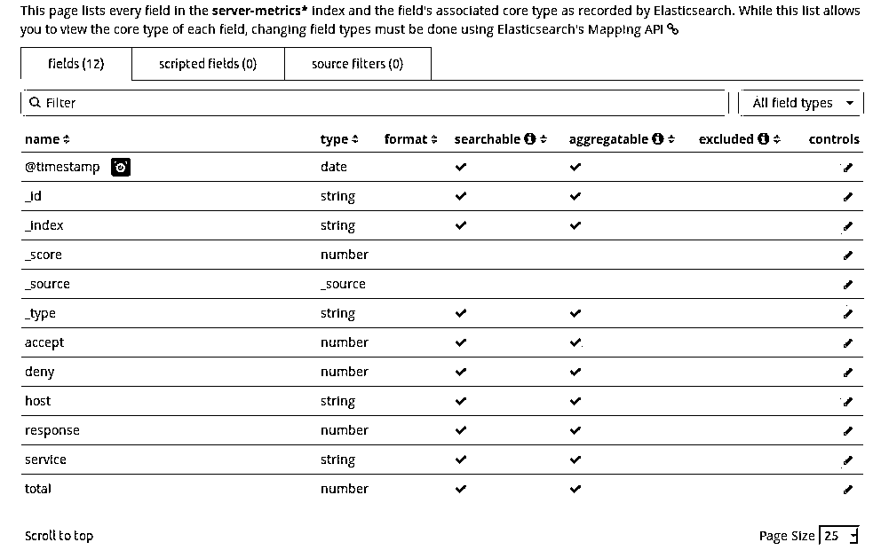

单击任何字段的编辑控件后，我们可以使用格式选择下拉菜单手动设置该字段的格式。因此，对于每种类型的数据，我们都有一套不同的格式，可以在编辑字段后进行更改。

在编辑屏幕上，我们可以使用流行度文本框设置流行度字段。完成所有这些更改后，我们可以通过单击“更新字段”按钮来保存它。我们可以通过单击“取消”按钮来取消这些更改。在 Kibana 的管理选项下，我们为以下类型的字段提供了一个字段格式化程序:

*   线
*   日期
*   地理点字段
*   数字

在页面的底部，我们有一个链接滚动到顶部，这将页面向上滚动。

#### 线

字符串字段支持两种格式:字符串和 URL。例如，在字符串字段格式化程序中，我们可以对字段内容应用以下转换:

*   小写字母盘
*   大写字母
*   标题案例
*   短 dota
*   Base64 解码

此屏幕截图显示了字符串类型格式和转换选项:

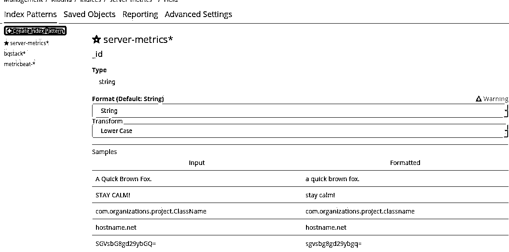

在 URL 字段格式化程序中，我们可以对字段内容应用以下转换:

*   环
*   图像

#### 日期

日期字段支持日期、字符串和 URL 格式。对于字符串和 URL 类型格式化程序，我们已经在前面的字符串类型中讨论过了。下面的屏幕显示了日期类型字段，其中有一个选项可以更改

该领域的形式和受欢迎程度:

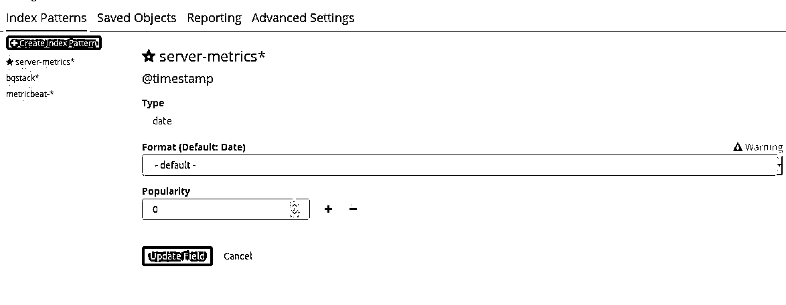

日期格式化程序使我们能够使用日期戳的显示格式，使用 moment.js 标准的日期-时间定义。

#### 数字

数字字段用于不同的领域，支持百分比、字节、持续时间、持续时间、数字、URL、字符串和颜色格式化程序。

下面的截图显示了类型字段，可以选择设置格式和非常流行的数字字段。

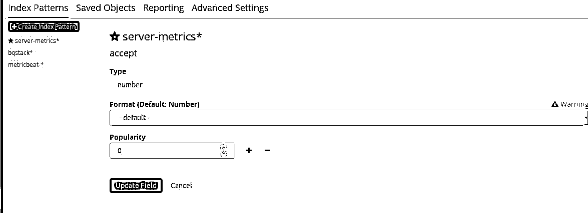

我们可以使用持续时间字段格式化程序以下列方式显示字段的数值:

*   皮秒
*   纳秒
*   微秒
*   毫秒
*   秒
*   分钟
*   小时
*   天
*   周；星期
*   月份
*   年

颜色字段选项使我们能够选择具有特定数值范围的颜色。我们可以选择格式化的颜色，它显示了字体、颜色、范围、背景颜色，还显示了一些示例字段，之后我们可以选择颜色。

数字、字节和百分比格式器使我们能够使用 numeral.js 标准格式定义选择数字的显示格式。

### 结论

我们讨论了索引模式，首先通过 Elasticsearch 的 server-metrics 索引创建了索引模式。在创建了一个索引模式之后，我们介绍了 set as default index pattern 的管理特性，通过它我们可以将任何索引模式设置为默认值。这很有帮助。至于发现、可视化和仪表板，我们不需要担心索引模式的选择，以防我们想要处理任何特定的索引。

### 推荐文章

这是基巴纳指数模式的指南。这里我们讨论索引模式，其中我们以 Elasticsearch 的 server-metrics 索引为例创建了索引模式。您也可以看看以下文章，了解更多信息–

1.  [基巴纳替代品](https://www.educba.com/kibana-alternatives/)
2.  [基巴纳报道](https://www.educba.com/kibana-reporting/)
3.  [什么是基巴纳？](https://www.educba.com/what-is-kibana/)
4.  [基巴纳警报](https://www.educba.com/kibana-alert/)

