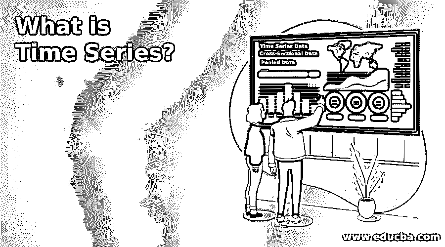
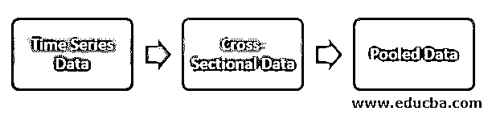

# 什么是时间序列？

> 原文：<https://www.educba.com/what-is-time-series/>

## 时间序列简介

在今天的现代和数字世界中，统计学家非常忙于分析消费者的模式。我们正在生成大量的数据，这些数据应该被简单地丢弃。正在生成的数据具有巨大的价值，如果处理得当，它可以通过让数据适应消费者的心态而为组织带来财富。无论我们是想评估消费者的电力消费模式，还是想研究金融趋势背后的统计数据，市场时间分析都起着至关重要的作用。

在当今世界，技术研究非常重要，数字技术蓬勃发展，时间是一个需要考虑的重要因素。为了预测消费者的使用分析，可以是他的金融投资或他的电力消费或他在电子商务上的支出，或者预测未来正增长的股票和规划，投资等时间序列起着至关重要的作用。

<small>Hadoop、数据科学、统计学&其他</small>

就定义而言，时间序列通常是时间线上的一系列有序点，时间始终是独立变量，目的是预测未来趋势。

收集的数据应该是下面提到的三种类型之一:

*   **时间序列数据:**这只不过是在不同时间范围内记录的或观察到的值。
*   **横截面数据:**在同一给定时间收集的一个或多个因变量的数据。
*   **汇集数据:**这是混合数据，可以是数据和横截面数据的组合。

数学上，时间序列可以通过以下等式获得:

y=f(t ),其中 t 是独立变量时间，y 通常是函数对时间的响应。

还有其他主要方面:

*   **平稳:**如果一个依赖于可变时间的函数被称为是平稳的，且该函数的统计性质不随时间变化。换句话说，我们应该有固定的均值和方差。
*   **季节性:**随时间的周期性波动，与一年中的季节相关，称为季节性。这些特征的最好例子是住宅区的电力，其消耗量在白天和黑夜之间波动。在夜间，我们看到家庭的最大消耗量，而在白天，消耗量会大大减少。因此，如果我们画一张图，我们会看到，根据周期的不同，函数的峰值也相应地变化。
*   **自相关:**自相关是两个或两个以上的观测值之间存在时间滞后的相似性。这也为时间序列模式分析提供了重要的思路。

我们已经看到了上述特征，并且我们有可能有一个图，在该图中可以有上述特征的组合。

### 为什么我们需要时间序列？

*   基于时间索引的一系列事件是时间序列。
*   它们大多是用折线图或折线图绘制的。
*   要回答我们为什么需要时间序列，我们需要知道它们实施的广阔领域，这个列表将会非常大，因为预测正成为组织装饰其消费者的主要影响因素之一。
*   它有统计学和概率论的基础，因此被统计学家广泛使用。
*   它也用于数字信号处理，我们经常将时间视为独立变量之一。
*   基于一些预定义特征之一的模式识别是它已经识别其存在的应用之一。此外，数学家在计量经济学的研究中大量使用时间序列。
*   它已被应用于地震探测、预测自然灾害时估计受影响的区域，以及了解一段时期内的天气模式。
*   除上述领域外，它还在天文学、控制工程、电磁学中有应用。因此，时间序列分析已成为科学和工程技术领域的主要内容之一。

### 时间序列的重要性

以下是提到的一些重要性:

*   许多组织使用它来预测他们的业务利润或亏损趋势，从而可以为发展做出重要的业务决策。
*   它用于比较当前趋势和已经发生的过去趋势，以便可以估计和准备未来趋势。
*   使用时间序列分析一段时间内的周期变化将使我们能够非常有效地理解商业周期。
*   它用于了解数据的相关季节性趋势。
*   它还用于了解一个事件如何在一段时间内改变其特征，因此可以预测可靠性、灵活性和其他重要特征。
*   它也用于质量控制过程，在该过程中，质量趋势是随着时间的推移而预测的。
*   如果我们接收到它的复杂信号模式，那么我们可以应用一些变换，例如傅立叶分析来对图形进行去噪，并且将复杂模式分解成一系列更简单的模式，因此可以实现更好的理解。

### 结论

因此，我们可以看到，时间序列是一个数据集，其模式在时间范围内具有重大影响。这些模式可能会也可能不会重复多次。这篇文章给出了投票最多的问题“我们如何更好地获得想法或预测未来”的答案，以便我们做好准备。这种模式可以是季节性的、固定的或相关的。

### 推荐文章

这是一个什么是时间序列的指南？这里我们讨论一下引言，为什么我们需要时间序列？和重要性。您也可以看看以下文章，了解更多信息–

1.  [时间序列分析](https://www.educba.com/time-series-analysis/)
2.  [统计分析](https://www.educba.com/statistical-analysis/)
3.  [数据分析技术的类型](https://www.educba.com/types-of-data-analysis-techniques/)
4.  [数据分析工具](https://www.educba.com/data-analysis-tools/)

