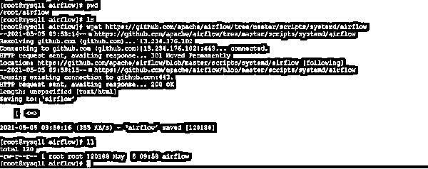
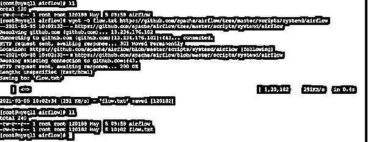
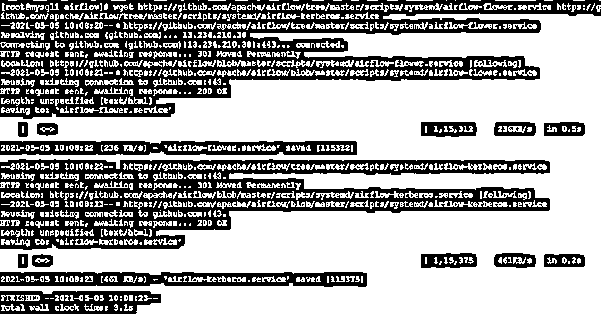

# CentOS wget

> 原文：<https://www.educba.com/centos-wget/>

## CentOS wget 简介

在 CentOS 环境中，我们正在处理多项任务。有时，我们需要连接到外部世界，如互联网、不同的网站，并下载软件包或一些内容。这里，wget 命令或实用程序起作用。wget 在 GNU 下面。这是一个基于计算机的程序，能够检索网络服务器的内容。wget 实用程序或程序只是 GNU 项目的一部分。它是由像 www(万维网)和 gets 这两种东西结合而成的。它将支持多种平台，如 SFTP，FTP，HTTP，HTTPS 等。它有多种功能，如链接转换，递归下载等。它也将支持代理环境。

**CentOS wget 的语法:**

<small>Hadoop、数据科学、统计学&其他</small>

`wget [ option ]... [ URL ]...`

**1) wget:** 我们可以在语法或者命令中使用 wget 关键字。它将接受不同的参数，如兼容选项、URL 等。根据所提供的输入，wget 将能够从外部世界检索 web 内容，并保持在 CentOS 系统上可用。wget 命令也将有助于管理不同的下载相关任务。

**2)选项:**根据需要，我们可以提供不同的标志作为与 wget 命令兼容的选项。

**3) URL:** 根据要求或需要，我们也可以通过 wget 命令使用必要的 URL。

### CentOS wget 如何工作？

在 Linux 环境中，我们可以根据需要使用任何发行版。我们可以使用多种实用程序和工具来提取互联网内容。根据应用或工作需要，我们可以选择我们需要使用的实用程序或程序。在 CentOS 环境中，通常我们使用 wget 命令。这将有助于在 CentOS 环境中下载互联网内容。

在 backed 中，wget 命令或实用程序使用两种方法，如 www(万维网)和 get。根据要求，我们需要将 URL 链接传递给 wget 命令。它将接受兼容选项和下载 URL。一旦我们触发命令，它将访问 URL 并从远程位置获取内容。一旦内容出现，它将在当前的工作环境中下载或获取。下面是与 wget 命令兼容的选项列表。

1.-V–version:该选项将帮助打印 wget 命令的版本信息。
2。-h–help:help 选项将在命令行视图中打印 wget 命令的基本帮助相关消息。
3。-b–后台:启动后立即在后台运行命令或进程会有所帮助。在执行此过程时，如果我们没有通过-o 选项提供输出文件，那么输出将被重定向到 wget 日志。
4。-e 命令–执行命令:这将有助于执行命令，就像它是. wgetrc 的一部分一样。如果您想要使用多个 wgetrc 命令，那么我们需要使用-e 选项的多个实例。
5。-o log file–output-file = log file:该选项有助于将所有消息记录到日志文件中。这些消息通常会报告给标准错误消息。
6。-a log file–append-output = log filen:这将有助于添加到日志文件中。这类似于-o 选项。它只是追加日志文件，而不是覆盖实际的旧日志文件。在某些情况下，如果日志文件不存在，它会在系统中创建新的日志文件。
7。-d–debug:这将有助于打开输出的调试模式。这将有助于获得各种有意义的信息，对 wget 的开发者有帮助。它运行良好，然后没有问题。但是如果它不能正常工作，那么系统管理员将在没有编译选项的情况下编译它。注意:请考虑一下，带有调试模式或支持的编译代码或命令总是安全的。具有调试支持的–wget 编译方法不会打印任何调试级别信息，除非并且直到它不被使用或被-d 选项
8 请求。-q–quiet:该选项将有助于关闭 wget 输出。
9。-v–verbose:这将有助于启用详细输出。它将启用所有可用的数据信息。在 wget 中，默认的输出方法是 verbose only。

### 理解 CentOS wget 的例子

让我们讨论 CentOS wget 的例子。

#### 示例 1: CentOS wget:获取单个文件

在 CentOS 环境中，我们可以从互联网上下载或获取单个文件。

**命令:**

`Wget https://github.com/apache/airflow/tree/master/scripts/systemd/airflow`

**说明:**

按照上面的命令，我们正在从环境中下载“气流”文件。

**输出:**

#### 示例#2: CentOS wget:用自己的文件名下载文件

在 wget 中，我们能够在下载文件时用它自己的文件名来改变下载文件的名称。

**命令:**

`wget -O flow.txt https://github.com/apache/airflow/tree/master/scripts/systemd/airflow`

**说明:**

根据上面的命令，我们正在从互联网下载 airflow 文件，但是我们将文件名从 airflow 更改为 flow.txt。为了实现这一点，我们需要在 wget 命令中使用“-O”选项。

**输出:**

#### 示例 3: CentOS wget:下载多个文件

在 wget 命令中，我们能够在同一个命令中下载多个文件。

**命令:**

`wget https://github.com/apache/airflow/tree/master/scripts/systemd/airflow-flower.service https://github.com/apache/airflow/tree/master/scripts/systemd/airflow-kerberos.service`

**说明:**

按照上面的命令，我们正在下载多个文件。在这里，我们同时下载这两个文件。

**输出:**

### 结论

我们已经看到了“CentOS wget”的完整概念，以及正确的示例、解释和带有不同输出的命令。wget 命令用于从互联网下载内容。根据要求，我们需要在 wget 命令中使用 compatible 选项。

### 推荐文章

这是一本 CentOS wget 指南。在这里，我们讨论介绍，参数，语法，CentOS wget 如何工作，代码实现的例子。您也可以看看以下文章，了解更多信息–

1.  [CentOS 包](https://www.educba.com/centos-packages/)
2.  [CentOS useradd](https://www.educba.com/centos-useradd/)
3.  [CentOS 更改主机名](https://www.educba.com/centos-change-hostname/)
4.  [CentOS 添加 sudo 用户](https://www.educba.com/centos-add-sudo-user/)

