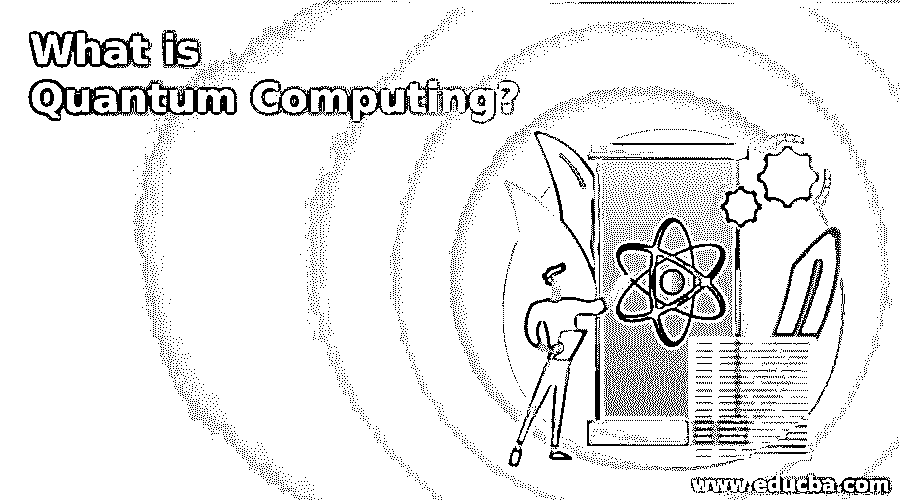

# 什么是量子计算？

> 原文：<https://www.educba.com/what-is-quantum-computing/>

## 量子计算机的定义

量子计算机在处理复杂和海量数据方面比经典计算机更有效。它基于量子力学工作，以快速解决复杂的计算过程。这些计算在从部署、金融到基因组学的行业中有无限多的潜在应用和无数的变量。通过破解密码的能力，它可以在网络安全方面被重新发明，加密可以在电子通信中进行。技术领域最大的应用包括微软、英特尔、阿里巴巴、IBM 和谷歌。量子计算的探索一直延伸到网络安全，它的计算竞赛仍然在寻找高级应用。本文简要介绍了量子比特的类型及其应用。

### 量子比特的解释

二进制数字是量子计算的对等物，它被称为经典计算的量子位。简而言之，比特是经典计算机中数据的基本元素，而量子比特是量子计算机中数据的基本元素。量子计算机是光子或电子等基本粒子的集合，可用于测量负责代表 1 或 0 的极化的离子粒子所取得的成功。这些粒子被称为量子位，在量子理论中有简单的描述。它大多与量子物理有关，遵循纠缠和叠加原理。

<small>Hadoop、数据科学、统计学&其他</small>

#### 叠加

假设在磁场中，一个量子位是一个电子，它或者与磁场方向一致，称为自旋向上状态，如果与磁场方向相反，则称为自旋向下状态。电子从一种状态到另一种状态的转变是通过使用来自激光的脉冲能量来实现的。如果使用一个单位的激光能量来代替半个单位的激光能量，那么将会有来自与其相关的粒子的外部影响，并且需要将其隔离。根据量子定律，粒子应该进入叠加态，同时表现为双面。每个量子位都使用叠加值 0 和 1。量子计算机可能完成的计算数量可以是 2^n.，这里 n 是几个量子位。这 500 个量子位由具有 2^500 潜能的量子计算机组成，可以在一个步骤中制造出来。2^500 的原子数比假定的要多，这是一个适当的数目。它被称为真正的并行处理，在经典计算机中执行，也称为并行处理器，其中只能及时分配一个任务。但是如果需要两个或更多的处理器来执行一个任务，那么粒子的相互作用就是通过量子纠缠来执行的。

#### 纠缠

在某一点上以这种连接方式交流的粒子，可以与每一个被称为关联的相关粒子对打结。找到一个打结粒子的自旋状态是向上还是向下，就能发现它的配对粒子的自旋方向相反。为了增加叠加态的知识，计算出的粒子在任何测量之前都没有直接的自旋方向，它可以在向下和向上的状态下自旋。在测量相互作用的相关粒子时，校准组件的自旋状态，并立即预测其与作为真实现象发生的被测组件相反的自旋方向。爱因斯坦称这种行为为幽灵行动的距离。这种机制没有任何理论解释和推导。量子纠缠使得量子比特能够在有限的距离上相互隔离，并立即相互通信，并且不受光速的限制。它不依赖于相关粒子的距离，保持纠缠，表现为不再分离。通过累积，纠缠和量子叠加增强了计算能力。这里，传统计算机中的两位寄存器只能保存四种二进制配置，即 00、11、10 或 10。在量子计算机中运行的双量子位寄存器可以保存所有同时存在的四个数字，因为每一位代表任意两个值。如果输入更多的量子位元，那麽它的容量会以指数方式增加。

### 量子计算的应用

经典计算的标准增长随着可行量子的发展而运行，并适合许多行业和应用。具有大数据集的计算应用从量子计算中受益，它从模拟到应用都基于数学原理。有时，数学计算可能很复杂，依赖于实时场景，并解决许多错综复杂的问题。

#### 研究

经典计算机在大小和分子复杂性方面受到限制，无法模拟和比较药物开发的基本过程。如果输入的大小为 N，分子中的原子数量和这些原子之间可能的相互作用的数量是指数的，并且与所有相关的原子相互作用。量子计算机能够模拟更大的分子，同时，研究人员可以设计一个模型，在药物和人类基因组中编码的 20K 蛋白质之间进行交互，从而增强辅助医疗领域的能力。

#### 诊断

量子技术用于在不同的应用中给出快速和精确的诊断。人工智能能力的提高增加了已经用于模式识别的机器学习过程。具有高分辨率的 MRI 机器将给出最大程度的描述，以支持临床医生筛查和诊断疾病。像放疗这样的治疗是基于一个模型来模拟复杂的情况，以给出最佳的治疗。它还使医生能够在最短的时间内执行更多的模拟，并限制辐射水平对健康组织的影响。

### 推荐文章

这是一本关于什么是量子计算的指南？.在这里，我们也讨论了量子计算的定义和应用，并给出了解释。您也可以看看以下文章，了解更多信息–

1.  [什么是网格计算？](https://www.educba.com/what-is-grid-computing/)
2.  [移动云计算](https://www.educba.com/mobile-cloud-computing/)
3.  [什么是效用计算？](https://www.educba.com/what-is-utility-computing/)
4.  [云计算的历史](https://www.educba.com/history-of-cloud-computing/)

