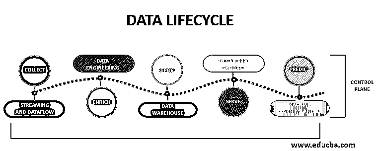
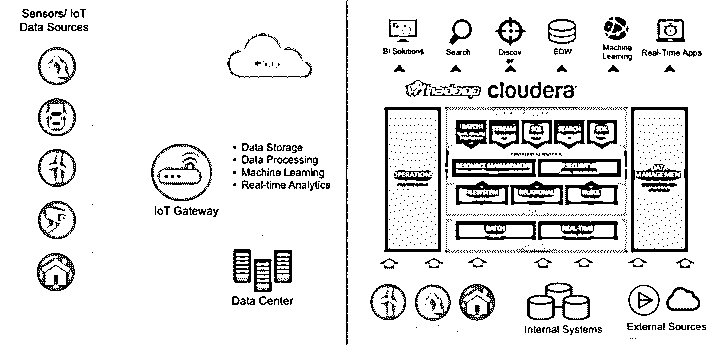

# Cloudera 架构

> 原文：<https://www.educba.com/cloudera-architecture/>

## Cloudera 简介

下面的文章提供了 Cloudera 架构的概要。Cloudera 是一个大数据平台，它与 Apache Hadoop 集成在一起，通过将各种用户纳入一个数据流来避免数据移动。数据发现和数据管理是由平台自己完成的，不需要担心同样的问题。此外，具有高可用性和容错能力的安全性使 Cloudera 对用户具有吸引力。由于这是开源的，客户可以免费使用该技术，并在 Cloudera 中保持数据安全。我们可以将 Cloudera 用于 IT 和业务，因为该平台具有多种功能。

### 云时代的建筑

下面给出了 Cloudera 的架构:

<small>Hadoop、数据科学、统计学&其他</small>

1.Cloudera 的简单性及其在所有设计阶段的安全性促使客户选择该平台。此外，Cloudera 在企业软件和数据平台方面采用新颖的方法，遵循新的思维方式。

2.当其他平台将数据科学工作与其数据工程方面集成在一起时，Cloudera 拥有自己的数据科学平台来开发不同的模型并进行分析。随着 Apache Hadoop 被集成到 Cloudera 中，开源语言和 Hadoop 一起帮助数据科学家进行生产部署和项目监控。

3.在 Cloudera 平台中，我们有私有云、公共云和混合云。Cloudera 的组成部分包括数据中枢、数据工程、数据流、数据仓库、数据库和机器学习。

4.Cloudera 中的数据生命周期或数据流涉及不同的步骤。第一步包括从任何来源收集数据或摄取数据。下一步是数据工程，数据被清理，不同的数据操作步骤被完成。在这种数据分析之后，在数据仓库的帮助下生成数据报告。该报告还涉及数据可视化。在数据库的帮助下，可以看到并使用这些数据。这是第四步，最后一个阶段涉及到数据科学家对这些数据的预测。这种预测分析可以用于机器学习和人工智能建模。

5.数据源可以是传感器或任何位于 Cloudera 平台外部的物联网设备。此外，数据可视化可以通过 Power BI 或 Tableau 等商业智能工具来完成。这些工具也是外部的。来自数据源的数据可以是批处理数据或实时数据。数据库用户可以是 NoSQL 或任何关系数据库。

6.数据中心向用户提供平台即服务产品，其中存储了复杂和简单工作负载的数据。任何复杂的工作负载都可以轻松简化，因为它连接到各种类型的数据集群。我们可以看到是否在任何地方使用了同一个集群，以及有多少服务器链接到数据中心集群。如果同一个集群的工作负载更多，我们可以增加同一个集群中的节点数量，而不是创建一个新的集群。节点可以是计算节点、主节点或工作节点。此外，可以通过减少节点数量来削减成本。

7.为了向集群提供安全性，我们在 Cloudera 中提供了边界、访问、可见性和数据安全性。群集入口受到外围安全的保护，因为它检查用户的身份验证。访问安全性为用户提供授权。数据源及其使用由可见性安全模式负责。最后，数据屏蔽和加密是在数据安全的情况下完成的。

8.我们在集群管理器中有动态资源池。此外，Cloudera 中的资源管理器有助于监控、部署和排除集群故障。Cloudera 中的服务器管理器连接数据库、不同的代理和 API。可以是 Rest API，也可以是其他任何 API。数据的备份在数据库中完成，它向 Cloudera Manager 提供所有需要的数据。代理可以是管理器中的工作节点，就像集群中的工作节点一样，因此主节点是服务器，而体系结构是主从节点。用户可以使用 API 登录并检查 Cloudera manager 的工作情况。

9.我们用 Python 或 Scala 语言在集群中运行作业。创建作业时，我们可以每天或每周安排一次。我们可以在“作业运行”页面上看到作业的趋势并进行分析。或者我们可以使用 Spark UI 来查看正在运行的作业的图表。

10.Cloudera platform 将 Hadoop 打包，以便习惯使用 Hadoop 的用户能够与 Cloudera 相处融洽。Cloudera 中提供了 Impala 查询引擎和 SQL，用于 Hadoop。Cloudera 中也提供了很多开源组件，比如 Apache、Python、Scala 等。

11.在 Cloudera 快速入门中，我们有 Cloudera 作业的状态、Cloudera 集群的实例、要使用的不同命令、Cloudera 的配置和 Cloudera 中运行的作业图表，以及虚拟机的详细信息。

12.Cloudera 中提供了各种集群，如 HBase、HDFS、Hue、Hive、Impala、Spark 等。最常用和首选的集群是 Spark。如前所述，主机可以是 YARN 应用程序或 Impala 查询，并且为系统分配一个动态资源管理器。也可以配置和使用静态服务池。

13.Hadoop 用于 Cloudera，因为它可以用作输入输出平台。因此，即使硬盘的数据使用受到限制，Hadoop 也可以应对这些限制并管理数据。而不是 Hadoop，如果驱动器多了，网络性能会受影响。

14.随着数据增加的需要，应该为 Cloudera 分配最快的 CPU，并且其分析会随着时间的推移而改进。瓶颈不应该出现在数据工程阶段的任何地方。

15.到目前为止，只有 Linux 系统支持 Cloudera，因此，Cloudera 只能用于其他系统中的虚拟机。

### 结论–cloud era 架构

Cloudera 是第一个在云中提供企业数据服务的云平台，它在当今竞争激烈的世界中有着广阔的发展前景。所有先进的大数据产品都存在于 Cloudera 中。

### 推荐文章

这是 Cloudera 架构的指南。为了更好地理解，我们在这里讨论 Cloudera 的介绍和架构。您也可以看看以下文章，了解更多信息–

1.  [Hadoop 中的 Yarn 是什么？](https://www.educba.com/what-is-yarn-in-hadoop/)
2.  [数据仓库工具](https://www.educba.com/data-warehouse-tools/)
3.  [什么是 ETL？](https://www.educba.com/what-is-etl/)
4.  [大数据分析软件](https://www.educba.com/big-data-analytics-software/)

