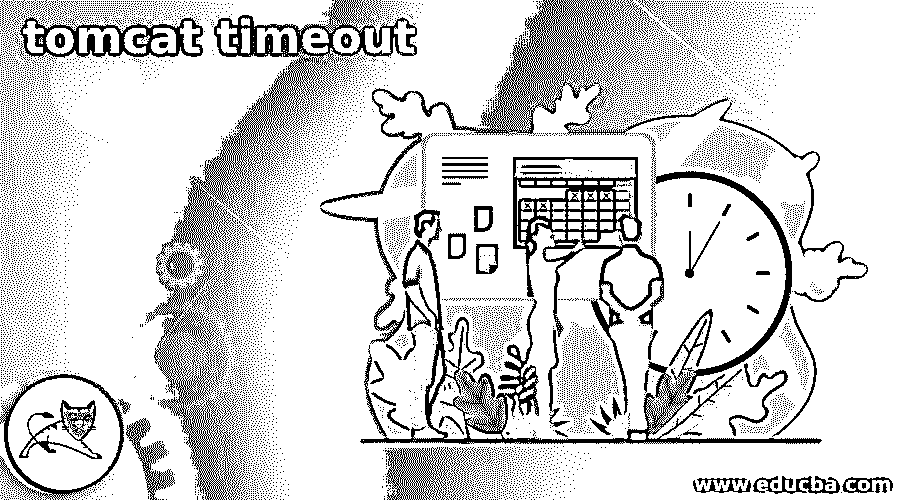
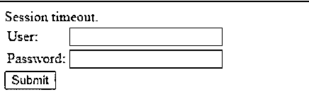
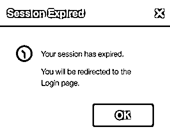
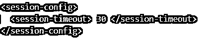
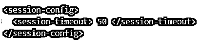

# tomcat 超时

> 原文：<https://www.educba.com/tomcat-timeout/>

## tomcat 超时简介

当有长时间的空闲会话没有发生任何事情时，tomcat webserver 会在一段时间后提高会话超时，导致会话等待时间的结束。这个超时参数的配置在 tomcat 安装主路径中的 web.xml 文件中指定。我们可以通过更改 web.xml 中的属性值来更改该值。其中一个棘手的问题是找到超时错误背后的原因，我们将在本次会话中尝试理解这一点。

在本文中，我们将分别讨论 tomcat 超时和超时错误的事情。

<small>Hadoop、数据科学、统计学&其他</small>

### 什么是 tomcat 超时？

Tomcat timeout 是在 web.xml 中指定的配置设置，它有助于确定服务器在特定空闲会话中等待的最长时间，该会话中没有任何进程发生。出于维护会话安全性和内存管理的考虑，关闭该会话始终是一个好的做法。经过这段空闲时间后，tomcat webserver 会引发一个会话超时错误，这个人会被导航出会话。

### tomcat 超时配置会话

可以在 tomcat 服务器的 web.xml 文件中找到会话超时属性的配置。该文件可以位于 tomcat 安装的主目录和 conf 文件夹中。通常，在 windows 中，该文件位于 c 盘的 Program Files/Apache Software Foundation/Tomcat(version installed)/conf 文件夹中。在 Linux 平台中，可以在/opt/ tomcat(已安装的版本)中找到该文件，在该文件中，可以找到 web.xml 文件所在的 conf 文件夹。

Apache Tomcat Web /server 的会话超时设置的默认值是在 web.xml 文件中的<session-timeout>元素的开始和结束元素之间指定的 30 分钟。</session-timeout>

### tomcat 超时配置会话错误

通常，当我们的应用程序需要很长时间来检索响应，而浏览器确实在会话超时的规定时间内从 web 服务器获得了响应时，就会在用户端抛出一个名为会话超时的错误，用户会被导航回登录页面，如下面的屏幕截图所示

通常，当您的获取特定数据或执行特定操作的请求由于数据量巨大或特性编码管理不当而需要很长时间时，最佳解决方案是增加 tomcat 配置中设置的会话超时值。因此，当您的功能需要很长时间才能成功时，可以通过操作 tomcat web 服务器配置的会话超时值来避免会话超时错误。

更改会话超时的现有值或默认值很容易，可以从以下几点理解。

### 我们更改会话超时值。

tomcat 会话超时的默认值设置为 30 分钟，这意味着应用程序将至少等待 30 分钟来获得对其请求的响应，如果没有响应，会话将被视为超时，并被关闭。我们可以简单地通过编辑一个名为 web.xml 的配置文件来更改 tomcat 会话超时的默认值，在这个配置文件中需要搜索和修改带有标签<session-timeout>的元素。默认情况下，标签如下所示</session-timeout>

`<session-config>
<session-timeout> 30 </session-timeout>
</session-config>`

您可以在 web.xml 中的 session-timeout 的开始和结束标记之间设置任何所需的值，然后保存该文件。请注意，该值应该以分钟为单位。保存更改以反映配置后，您需要重新启动 Apache Tomcat web 服务器。您可以在路径 <catalina tomcat="" installation="" home="">/conf 中找到配置的 web.xml 文件，其中 Catalina tomcat 安装主目录是您在系统中安装 Apache Tomcat 的目录。</catalina>

在对现有的 web.xml 文件进行任何更改之前，建议备份该文件。这只是为了防止您在文件中设置或修改的配置不按预期工作；然后，如果有备份，您可以将文件还原到以前提供的。

通过将 web.xml 的 session-timeout 元素中提到的值更改为-1，我们还可以在 tomcat 中为会话设置无限制的超时配置，或者表示会话没有超时。虽然不建议这样做，但是您的会话详细信息可能会被攻击者获取，这将导致您的凭据和相关应用程序的信息泄漏。因此，出于安全原因，不要将该值设置为无限制超时。

### tomcat 超时示例

让我们首先用一个例子来理解改变 tomcat 超时值的必要性。如果超过指定的超时值，会话将关闭，用户将再次返回登录页面以启动新的会话，如以下屏幕所示

当来自应用程序的请求返回响应的时间大于设置的超时值时，设置为超时的默认值在某些情况下可能会导致问题。不幸的是，这导致用户无法使用该功能。然而，我们可以简单地通过改变 tomcat web 服务器的配置文件中设置的超时值来解决这个问题。

首先，打开 web.xml 文件并搜索 session-timeout 元素。默认情况下，如下图所示

如果我知道我的请求需要 45 分钟才能送达。考虑到网络的最坏情况，我们将 web.xml 中的值设置为 50 分钟，如下所示

这样做之后，我的功能将正常工作并执行必要的任务，而无需退出会话。

### 结论

Tomcat 超时或会话超时是浏览器端的特定会话在从服务器获得响应之前等待的值。我们可以通过配置来操纵这个值。

### 推荐文章

这是一个 tomcat 超时指南。这里我们分别讨论 tomcat 超时和超时错误。您也可以看看以下文章，了解更多信息–

1.  [什么是阿帕奇雄猫？](https://www.educba.com/what-is-apache-tomcat/)
2.  [Spring Boot 雄猫](https://www.educba.com/spring-boot-tomcat/)
3.  [Spring Boot 码头工人](https://www.educba.com/spring-boot-docker/)
4.  [阿帕奇兴趣点](https://www.educba.com/apache-poi/)

