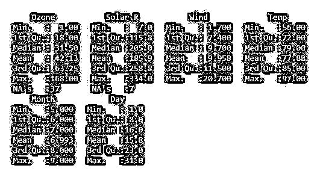
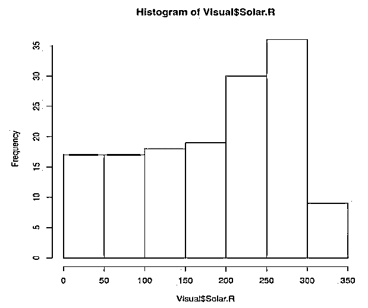
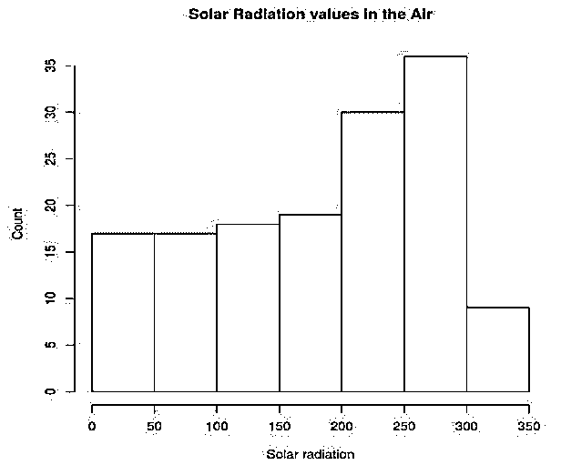
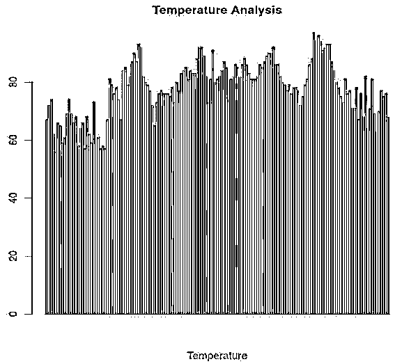
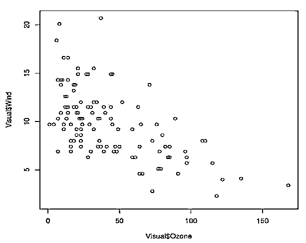
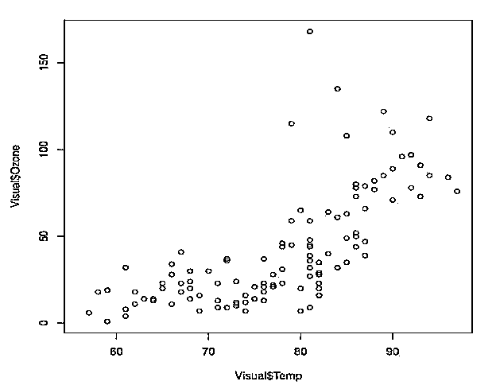
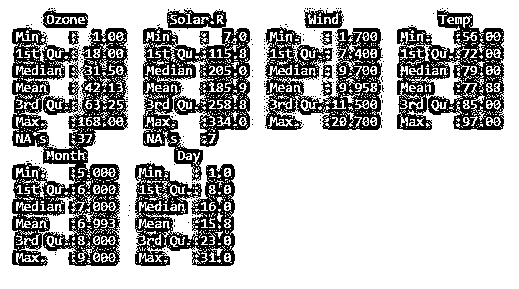
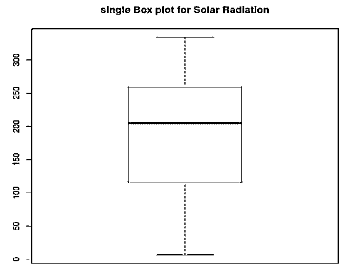
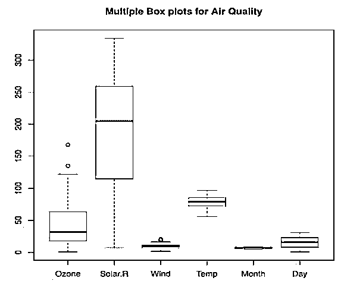

# R 中的可视化

> 原文：<https://www.educba.com/visualization-in-r/>

## R 中的可视化介绍

数据可视化在 R，数据是运行行业的新油。但是它的数量很大。我们需要分析数据，但分析数据是不够的，我们必须将重要的关键点传递给利益相关者。通常，这些利益相关者没有时间阅读和理解我们用来分析数据的术语，因此留给我们的最佳选择是以视觉形式呈现我们的分析。

### R 中可视化的好处

*   容易理解
*   理解视觉效果不需要先验知识
*   可视化数据处理速度更快
*   与传统报告相比较的要点信息
*   协助决策

有“n”种数据可视化方法，但是理解哪种可视化技术最适合数据是最重要的部分，因为可视化技术是预先安装在 R 库中的。为可视化传递代码并不是一项艰巨的任务。一般来说，数据可视化意味着以图表的形式展示数据，图表基本上是数据的图形表示。

<small>Hadoop、数据科学、统计学&其他</small>

### R 中的可视化技术

在本文中，我们将介绍一些最常见的可视化技术，这些技术通常适用于各种类型的数据。

*   柱状图
*   条形图
*   散点图
*   箱形图
*   多盒图

我们将研究一些已经存在的数据集，称为“空气质量”。该数据集包含纽约从五月到九月的每日空气质量测量值。它由 6 个变量的 153 次观测组成，即臭氧(平均十亿分之一的臭氧)、太阳。r(太阳辐射)、风(以英里/小时为单位的平均风速)、Temp(以华氏度为单位的最高日温度)、月和日。

关于数据集的更多信息，我们将使用 Str()。

**代码:**

`Visual = airquality
str(Visual)`

**输出:**

我们使用的数据集的统计结构如下:

**代码:**

`Visual = air quality
summary(Visual)`

**输出:**

R 中常用的图形表示的库有 ggplot、ggplot2 等。

#### 1.柱状图

当我们有一些频率分布的连续数据时，我们将使用直方图。

**优点:**

1.以图形方式汇总大型数据集

2.告诉我们有关数据分布的情况(偏斜度、异常值)

**答:我们将看到数据集空气质量中可变太阳辐射的直方图:**

**代码:**

`Visual = airquality
hist(Visual$Solar.R)`

**输出:**

**说明:**这是太阳辐射变量的基本直方图。

b .现在假设我们想给直方图的条添加图例、直方图的名称、颜色。对于所有这些，我们的新代码看起来像:

**代码:**

`Visual = airquality
hist(airquality$Solar.R, main = 'Solar Radiation values in the Air',ylab='Count',xlab = 'Solar radiation', col='yellow')`

**输出:**

#### 2.条形图

条形图或条形图是用矩形条表示分类数据的图形或图表，矩形条的高度或长度与它们在数据集中表示的值成比例。

**优点:**

1.在单个条形中显示每个变量的频率

2.比原始数据更有助于识别趋势(如果有)

让我们考虑这样一种情况，我们想知道从五月到九月的时间段内的温度(这里我们使用相同的数据“空气质量”)。比如有没有趋势:

**代码:**

`Visual = airquality
barplot(Visual$Temp, main = 'Temperature Analysis',xlab = 'Temperature', col= 'Orange')`

**输出:**

#### 3.散点图

它显示了两个变量之间的关系。

**优点:**

1.对观察和阅读的理解是非常容易和直接的。

2.有助于确定两个变量之间的关系。

3.数据范围，即最大值点、最小值点。

**答:这里我们将看到臭氧变量和风变量之间的关系:**

**代码:**

`Visual = airquality
plot(Visual$Ozone, Visual$Wind)`

**输出:**

**说明:**从图中可以明显看出，臭氧与风呈负相关。

让我们看看温度变量和臭氧变量之间的另一个关系:

**代码:**

`Visual = airquality
plot(Visual$Temp, Visual$Ozone)`

**输出:**

**解释:**气温和臭氧变量呈正相关。

#### 4.箱形图

回想一下我们用来了解数据集的统计描述的代码(Summary()), Box plot 有助于以图形方式查看该描述。

**代码:**

`Visual = airquality
summary(Visual)`

**输出:**

**优点:**

1.图形化显示变量的位置。

2.以图形方式显示变量数据点的分布。

3.提供数据对称性和偏斜度的一些指示。

4.显示异常值(如果有)

**代码:**

`Visual = airquality
boxplot(airquality$Solar.R,main='single Box plot for Solar Radiation')`

**输出:**

#### 5.多盒图

**代码:**

`Visual = airquality
boxplot(airquality, main='Multiple Box plots for Air Quality')`

**输出:**

### 结论

当结果以一些视觉效果的形式出现时，很容易理解数据集的特征。就像直方图一样，我们只需花几秒钟观察图表，就可以看到哪个变量出现的频率最高，或者通过查看散点图，我们可以看到变量的分布情况。但唯一的问题是，我们必须了解哪种类型的视觉效果必须与哪种类型的数据集一起使用。

### 推荐文章

这是一个 R 中可视化的指南。这里我们讨论 R 中可视化的介绍，好处和一些带有查询例子的技术。您也可以浏览我们的其他相关文章，了解更多信息——

1.  [数据可视化的类型](https://www.educba.com/types-of-data-visualization/)
2.  [画面可视化](https://www.educba.com/tableau-visualization/)
3.  [最佳数据可视化工具](https://www.educba.com/best-data-visualization-tools/)
4.  [什么是数据可视化](https://www.educba.com/what-is-data-visualization/)

