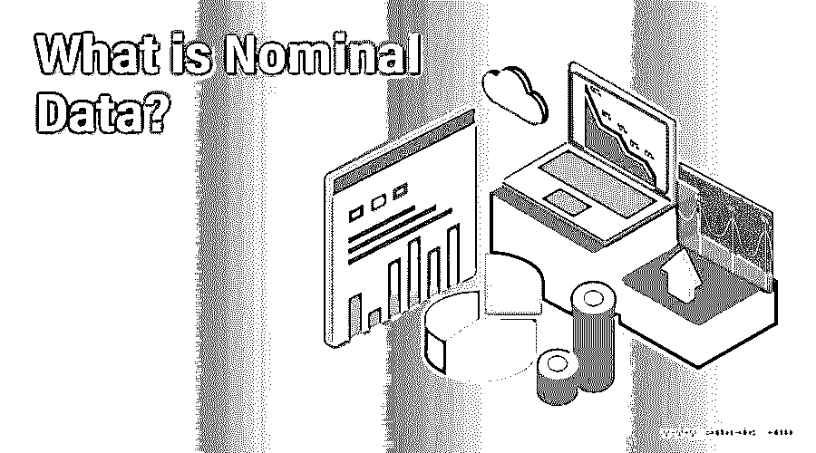

# 什么是名义数据？

> 原文：<https://www.educba.com/what-is-nominal-data/>

## 名义数据介绍

名义数据可以是定量和定性两种形式，但定量属性缺乏算术值或关系。它可以是一个标识号。换句话说，不同种类的定性数据被表征为名义形式。它包括符号、字母或单词。名义数据的几个例子是性别、人、出生等等。它被命名或标记，被分成没有任何重叠的组。收集的数据的顺序不能在名义信息的帮助下建立，因此，如果你改变数据的顺序，数据的重要性不会受到影响。

### 名义数据的特征

名义数据是不同项目之间的相似性，但与这种相似性相关的描述不能透露。它对数据的收集和分析过程进行了简化。在某些情况下，名义数据也被定义为分类数据。例如，如果二进制数据表示二值数据的含义，而名义数据被视为离散数据，那么一只狗可以是德国牧羊犬，也可以不是。

<small>Hadoop、数据科学、统计学&其他</small>

名义数据的行为属性可以作为一个问卷来讨论

#### 你对什么感兴趣

*   云计算
*   大数据
*   数据分析
*   物联网

名义上的数据永远不能被列举，这是一种命名法。一项关于人们感兴趣领域的调查包含了本案例中描述的一个问题。在这里，基于数据的逻辑和统计计算的数字分析是不可能的，而研究人员不能从收集的数据或任何得出 1 大于 2 和变量的变量中相加或相乘。

答案和选项的顺序与研究者给出的答案不相符合。名义数据永远不能像序数数据那样按确定的顺序分配。所收集的数据将具有定性属性，而解决方案的性质是定性的，这有助于做出决策。当数据按字母顺序排列时，名义数据的平均值是不方便的。如前所述，由于数据的定性性质，研究人员很难计算屈服于道德规范的回复的平均值。

提交大量个人样本作为首选项。频繁收集的答案被定义为节点。在给出的例子中，如果物联网是采样数据的大多数人提交的答案，那么它被定义为一个节点。名义数据以字母形式存在，而不是数字形式。例如，非数字数据可以分为许多组。

### 如何分析一个名义上的数据？

大多数情况下，数据是以调查问卷的形式收集的，调查问卷会给出一个属性列表供受访者选择，你住在哪条街？(后面是当地街道的多个列表)你最喜欢的冰淇淋配料是什么？扔出的选择是奥利奥，腰果，焦糖，糖粉，鲜奶油，樱桃。有三种收集数据的方法。在上面提到的例子中，回答者被提供了空格来填写他们的答案。这是一种开放式问卷，每个州都有编号。该数据可以提供给具有多项选择的回答者，他可以在那里选择他的选择。

下一个示例是多回答问题的格式，其中如果选择了每个类别，则编码为 1，如果没有选择，则编码为 0。它还集成了一个开放组件，如果某一部分未包含在列表中，则允许回答者选择在该部分中提及。则此类回答应填写在单独的栏中，而编码要求应进行评估。应使用代表常见解决方案的模式和百分比来评估数据。对于给定的问卷，有可能出现多种模式的回答。例如，如果腰果和搅打奶油都被选择了相似的次数，那么研究人员会考虑冰淇淋示例中提到的多项选择的响应，以生成一个度量变量，用作分析的额外解决方案。在这些情况下，被调查者可以选择所有的选项，这些选项带有一个从零到最大类别不等的变量。它是消费者数据细分的有用工具。数据在用于描述受访者时是最佳的。尽管其统计能力有限，但这种数据对于深入了解答卷人至关重要。

### 例子

从示例中收集的标签与用于标记的每个响应相关。正如在第一个案例中所提到的，每一个狗品种都被分配了号码，而下一个问题代表了性别分配给各自的首字母，这是方便的方法。在美国，大多数人都是爱鸟人士。如果一个公司，在没有所有者的情况下照顾鸟类，有一些支持优化其目标市场的策略。哪种鸟最受欢迎？

*   芬奇-1
*   亚马逊鹦鹉–2
*   长尾小鹦鹉-3
*   凯凯–4

如果任何旅游应用程序计划为一部分人推出旅行日程安排程序，他们在调查中的第一个问题将是，谁更喜欢旅行，回答将是男性- M 或女性-w。

标称数据可以用分组技术进行评估。可以将变量组合成类别，并且可以计算类别中每个部分的百分比。名义数据可以直观地表示出来，如饼图。虽然名义数据不能被数学算子很好地管理，但数学算子应该用先进的统计方法进行分析。它可以通过构造卡方检验用假设检验来计算。它有助于确定给定值中预期属性和观察属性之间的主要差异。

### 推荐文章

这是一个什么是名义数据的指南？.这里我们也讨论一下入门和如何分析名义数据？以及示例和特征。您也可以看看以下文章，了解更多信息–

1.  [数据仓库流程](https://www.educba.com/data-warehouse-process/)
2.  [统计中的数据类型](https://www.educba.com/types-of-data-in-statistics/)
3.  [画面可视化](https://www.educba.com/tableau-visualization/)
4.  [R 中的直方图](https://www.educba.com/histogram-in-r/)

