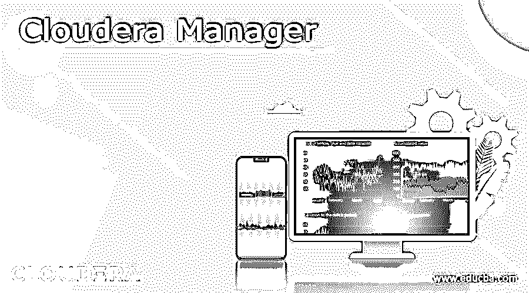

# Cloudera 经理

> 原文：<https://www.educba.com/cloudera-manager/>

## Cloudera Manager 简介

Cloudera Manager 是 Cloudera 数据平台 CDP 的组件。这是一个用于管理 CDH 集群的端到端应用程序，它通过改善性能、提高服务质量、降低管理成本和提高合规性来提供对 CDH 集群每个部分的可见性和控制。该应用程序用于配置、管理和监控 CDP 云基础集群和 Cloudera 运行时服务。它还可以自动执行安装过程，减少部署时间，并通过提供一个中央控制台，在整个集群范围内实时查看服务和主机的运行情况。让我们更深入地了解这个主题，并了解 Cloudera Manager 的工作原理、服务器和其他管理服务。

### Cloudera Manager 是如何工作的？

为了理解其工作原理，用户需要了解其内部工作原理或 Cloudera Manager 的词汇和架构。

<small>Hadoop、数据科学、统计学&其他</small>

*   部署是集群的主要部分。集群是一致的 CDH 主机的集合，主机被组织到机架中。
*   服务是具有许多角色的特定系统的实例，每个角色都分配给一台主机。
*   一个共同点是“角色”和“服务”的类类型/类实例性质。与其他编程语言类似，“字符串”表示类型或类型的实例。

`(“java.lang.String”) or (“hello world”).`

### 代理服务器体系结构

它运行一个中央服务器，即 Cloudera Manager 服务器，过去也称为“SCM 服务器”和“CMF 服务器”,它托管用于管理 CDH 的 UI Web 服务器和应用程序逻辑。

*   任何与安装 CDH、启动和停止服务以及配置服务相关的事情都由 Cloudera Manager 服务器管理。
*   Cloudera Manager 代理安装在每个托管主机上，负责启动、停止 Linux 进程、触发各种安装路径、解包配置和监控主机。
*   心跳是主要的沟通渠道。默认情况下，代理每 15 秒向服务器发送一次心跳，以了解代理正在做什么。
*   当心跳说，“这就是我要做的！”，服务器在响应中说“这是您应该做的”。因此，代理和服务器都以和解告终。
*   如果用户通过 UI 停止服务，代理将停止相关进程。如果进程未能启动，服务器会将启动命令标记为失败。

### Cloudera Manager 服务器:

Cloudera Manager 服务器维护整个集群的状态，用户可以分为“模型”和“运行时”状态，两者都存储在 Cloudera Manager 服务器的数据库中。

*   模型状态:它应该是什么需要在哪里运行，以及配置。它有 17 台主机，每台都应该运行数据节点，这就是所谓的模型状态。用户可以通过配置屏幕与模型集成。
*   运行时状态:它是什么进程正在运行，在哪里，当前正在执行什么命令。运行时状态将包括运行流程所需的确切配置文件。当用户在 Cloudera Manager 中单击“Start”时，服务器收集服务和角色的所有配置，进行验证，然后通过将它们存储在数据库中来生成配置文件。

### Cloudera Manager 监控和其他管理服务。

Cloudera 本身管理它的一些助手，包括活动监视器、主机监视器、服务监视器、报告管理器、事件服务器和警报发布器。为了隔离和可伸缩性，它们是分开管理的。

*   活动监视器:它收集由 MapReduce 服务运行的活动的信息，不是默认添加的。服务监视器:它从 Impala 和 YARN 服务收集关于服务和活动信息的健康和度量信息。
*   主机监视器:它收集主机的健康和度量信息。
*   事件服务器:它聚合相关的 Hadoop 事件，并使它们可用于搜索和报警。
*   Reports Manager:它生成报告，提供按用户、目录、用户组、按 YARN 和用户池的处理活动、HBase 表、名称空间的磁盘利用的历史视图。Cloudera Express 中没有添加。
*   警报发布者:它为某些类型的事件发送和生成警报。

Cloudera 将它们作为单独的角色进行管理，而不是将其视为 Cloudera Manager 服务器的一部分，以实现隔离和可伸缩性。此外，Cloudera 管理服务提供 Navigator 审计服务器、Navigator 元数据服务器作为 Cloudera Navigator 的角色。

**显示 Cloudera 管理服务状态，**

选择集群 Cloudera 管理服务

在主页上 Cloudera 管理服务表中的状态选项卡上，单击 Cloudera 管理服务链接

**要启动 Cloudera 管理服务**，最低要求是进行集群管理，

选择集群 Cloudera 管理服务

选择操作开始

在主页状态选项卡上，单击 Cloudera 管理服务右侧的向下箭头，单击开始

命令详细信息窗口将显示角色开始的进度，当 n/n 个成功的子命令完成时，任务就完成了。点击关闭

**要停止 Cloudera 管理服务，**最低要求是进行集群管理，

选择集群 Cloudera 管理服务

选择操作停止

在主页状态选项卡上，单击 Cloudera 管理服务右侧的向下箭头，单击停止

命令详细信息窗口将显示角色停止的进度，当 n/n 个成功的子命令完成时，任务就完成了。点击关闭

**重新启动 Cloudera 管理服务，**最低要求是进行集群管理，

选择集群 Cloudera 管理服务

选择操作重新启动

在主页状态选项卡上，单击 Cloudera 管理服务右侧的向下箭头，单击重新启动

“命令详细信息”窗口将显示角色停止然后启动的进度，当 n/n 个成功的子命令完成时，该任务被称为完成。点击关闭

### 结论

至此，我们将结束“Cloudera Manager”这一主题。我们已经了解了 Cloudera Manager 的含义和工作原理。我们还看到了代理服务器架构和 Cloudera Manager 服务器，它具有运行时和模型状态。还列出了 Cloudera Manager 的其他管理服务。最后但同样重要的是，我们看到了一些命令来启动/停止 Cloudera 管理服务，重新启动或显示 Cloudera 管理服务。这将有助于您了解什么是 Cloudera Manager 及其组件。谢谢！快乐学习！!

### 推荐文章

这是一个云时代管理器的指南。在这里我们讨论了 Cloudera Manager 的工作原理、代理服务器架构、Cloudera Manager 监控和其他管理服务。您也可以看看以下文章，了解更多信息–

1.  [Cloudera vs Snowflake](https://www.educba.com/cloudera-vs-snowflake/)
2.  [云迁移工具](https://www.educba.com/cloud-migration-tools/)
3.  [云迁移的优势](https://www.educba.com/cloud-migration-benefits/)
4.  [Cloudera vs Hortonworks](https://www.educba.com/cloudera-vs-hortonworks/)

