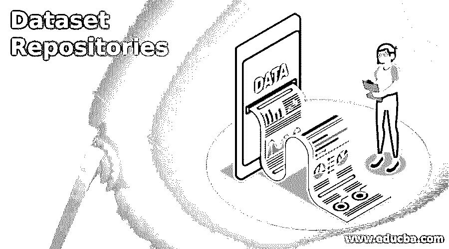

# 数据集储存库

> 原文：<https://www.educba.com/dataset-repositories/>

## 数据集存储库简介

数据集存储库被定义为存储、管理和使用可用于各种应用的数据集合的中心位置。在当前的时间表中，拥有一个可用于数据库查询分析的预定义数据集一直是一个挑战，该数据集可靠、清晰且易于解释各种用例，如数据库查询学习、数据科学建模和/或机器学习。同样，浏览大量数据集并选择最适合所需用例的数据集既有趣又令人沮丧。在本文中，我们将浏览一些数据集存储库，从中可以找到适合数据库、数据科学或机器学习用例的数据集。

### 顶级数据集存储库

在本文中，我们将尝试包含顶级数据集存储库的所有不同来源，然后在下一节中查看数据存储库的示例。顶级数据集存储库列表如下:

<small>Hadoop、数据科学、统计学&其他</small>

*   **来自美国政府的公开数据**:这个公开数据集由不同类型的数据组成，即。气候、农业、金融、健康相关、教育等。该网站允许用户搜索所需的数据并发布搜索结果，它提供的数据是公开的，可以免费使用。该数据集有不同的格式可供下载，由 Data.gov 汇总，并通过 GitHub 储存库进行维护。在
*   **ka ggle 中的开放数据集** : Kaggle 是一个在线社区，通过平台连接数据科学家和机器学习专家。这个平台包含来自各种来源的真实数据集，如用于学习 ML/AI 的开放数据集，由组织进行的真实比赛，这些组织反过来将这些解决方案用于他们的产品构建等。
*   **来自 Google 的数据集搜索**:查找任何搜索相关案例“Google”的最便捷平台。Google 的数据集搜索是一个工具箱，用户可以通过它的名称搜索数据集。这样做的话，将会返回许多数据集存储库，使其成为统一数据集并使其可被发现的平台。
*   **印度政府开放数据平台**:印度各部委和部门收集了大量数据，这些数据可在开放政府数据(缩写为 OGD)中获得，以实现对数据集的单点访问。这些数据集以开放格式提供给公众使用。通过该平台共享数据的目的是提高政府运作的透明度，同时开辟新的途径来试验和创新性地使用政府数据。
*   **开放来自微软研究院的数据**:和谷歌一样，微软也在 2018 年 7 月与一个研究社区合作扩展了一部分数据。呈现的数据集是为已完成和已发表的研究而精选的。该存储库中的数据集属于一个广泛的主题类别，如计算机科学、生物数学、医疗保健等。
*   **来自 Socrata** 的开放数据:该平台包含来自多个来源的数据集，并被放在一个被称为开放数据网络的地方，用户可以在那里浏览和搜索来自开放目录的数千个数据集，以找到所需的数据集。搜索方法还采用机器学习进行数据集分析，然后在目录之间进行分类。该平台还支持内置的可视化工具。
*   来自 Quandl 的数据集:任何从事机器学习项目的人可能一生中都会在 Quandl 中遇到一个数据集，因为据说世界上最强大的数据都在 Quandl 中。Quandl 中的数据集是干净的，因此通过数据的预测是相当准确的。在这个平台上，一些数据是公开的，而另一些数据不是免费的。
*   **UCI 机器学习库**:这也是最著名的数据仓库之一，任何研究机器学习问题的人都会遇到这个仓库，因为它包含了大约 500 个不同主题的数据集，数据集按照问题陈述的类型分类，如分类或回归。
*   学术洪流:顾名思义，它不是一个主流知识库，但却是一个强大的知识库。创建这样一个平台的主要尝试是通过 BitTorrent 提供各种类型的学术研究和相应论文中使用的数据集。
*   来自 Reddit 的数据集:最后但并非最不重要的是来自 Reddit 的知识库，这是一个非常受欢迎的新闻网站，在那里有讨论板，可以共享数据集。这些板被称为子记录或 r/数据集。挑战的一点是，共享数据集的健全性仍然是一个大问号。

### 数据仓库的例子

尽管数据存储库是一个非常通用的术语，它包含了收集和存储数据的各种方式。下面是一些数据仓库的例子以及相应的解释。

*   数据仓库(Data Warehouse):这是一个存储位置，来自多个数据源的数据被聚集在这里，记住这些数据不一定是相关的。
*   **数据湖**:这种存储指的是以原始和非结构化格式存储的数据。呈现的数据格式要么是 blobs，要么是文件。
*   **数据集市**:这些是数据存储库的较小版本，记住这些存储库需要有针对性。这些存储库往往更安全，因为授权用户仅限于针对该目标受众的孤立数据集。
*   **元数据存储库**:这是存储关于被存储数据的信息的存储器。
*   **数据立方体**:这些是存储为多维数组的数据，由数值组成！

### 结论

在本文中，我们讨论了数据存储库的各种动态，从顶级存储库和数据如何存储在存储库中的相应示例开始，为用户启用不同的数据存储库示例，相应地，这将使读者能够为各自的用例做出正确的选择！

### 推荐文章

这是数据集存储库的指南。这里我们讨论数据存储库的各种动态，从顶级存储库开始。您也可以看看以下文章，了解更多信息–

1.  [火花数据集](https://www.educba.com/spark-dataset/)
2.  [机器学习数据集](https://www.educba.com/machine-learning-datasets/)
3.  [数据结构中的哈希表](https://www.educba.com/hash-table-in-data-structure/)
4.  [什么是数据泄露？](https://www.educba.com/what-is-data-breach/)

