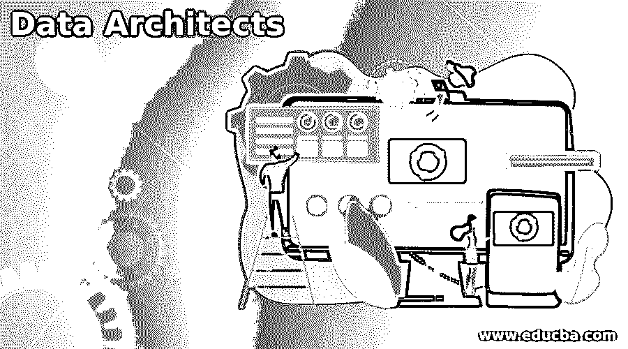

# 数据架构师

> 原文：<https://www.educba.com/data-architects/>

## 数据架构师简介

数据架构师在业务环境中进行监督，他将业务需求转化为技术需求，并为业务提供适当的原则和标准。他负责设计和可视化企业数据框架和管理。所以这个框架解释了计划、指定、允许、开发、获取、管理、使用、维护、检索、清除和存档数据的过程。他提供标准的业务声明，处理战略需求，表达高级集成框架来实现需求。他赞同与业务架构相关的分析视图。

### 数据架构师角色

*   数据架构师的角色是开发安全且可访问的复杂数据库系统。
*   它有助于定义数据库的全部用途，并开发一个框架来构建、测试和管理数据库。
*   数据架构师也称为 IT 专家，其职责是配置存储和访问数据的策略，与企业内部的不同数据源协作，并将趋势数据技术集成到现有的 IT 环境中。

### 数据架构师的职责

一个有效的数据架构师应该有以下职责:

<small>Hadoop、数据科学、统计学&其他</small>

*   首先，他应该与 IT 团队和管理层协调构建数据策略，以满足行业需求。
*   他应该有能力为架构实现开发数据清单，并致力于获取数据的最新机会。此外，他应该找到并评估现有的技术和数据管理流程，并创建一个端到端的愿景来定义企业内的数据流。
*   他应该为数据库应用程序和架构开发、设计、部署、调试和构建数据模型。他应该集成方法功能，如安全性、数据恢复、可靠性、性能、可伸缩性和准确性。他应该有一个定期的监视器来报告和改进数据库管理的性能。

### 数据架构师业务技能

*   数据架构师应该精通业务和技术技能，从数据挖掘到问题解决。成为数据架构所需的技术技能包括 Oracle 等应用服务器软件、Microsoft SQL server 等数据库管理系统软件、XML 等企业应用集成工具、查询软件、环境软件开发知识、归档和备份软件、ERP 实施和敏捷方法、NLP、预测建模、数据挖掘、Visio、ERWin、ETL 工具等数据建模工具、Perl、C、C++、Python、MS Windows、Solaris、Linux、Unix、NoSQL、Hadoop、机器学习。
*   数据架构师的业务技能包括有效的沟通、分析性问题解决、行业知识和专家管理。以清晰的视角观察高层次的数据挑战非常重要，而正确应对这些挑战是最重要的。所以他要有很强的分析能力，突出解决问题。数据科学家必须开诚布公，并具备仔细倾听管理层意见的技能，以便听到和理解问题。数据分析师和其他相关人员应该共同努力，实现解决问题的最佳设计，并拥有最佳的沟通技巧，让企业了解他们的想法。
*   沟通技巧很重要，因为他需要向他的非技术同事解释概念、过程、问题和解决方案。数据架构师的专家管理应该指导和建议他的数据建模师、数据库管理员、数据工程师和初级架构师。行业知识对于理解组织的功能以及如何分析、使用和收集数据是必要的。它保持了大数据开发的灵活性。

### 数据架构师工资

*   根据 payscale 报告，2021 年 5 月，数据架构师在美国的平均年薪为 121，198 美元，在 Indeed 的报告中具有 273，000 美元的共同基线。
*   在印度，平均薪酬为每年 172.2 万卢比，最高可升至 100 万卢比。每年 3，131，000，如果不满足适当的条件，可以降到每年 1，015，000 卢比。

### 数据架构师进一步学习

*   数据架构师的学习路线图从常见的步骤开始。首先，毕业于计算机工程、计算机科学或相关领域的学士学位。课程工作应该是编程、大数据开发、数据管理、系统分析和技术架构。
*   获得数据科学相关领域硕士学位者优先。你的应用程序的关键要素取决于体验。
*   表现优秀的人可以期望候选人在绩效管理、网络架构和应用架构方面有相关的经验。那么他应该获得数据相关领域的认证，才能在技术上大放异彩。该认证帮助他在大多数知名的数据相关组织中获得了令人着迷的薪水。最后，他应该在实时项目上工作，以获得各种投资组合的经验，这有利于他未来的就业。

### 数据架构师认证和工作

*   有一些强制性的认证来扩展和评估你的知识和学习。这些认证来自 Hortonworks、IBM 和 Salesforce。因此，用户应该为考试做好准备并通过考试，以节省时间和成本。
*   CDMP 是由认证数据管理开发的，我们可以在大多数数据架构师的简介中看到这一点。它并不针对某个特定的供应商或平台，但是它为通用数据库的专业人员提供了可靠的输入。认证分为四个级别:硕士、研究员、从业者和助理。
*   大数据-IBM 认证数据架构师，候选人应该在数据复制、集群管理、LDAP 安全方面具有很强的技能。它的目标是 Hadoop、Cloudant、BigSQL 和 BigInsights。
*   管理设计器和 Salesforce 数据架构提供给在 Salesforce 平台、管理设计器和数据架构上工作的资源。该考试基于 LDV 环境、更高维的卷风险、LDV 注意事项和缓解策略。

### 结论–数据架构师

数据架构师应该将新系统合并、开发并实施到现有的数据库开发模型中，并使其成为标准模型。此外，他应该管理包含数据架构过程和工件的业务存储库。

### 推荐文章

这是数据架构师指南。在这里，我们讨论介绍，角色，责任，业务技能，工资，认证和工作。您也可以看看以下文章，了解更多信息–

1.  [什么是数据工程？](https://www.educba.com/what-is-data-engineering/)
2.  [文本数据挖掘](https://www.educba.com/text-data-mining/)
3.  [数据库管理员技能](https://www.educba.com/database-administrator-skills/)
4.  [数据操作工具](https://www.educba.com/data-manipulation-tools/)

