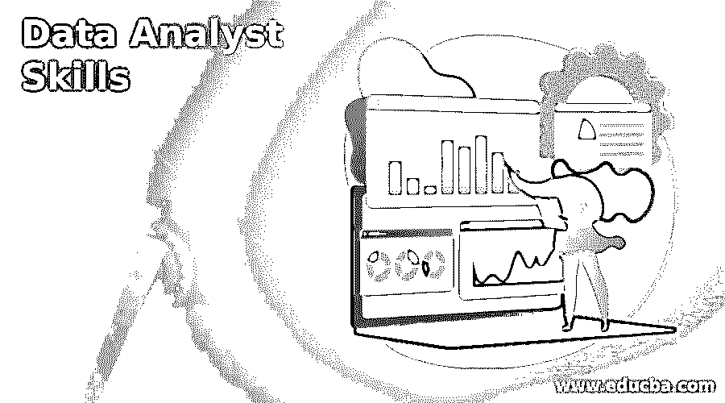

# 数据分析师技能

> 原文：<https://www.educba.com/data-analyst-skills/>

## 数据分析师技能简介

以下文章概述了数据分析师的技能。数据分析师分析数据以获取企业或组织的重要信息。他们从原始数据中提取的信息，他们只是提取了有意义的完整部分，这将有助于雇主或企业根据他们在此过程中收集的不同趋势和事实做出关键决策。它包括数据分析师不同类型的职责，包括准备报告、删除损坏的数据、使用工具提取信息、向管理层提交最终报告等。这些是 data analyst 的一些要点，在 it 的生命周期中非常重要。

### 顶级数据分析师技能

下面详细介绍了数据分析师的关键技能，以便更好地理解在该领域获得工作的要求。

<small>Hadoop、数据科学、统计学&其他</small>

*   他们应该有高水平的数学技能。
*   非常好的解决问题的能力。
*   团队工作技能。
*   口头和书面沟通技巧。
*   应该有能力分析和解释数据，并从中获取相关信息。
*   准确性和对每个次要和主要细节的关注，以获得更好的结果。
*   应该在截止日期前完成。
*   良好的逻辑和神话方法。

我们所给出的一切显示了他们应该具备的技能，但现在我们将看到技术技能，他们还应该有一些更重要的技能来获得结果。

以下是数据分析师所需的技能:

#### 1.统计程序设计语言

首先，他们应该很好地理解任何统计编程语言，因为分析数据是非常有用和重要的，有助于我们准备并从中获得重要信息，从而帮助管理层、雇主和企业根据这些数据做出决定。所以我们有 Python 或者 R；这些语言帮助我们分析大量的数据。

#### 2.机器学习

现在，我们有许多公司使用先进的技术机器来完成他们的任务，而不太需要人类的意图，所以数据分析师应该知道机器学习。所以他们应该发展这种技能，因为随着技术的进步，人工智能在不断发展。

#### 3.数据可视化

我们可以说这发生在最后，因为一旦数据分析师完成了与相关发现相关的三项工作，即汇编数据和分析之后，他们必须向组织展示他们的数据和发现。但是要表示它们，我们必须有数据可视化，以便更好、更快地理解它。这些可以是图形或图表，直观地表示数据，使其与用户更具交互性。

#### 4.研究

这也是一项重要的技能，因为有时，我们必须做大量的研究来获得相关的信息。这有助于他们确定可以用来解决任何技术问题的新方法。所以它是解决方案、不同方法和信息的组合。

#### 5.问题解决

结论这是技术界非常重要的技能。我们必须给出问题的解决方案，因为我们可能会提出一个需要解决的新技术问题，这是我们日常工作的一部分，所以提出解决方案非常重要。

#### 6.结构化查询语言

这代表结构化查询语言；它是一种计算工具，可以帮助我们非常快速地处理大量数据，在这些数据的帮助下，我们可以非常快速地提取相关信息。我们可以应用任何条件来获取数据，数据会立即给出结果。因此，这是进行数据分析时非常重要的技能。

#### 7.电子表格

为了表示数据，很少公司的首选报表应该由表示重要数据的报表来准备，因此它是一种工具，有助于通过使用传统的电子表格工具来满足他们的要求。

#### 8.数据准备

这也称为数据优先；在这个过程中，我们试图做出可理解的报告，这些报告可以进一步用于表示相关信息。基本上，我们用这种方法将我们的重要数据转换成可理解的、可读的、易于捕捉的报告。这一步通常在可视化 pat 之前完成，因为在这之后，使用图形或图表来表示数据，以将它们呈现给公司。

#### 9.领域知识

领域知识对于分析任何数据也非常重要，因为它帮助我们提供对数据的洞察，然后帮助我们从这些数据中获得更多的意义。此外，关于领域的适当知识有助于他们快速理解数据，这有助于他们使数据具有相关性。

#### 10.写作

强有力的写作技巧是非常重要的，因为它们与数据分析部分密切相关，这需要创建重要的信息。他们积极参与创建报告，并必须将调查结果写入报告，因此需要写作技能。

#### 11.合作

为了与团队和外部涉众紧密合作，这是数据分析师需要具备的主要技能之一。因为他们经常与他们联系在一起，因为对团队和他们的工作的欣赏有助于每个人在各自的时间内完成任务。

#### 12.数据库

这有助于创建代表公司数据的虚拟存储。对于这些数据，数据分析师必须维护适当的访问权限，因为组织的数据分析师管理这些数据。此外，它还包含需要适当安全性的敏感数据。

### 推荐文章

这是数据分析师技能指南。为了更好地理解，我们在这里讨论简介和顶级数据分析师技能。您也可以看看以下文章，了解更多信息–

1.  [什么是数据工程？](https://www.educba.com/what-is-data-engineering/)
2.  [文本数据挖掘](https://www.educba.com/text-data-mining/)
3.  [数据库管理员技能](https://www.educba.com/database-administrator-skills/)
4.  [数据操作工具](https://www.educba.com/data-manipulation-tools/)

