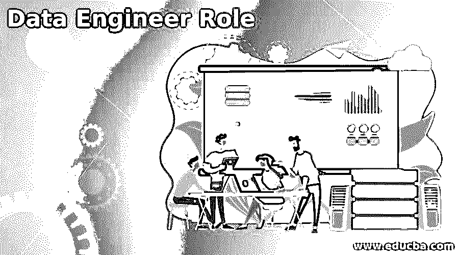

# 数据工程师角色

> 原文：<https://www.educba.com/data-engineer-role/>

## 数据工程师角色介绍

数据工程师可以定义为数据科学团队中的工程角色，包括与数据操作相关的各种领域或一些需要制作和处理数据平台技术结构的数据相关项目。谈到数据工程师的角色，它的角色是多用途的，因为项目需要他们。此外，它将与全球复杂的数据平台相连接。因为数据科学和数据科学家特别渴望发现数据，在数据中产生直觉以及构建机器学习算法，现在数据工程维护关于在创建基础设施上创建这些算法的努力，并在广谱中制造数据管道。

### 数据工程师角色技能

基本上，任何专家所拥有的技能都与他们所控制的职责相关，比如团队规模、平台规模和项目复杂性，包括工程师的优势水平。在这里，所建立的技能会有所不同，因为数据工程师可以确保的事情有多种选择。但是总的来说，他们的任务可以分成三个核心区域:数据科学、工程和仓库/数据库。

<small>Hadoop、数据科学、统计学&其他</small>

#### 1.工程技能

为数据分析或大数据实现的极限工具和系统都是用 Java(像 Apache Hive，Hadoop)和 Scala(像 Apache Spark，Kafka)编程的。Python 和 Rlang 因其可接受性和语法简单性而被广泛应用于数据项目中。然而，像 C#/C 和 Golang 这样的高性能语言在数据工程师之间太普遍了，特别是对于训练和执行 ML 模型。因此，技能包括软件架构、背景、Scala、Java、R、Python、Golang、C/C#。

#### 2.数据相关的熟练程度或数据科学技能

数据工程师几乎可以和数据科学家一起工作。使用数据平台的基本要素包括对数据建模、算法和数据转换方法的深入理解。数据工程师将控制 ETL 的构建，即数据提取、转换、加载、存储和分析工具。因此，了解流行的 ETL 和 BI 解决方案是必要的。

在运行 Hadoop 或 Kafka 等承诺机制的大数据任务中，需要更精确的熟练程度。如果项目与机器学习和人工智能相关，数据工程师应该具有 ML 库和框架的知识，如 Spark，mlpack，TensorFlow，Pytorch。这些技能包括数据科学思想的丰富知识、数据分析的熟练程度、Kafka 和 Hadoop 等大数据技术，以及 ETL 工具和 BI 工具的实践经验。

#### 3.数据仓库/数据库

在最好的情况下，数据工程师实现精确的工具来设计和构造数据存储。在这里，这些存储将用于存储结构化或非结构化数据，以供考虑或插入承诺的分析界面。此外，在极端情况下，这些是关系数据库；因此，对于查询/数据库，SQL 是每个数据工程师必须了解的主要内容。很少有其他工具，如 Redshift、Talend 或 Informatica，是开发大型分布式数据存储(即 NoSQL、云仓库)或在成功的数据平台中执行数据的主流解决方案。因此，主要工具包括 SQL/NoSQL、Panoply、Amazon Redshift、Oracle、Informatica、Apache Hive 和 Talend。

### 数据工程师角色主要职能

众所周知，数据工程是一项复杂的活动，它为组织内的数据科学家和收集者创建可操作的原始数据，从而设计、安排和增强整个组织内的事实流。

我们有三个主要功能来帮助通过数据基础架构原则处理数据:

#### 1.提取数据

最初，我们需要提取可能存在于其他地方的信息或事实。关于业务数据信息，来源可能是一些数据库、内部 CRM/ERP 系统、网站的用户交互等。甚至数据源可以是位于飞机机身上的传感器，或者数据源可以来自在线的公共源。

#### 2.数据存储/更改

存储是任何数据管道中的主要架构点。我们必须将提取的数据信息存储在某个地方。在数据工程中，数据仓库的概念象征着为分析而收集的所有数据的最终存储。

#### 3.转换

由于很难分析原始形式的数据事实，因此可能不会为终端操作人员创建太多逻辑。因此，转换的目标是清理、组织和配置数据集，以创建可用于处理或研究的数据。在这种结构中，它最后可以用于额外的处理或从报告级别请求。

数据管道的标准架构在其中心点附近转向，称为仓库。但是，组合存储的存在可能不是强制性的，因为专家可以将其他事件用于存储/转换目的，或者甚至可以根本不进行存储。因此，数据访问工具和数据源之间出现的次数总和决定了数据管道体系结构。

### 单独零件

数据工程师的职责可以同时涉及整个系统，也可以单独涉及系统的每个部分:

#### 1.一般角色

在一个较小的数据专家团队中创建的数据工程师将负责数据流的每个阶段。因此，从构建数据源到同化分析工具；总之，这些系统将由一个普通的数据工程师来设计、构建和完成。

#### 2.以仓库为中心

传统上，数据工程师包括一个负责使用 SQL 数据库来构建数据存储的角色。然而，以仓库为中心的数据工程师可能还包括几种存储(SQL 或 NoSQL)、关联源或其他数据库的集成工具，以及处理大数据的工具(Kafka、Hadoop)。

#### 3.以管道为中心

这个角色数据工程师关注与数据仓库相关的数据集成工具，这些工具可以从一个地方进一步提供负载信息，或者转移更精确的职责。在处理生态系统的这一层时，这将是以管道为中心的数据工程师的重点。

### 数据工程师角色职责

数据工程师通常是一个技术点，它整合了计算机科学、工程和数据库的知识和能力，包括以下职责:

*   一个数据平台的架构设计。
*   使用编程技能改进数据连接实例或工具，以创建、定制和管理数据库、集成工具、分析系统和仓库。
*   测试/维护数据管道的一致性和性能。
*   将数据科学家规划的机器学习算法模型放入生产环境。
*   通过数据库管理系统以结构化或非结构化的形式处理存储在仓库中的数据和元数据。
*   提供数据访问工具来观察数据、生成报告和制作图像。
*   跟踪管道的稳定性和性能，以便根据数据要求/模型的变化进行监控和更新。

### 以下任务

当您可能需要数据工程师时，有各种场景/任务可供选择:

*   **扩展数据科学团队:**数据工程师是数据科学团队处理技术基础设施的一个很好的选择。
*   **处理大数据项目:**数据工程师包括旨在执行大数据、组织数据湖以及为 NoSQL 存储构建宽敞的数据集成管道的项目。
*   **定制数据流的必要性:**即使是中型企业也需要将 ETL(提取、转换和加载)原则应用于自动化 BI 平台，以利用多种数据类型的各种存储和流程。

### 推荐文章

这是数据工程师角色指南。在这里，我们讨论简介，数据工程师的角色技能，主要功能，各个部分，责任。您也可以看看以下文章，了解更多信息–

1.  [什么是数据工程？](https://www.educba.com/what-is-data-engineering/)
2.  [文本数据挖掘](https://www.educba.com/text-data-mining/)
3.  [数据库管理员技能](https://www.educba.com/database-administrator-skills/)
4.  [数据操作工具](https://www.educba.com/data-manipulation-tools/)

