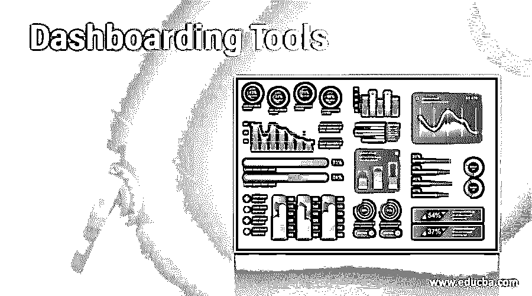

# 仪表板工具

> 原文：<https://www.educba.com/dashboarding-tools/>

## 仪表板工具简介

仪表板工具提供所有关键性能指标，以提供可视化、分析和显示数据的所有信息，以便全天监控数据并从中得出结果。此外，可以对数据进行定制，以适应特定分支机构或特定公司的需求。有许多仪表板工具专门用于监控、分析、可视化或组合所有数据流程。此外，仪表板有助于跟踪工作或从任何资源获取输入，以便对数据进行分析。

### 仪表板工具说明

以下是仪表板工具列表

<small>Hadoop、数据科学、统计学&其他</small>

#### 1.数据线

要可视化和监控的数据可以按照特定需求的顺序排列，并且可以使用应用程序中的高级分析功能对数据进行分析。我们可以根据需要创建公式，以便数据分析在我们的控制之下。警报可以修改，当数据不受用户控制时，用户会知道。报告也是自动创建的，用户对应用程序中的交互式仪表板非常满意。趋势是由工具本身创造的，应用程序对用户来说不是免费的。

#### 2.活人画

大多数人都乐于使用 tableau，因为它具有高度交互性的用户界面和交互式仪表盘。它与外部资源或任何云应用程序连接，并从应用程序收集数据，以将更新的数据上传到工具中并自动进行分析。tableau 的任何用户都可以轻松访问应用程序的任何部分，并很好地使用它。应用程序管理员可以轻松地为任何进程授予权限，以便很好地检查该工具。使用该工具不需要基础设施，与 Datapine 相比，价格非常便宜。

#### 3.西森斯

该应用程序可以轻松处理复杂的数据，并进行分析，以便得出结果。用户界面非常简单，拖放操作可以帮助应用程序从任何资源或多个资源创建和管理许多数据模型。商业智能是该工具的另一部分，因为提供的结果可以可视化，以帮助企业在竞争激烈的世界中发展壮大。不需要插件或其他工具，因为 Sisense 拥有分析和可视化数据所需的所有工具。这个工具是有价格的，根据使用情况有所不同。

#### 4.壁虎

数据被收集，以图表的形式可视化，并在同一公司的同行之间共享，以便在群体中理解数据。这有助于商业上的进一步讨论。此外，可以从任何网站或任何工具跟踪任何信息，以使可视化成为现实。数据可以取自任何资源，或者用户可以提供数据以可视化其流程。mac 系统中还有一个 Geckoboard 的移动应用程序，可以随时跟踪数据。任何形式的数据都可以很容易地可视化，并且可以很容易地定制共享版本。第一个月免费提供，第二个月开始收费。

#### 5.Cyfe

该工具在网上提供，当然，它是免费提供的。该平台类似于 Geckoboard，它从任何资源中获取数据，并根据用户的需求组合这些数据。工具内部可以使用不同的仪表盘，最多五个。仪表板可以在团队成员之间或组织外部共享，报告可以以任何形式自动创建并自动发送。历史记录可以在工具中删除或存档。该帐户的高级版本价格低廉。工具内部可以构建许多服务。

#### 6\. Klipfolio

一个在线仪表盘被称为 Klipfolio，它可以与云集成，一次创建任意数量的仪表盘。结果可以与任何在线资源进行比较，这有助于用户更好地理解数据流。仪表板是灵活的，因为它可以在工具中容纳任意数量的数据。虽然对于初学者来说，将复杂的数据输入到工具中非常容易，但是执行这些操作需要时间，而且可能会很慢。与其他工具相比，价格适中。数据可以很容易地定制，因此数据可以很容易地用于业务目的。

#### 7.Zoho 分析或 Zoho 报告

Zoho 提供的工具有助于整合数据，并根据用户的需求进行分析。此外，可以在工具内部创建报告，并与他人共享。输入的数据也可以与组织中的人协作。它很容易被认为是一个根据用户需求可视化数据的商业智能平台。该工具中提供了隐私保护，以保护其免受外部攻击。该工具价格适中，可以与不同的用户共享。

#### 8.InetSoft

InetSoft 提供了一个用于分析和报告的仪表板工具，支持云，因此数据可以上传到大数据级别。仪表板嵌入在系统中，注释可以上传到工具中。该工具提供了数据块建模，最终用户甚至可以通过互联网进行连接。基础设施是安全的，因此不会发生对数据的外部攻击。此外，各种数据可以与该工具集成，因此我们可以说它是一个强大的数据分析混搭工具。

通过可视化来理解数据是非常容易的，仪表板在帮助用户与资源协作方面发挥了重要作用。一些仪表板也可以定制。

### 推荐文章

这是仪表板工具指南。在这里，我们讨论仪表板工具列表及其详细说明。您也可以看看以下文章，了解更多信息–

1.  [什么是 Tableau 仪表盘？](https://www.educba.com/what-is-tableau-dashboard/)
2.  [商业智能仪表板](https://www.educba.com/business-intelligence-dashboard/)
3.  [Pig 数据类型](https://www.educba.com/pig-data-types/)
4.  [性能监控工具](https://www.educba.com/performance-monitoring-tools/)

