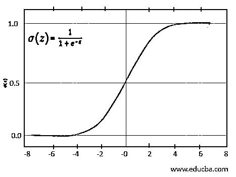

# 统计学习导论

> 原文：<https://www.educba.com/introduction-to-statistical-learning/>

## 统计学习导论

统计学可以理解为一门收集和分析大量数据的学问。统计学习服务器作为提取事实和总结可用数据的手段。统计自 18 世纪以来一直在实践中，主要用于税收和军事用途。到 20 世纪末，随着计算机的出现，统计概念的应用随着其对机器学习和神经网络等技术的贡献而扩大。在这个主题中，我们将学习统计学习的介绍。

统计学习通过处理大量数据，执行数百次迭代来分析和选择最佳和相关数据以获得优化结果，从而使数据预测和分类成为可能。

<small>Hadoop、数据科学、统计学&其他</small>

### 什么是统计学习？

数据是推动统计学习的燃料，而统计就是要理解手中的数据。从统计学习中获得的结果帮助我们确定趋势并预测未来可能的结果。

统计学习作为一种工具来实现监督和非监督机器学习技术的目标。使用监督统计学习，我们可以根据以前的输出预测或估计结果，而使用非监督统计学习，我们可以通过将数据聚类到类似的组中来发现数据中存在的各种模式。

本文简要介绍了监督统计学习方法，即回归和分类

#### 1.回归

想知道股市预测是如何工作的吗？或者房地产经纪人如何估算房价？或者想知道市场上的新车是否值得购买？如果是，那么你可以在一种叫做回归的统计方法中找到答案。回归方程和分析用于对定量(数字)数据进行无偏和准确的预测。此外，回归分析有助于我们确定两个或多个变量之间的关系。

一个因变量(Y)和一个自变量(X)之间的关系在简单线性回归(SLR)中确定。对 X 的任何变化将如何影响 Y 的估计由下面的等式给出。

##### 偏差-方差权衡:

线性回归就是寻找最合适的直线。回归模型中的误差主要是由于偏差和方差。最小化这两个预测误差对于获得在训练和测试数据集上都工作良好的一般化模型是至关重要的。

##### 偏见:

线性回归模型假设目标变量与其特征具有线性关系。在现实中，尽管情况可能并非如此，线性回归模型无法捕捉真实的关系被称为偏差。偏差引起的误差计算为预测值和实际值之间的差值。

##### 差异:

方差向我们展示了所考虑的数据点分布有多远。方差误差是指数据集发生变化时预测的波动，它是根据给定数据点的模型预测的可变性来计算的。

考虑模型具有高偏差和低方差的情况；那么它可能不太复杂，并且可能会使数据不足。现在，如果模型具有低偏差和高方差，它可能会过度拟合数据，使其在尝试未知输入时更加复杂和不一致。因此，为了避免这种情况，需要就偏差和方差达成共识，以获得可接受的模型。

理想模型被选择为具有能够捕捉其变量之间的真实关系的低偏差和跨不同数据集产生一致预测的低方差。这可以通过获得简单和复杂回归模型之间的最佳平衡点来实现。方法，如正规化，装袋和助推有助于实现汗水点。

#### 2.分类

分类适用于定性(非数字)数据，其中目标变量可被分类或分组为两类(二元分类)或更多类(多类分类)。分类统计学习的示例包括将电子邮件标记为“垃圾邮件”或“火腿”，预测客户流失，根据动物的品种对它们进行分类，等等。

在分类中，通常使用概率方法来获得输出，以便统计推断的结果给出实例属于某个类别的概率，而不仅仅是指定最佳类别。

##### 逻辑回归:

逻辑回归是广泛用于二元分类的分类算法之一。该模型使用逻辑函数来确定 0 到 1 范围内的目标值，并且可以表示为如下所示的 Sigmoid 函数。

### 我们为什么需要统计学习？

在当今时代，如果有一样东西变得比自然资源更丰富，那么毫无疑问，它应该是数据。我们每天产生的数百万字节的数据需要一个来源来分析和总结它们。如果不明智地使用，这些数据很容易被误解或被操纵，只展示某个观点。因此，为了避免危险的数据事故，统计学习成为一种工具，以确保数据的完整性及其正确和传出的使用。

统计学习帮助我们理解为什么一个系统会有这样的行为。它减少了模糊性，并产生了在现实世界中很重要的结果。统计学习为我们提供了准确的结果，可以在医学、商业、银行和政府领域找到它的应用。

### 优势

| 

 | 轻松识别模式和趋势。随着趋势的确定，针对特定产品的特定客户变得更加容易。 |
| 

 | 节省时间。在几分钟的时间跨度内，成百上千个用于实现优化结果的时期是可能的。 |
| 

 | 可以处理大量数据和各种参数。 |
| 

 | 通过对数据进行逻辑分析，而不是根据“直觉”发号施令，改进决策和预测技术 |
| 

 | 一旦系统运行，除了保持系统运行所需的偶尔更新之外，不需要任何人工干预。 |

### 结论——统计学习简介

随着技术的进步，我们现在在日常生活中处理的统计数据比以往任何时候都多。我们积累的每十亿字节的数据都告诉我们需要正确解释的各种故事，如果没有统计学与数据挖掘、机器学习和人工智能等其他分支的交叉，这是不可能的。

### 推荐文章

这是一本介绍统计学习的指南。这里我们讨论监督统计学习方法，即回归和分类。您也可以看看以下文章，了解更多信息–

1.  [统计分析工具](https://www.educba.com/statistical-analysis-tools/)
2.  [统计分析回归](https://www.educba.com/statistical-analysis-regression/)
3.  [统计分析方法](https://www.educba.com/statistical-analysis-methods/)
4.  [统计分析类型](https://www.educba.com/statistical-analysis-types/)

