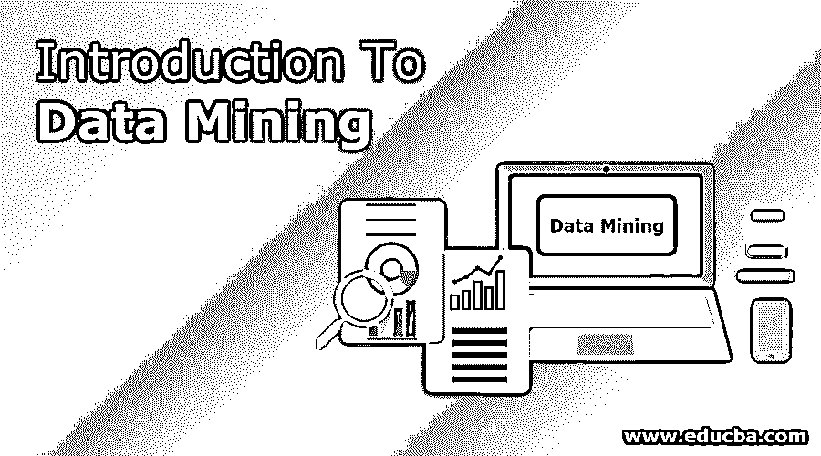
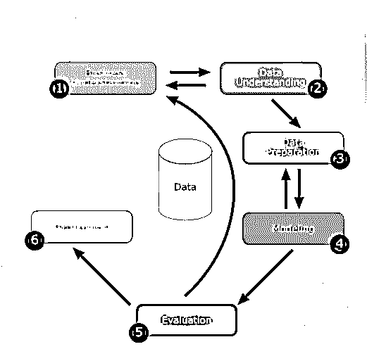
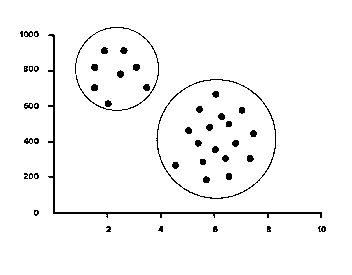
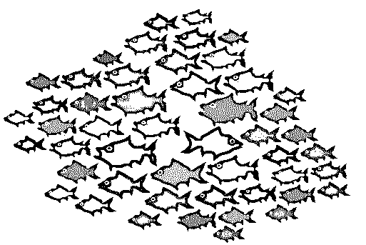
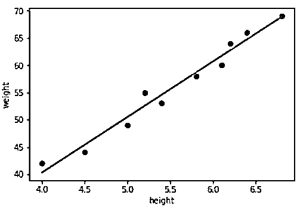
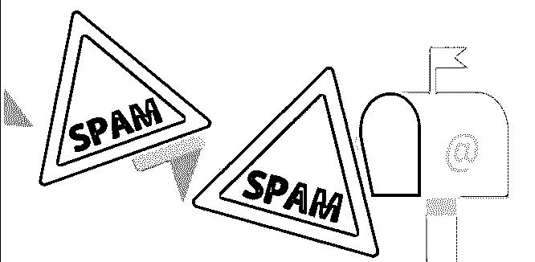

# 数据挖掘简介

> 原文：<https://www.educba.com/introduction-to-data-mining/>

## 数据挖掘简介

在本文中，我们将了解数据挖掘的介绍，因为人类已经从地球上挖掘了几个世纪，以获得各种有价值的材料。有时候在采矿的时候，人们会从地下发现一些东西，而这些东西原本是没人会想到会被发现的。例如，1898 年，在埃及萨卡拉挖掘一座坟墓寻找木乃伊时，发现了一件酷似飞机的木制工艺品。它可以追溯到公元前 200 年，大约 2200 年前！但是我们能从大量的数据中获得什么样的信息呢？而且即使我们开始挖掘，有没有可能从数据集里得到任何意想不到的结果？在此之前，让我们来了解一下什么是数据挖掘。

### 什么是数据挖掘？

*   它基本上是从大量数据中提取重要的信息/知识。
*   把数据想象成一个巨大的地面/岩石表面。我们不知道里面是什么；我们不知道岩石下面是否有有用的东西。
*   在这个数据挖掘的介绍中，我们正在寻找隐藏的信息，但是不知道我们想要找到什么类型的信息，以及一旦我们找到它，我们打算用它来做什么。
*   就像传统挖掘的概念一样，在数据挖掘中也有各种各样的技术和工具，这些技术和工具根据我们要挖掘的数据类型而有所不同，所以我们已经通过数据挖掘简介这一主题明确了什么是数据挖掘。

### 例子

数据挖掘的一个例子如下所示:

<small>Hadoop、数据科学、统计学&其他</small>

*   于是就有了移动网络运营商。他们向数据挖掘专家咨询，以深入研究接线员的通话记录。数据挖掘者没有具体的目标。
*   给出了一个月内发现至少 2 个新模式的量化目标。
*   随着数据挖掘者开始挖掘数据，他发现了一种模式，即周三的国际电话比其他日子少。
*   这些信息与管理层共享，他们提出了降低周三国际电话费率的计划，并发起了一场运动。
*   通话费率飙升，客户对低通话价格感到满意，更多的客户签约，他们赚更多的钱！双赢！

记住上面的例子，现在让我们看看各种数据挖掘步骤。

### 数据挖掘涉及的步骤

以下是数据挖掘中涉及的步骤:

#### 1.商业理解

在对数据挖掘的介绍中，我们将了解业务目标和需求的每个方面。通过寻找资源、假设和其他重要因素来评估当前情况。因此，为数据挖掘计划建立一个良好的介绍，以实现业务和数据挖掘目标。

#### 2.数据理解

最初，从所有可用的来源收集数据。然后，我们选择最佳数据集，从中提取信息，这可能更有益。

#### 3.数据准备

一旦数据集被识别，它就被选择、清理、构造并以期望的形式格式化。

#### 4.数据建模

它是根据用户的要求对给定的数据进行重新建模的过程。可以在准备好的数据集上创建一个或多个模型。最后，模型需要由涉众仔细评估，以确保创建的模型符合业务计划。

#### 5.估价

这是数据挖掘中最必要的过程之一。它包括检查流程的每个方面，以检查任何可能的故障或数据泄漏。此外，由于发现了新的模式，可能会提出新的业务需求。

#### 6.部署

它意味着展示知识，以便涉众在需要时可以使用它。在我们上面的例子中，发现国际电话在星期三较少，所以这个信息被呈现给利益相关者，他们利用这个信息来增加他们的利润。

### 数据挖掘中使用的技术

下面列出了数据挖掘领域中使用的技术:

#### 聚类分析

聚类分析能够根据数据库中的标准特征来识别给定的用户组。这些特征可以包括年龄、地理位置、教育水平等等。

#### 异常检测

它用于确定某个事物何时明显不同于常规模式。它用于从源头消除任何数据库不一致或异常。

#### 回归分析

这种技术用于根据数据集中的关系进行预测。例如，可以通过分析过去的质量并考虑决定库存率的不同因素来预测特定产品的库存率。或者，如下所示，如果我们有不同人的身高和体重数据，那么给定任何一个尺寸或体重，我们就可以确定另一个值。

#### 分类

这是关于有标签的东西。聚类检测中的注意事项；项目中没有标题，通过使用数据挖掘，我们必须标记并形成集群。尽管如此，在分类中，存在可以使用算法容易地分类的信息。一个例子是垃圾邮件过滤器。垃圾邮件过滤器提供有相关和垃圾邮件消息(训练数据)。它们之间的差异被识别，从而使它能够正确地分类未来的电子邮件。

**联想学习**

它用于分析哪些事情倾向于成对或成组一起发生。例如，想买柠檬的人也会买橘子，倾向于买面包，再买牛奶等等。因此，对所有顾客的购买行为进行分析，将一起发生的事情放在一起，以增加销售额。所以牛奶放在面包旁边，柠檬放在橘子旁边，等等。

### 数据挖掘道德吗？

所以，我计划和一个朋友去果阿度周末。我在网上搜索果阿值得去的地方。下次打开互联网，发现果阿各种酒店入住的广告。

#### 好事？

是的，互联网帮助我简化了我的旅行。毕竟，如果我决定去果阿，我需要找个地方睡觉，一个向我展示酒店的广告要比一个向我展示随机购买的衣服的广告有用得多。

#### 坏事？

是啊！为什么一个我从未听说过的数据挖掘公司会知道我要去哪里度假。如果我没有告诉任何人这次旅行，但在这里互联网突然知道我要去那里。事实是，数据挖掘公司的商业模式依赖于此。他们通过 cookies 和脚本收集这些数据，然后将这些数据出售给广告商，而广告商又试图向我出售其他东西(在这种情况下，是一个酒店房间)。

所以它可能是好的也可能是坏的取决于我们看待它的方式。此外，在上述情况下，我们可以随时关闭 cookies 或隐姓埋名。尽管不管是什么情况，有一件事是肯定的。数据挖掘将会继续存在。

### 推荐文章

这是一本介绍数据挖掘的指南。在这里，我们讨论数据挖掘的步骤和技术以及相应的例子。您也可以阅读以下文章，了解更多信息——

1.  [数据挖掘面试问题](https://www.educba.com/data-mining-interview-questions/)
2.  [预测分析与数据挖掘](https://www.educba.com/predictive-analytics-vs-data-mining/)
3.  [数据科学简介](https://www.educba.com/introduction-to-data-science/)
4.  [什么是回归分析？](https://www.educba.com/what-is-regression-analysis/)

