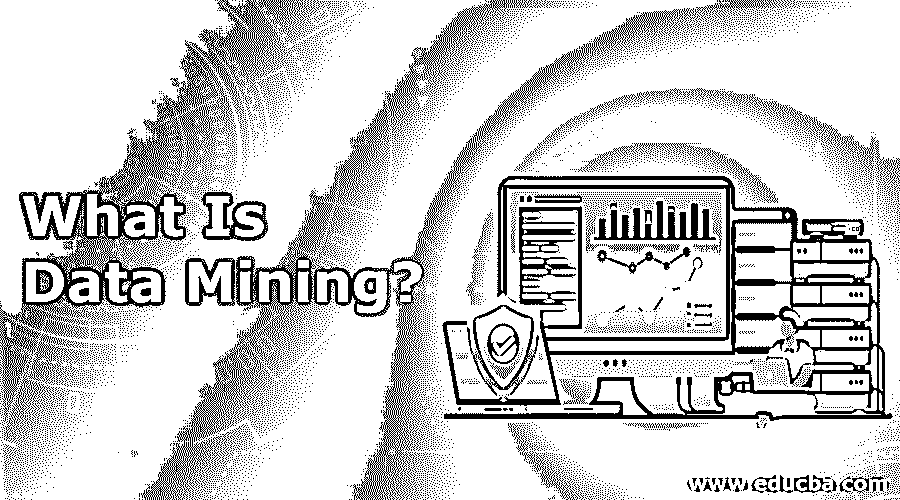

# 什么是数据挖掘？

> 原文：<https://www.educba.com/what-is-data-mining/>

## 数据挖掘的定义

数据挖掘涉及使用机器学习、统计和其他数据库系统对大规模数据集进行新的模式，以生成关于数据的新见解。如果解释和分析不当，这些数据会产生很大的误导。模式有助于节省解释数据的时间，因为它有助于快速可视化数据。在一些软件或工具的帮助下，原始数据被转换成有用的和可信的信息。高优先级被给予安全数据，因为没有人知道这种数据的行为。

### 什么是数据挖掘

挖掘通常是在具有不同数据集的数据库上进行的。它以结构化格式存储。到那时，隐藏的信息被发现了；例如，谷歌等在线服务需要大量数据来为用户做广告。这种案例挖掘分析查询的搜索过程以给出相关的排名数据。挖掘过程中使用的工具和技术有分类(预测最可能的情况)、关联(识别彼此相关的变量)、预测(用一个变量预测另一个变量的值)。为了实现良好的模式识别，它使用了机器学习。实现了各种各样的算法来从查询中获取相关信息。

<small>Hadoop、数据科学、统计学&其他</small>

### 它是如何让工作变得如此简单的？

他们通过预测客户行为并使用这些工具搜索数据模式，让这项工作变得如此简单。它将原始数据转化为结构化信息。

该过程涉及的步骤有:

*   他们提取数据并将其加载到存储在[多维数据库](https://www.educba.com/multidimensional-database/)中的数据仓库(需要预处理)(进行切片、切块、立方体格式分析)。
*   使用应用软件，他们向业务分析师提供数据访问。
*   以易于理解的格式(如图表)呈现这些信息。
*   我们需要增加数据的数量和多样性。

简而言之，我们可以说它在三个简单的步骤中工作。它们是数据准备(探索)、选择各种构建和验证模型、部署阶段(生成预期结果)。另一方面，工作并不简单，因为了解它可以在所有数据流中实现什么以及如何实现是必不可少的，这些数据流与组织中的大规模数据生产相关。例子包括电子商务、客户关系管理、银行、医疗保健、市场营销的基本要素。在所有这些应用中，数据挖掘算法被用于准备预测和提取数据模式。

### 顶级数据挖掘公司

许多领先的顶级公司使用这个领域来确保市场成功，增加收入，识别客户，使他们的业务有利可图。

*   谷歌-根据查询搜索相关信息
*   天鹅座网站
*   神谕
*   IBM 和 SAP
*   数据信息学
*   IBM Cognos–BI 自助服务分析
*   惠普企业
*   SAS 研究所-数据挖掘服务
*   WizSoft
*   神经技术-提供产品和服务
*   亚马逊-产品服务
*   达美航空公司服务(监控客户反馈)
*   太阳科技-网络研究服务

### 数据挖掘的各种子集

一些挖掘技术包括预测、分类、回归、聚类、关联、决策树、规则检测、最近邻。它将数据集分为两种类型。它们是训练集和测试集。与数据相关的数据挖掘的其他子集是数据科学、数据分析、机器学习、大数据和数据可视化。他们之间的主要区别是挖掘仍然是一个分析师，并建立一个算法来确定数据的结构。挖掘首先收集数据并进行归纳过程，而其他人不会发现模式。

### 你能用数据挖掘做什么？

我们需要把数据挖掘看作是原始的，因为它改善了客户服务，增加了生产服务。我们可以通过分析医疗保健、电信、制造、金融和保险等领域的数据来优化数据。它面向应用，不太关心寻找与变量的关系。它帮助组织节省资金，识别超市中的购物模式，定义新客户，并预测客户响应率。它处理三种类型的数据:元数据(关于自身的数据)、事务性和非操作性数据。政府利用它来追踪欺诈，遵循游戏策略，交叉销售。

### 使用数据挖掘

最初的过程包括清理来自不同来源的数据，这是必不可少的一部分。为此，他们使用了几种称为统计分析、机器学习的技术。[数据可视化工具](https://www.educba.com/best-data-visualization-tools/)是其中一种通用工具。用于处理该问题的方法称为预测建模。该过程包括探索、验证/验证、部署。

这项任务包括:

*   生成问题陈述。
*   用背景来理解数据。
*   实施建模方法。
*   识别性能测量并解释数据。
*   可视化数据和结果。

与 Rapid Miner、Orange 等开源工具配合使用。这里使用的建模技术是贝叶斯网络、神经网络、决策树、线性和逻辑回归、遗传算法、模糊集。

主要任务是:

*   分类
*   群聚；聚集
*   回归
*   摘要
*   依赖性建模
*   发现检测

### 数据挖掘的优势

下面是提到的优点:

*   他们改进计划和决策，制定流程并最大限度地降低成本。
*   用户可以很容易地快速分析大量数据。
*   它们有助于通过所使用的技术来预测未来趋势。另一种流行的技术是图形界面，它使程序更易于管理。
*   它们帮助我们在市场分析和制造数据挖掘中发现欺诈行为；它们改善了可用性和设计。它们也可以用于非营销目的。
*   提高公司收入并降低业务成本。
*   它们被用于不同的领域，如农业、医学、遗传学、生物信息学和情感分析。
*   它帮助营销人员预测客户的购买行为，并已用于电力工程和更好地了解客户。
*   它们也有助于信用卡交易和欺诈检测。
*   挖掘在农业中被广泛用于使用 K-Means 方法来预测发酵问题。

### 所需技能

要成为数据挖掘从业者，他们需要独特的技术和人际交往能力。技术技能包括 MySQL、Hadoop 等分析工具和 Python、Perl、Java 等编程语言。并且需要了解统计概念、知识归纳、数据结构和算法以及 Hadoop 和 MapReduce 的工作知识。需要以下领域的技能，如 DB2、ETL 工具、Oracle。

如果你想从其他数据矿工中脱颖而出，学习机器学习是必不可少的。为了识别数据的模式，数学基础是计算数字、比率、相关性和回归步骤的必修课。要教学，必须有数据库概念，如模式，关系，结构查询语言。它的专家必须了解商业智能，特别是编程软件和操作系统方面的经验，特别是 Linux 和数据科学方面的强大背景，才能在职业生涯中迈出坚实的步伐。

### 为什么要使用数据挖掘？

它是未来几年影响组织的最重要的关键技术，这就是为什么采矿如此重要。它们有助于探索和识别数据模式。它们连接到负责提取的数据仓库和神经网络。在市场营销中，细分和聚类跟踪购买行为。对于文档挖掘中的相关搜索，挖掘沿着 web 挖掘页面。

他们的职责包括进行数据分析研究和解释结果。它的一个重要用途是帮助欺诈检测和开发模型，以了解基于模式的特征。挖掘用于帮助收集观察结果，并发现事实之间的相关性和关系。这些功能包括数据特征化、异常值分析、数据鉴别、关联和聚类分析。

采矿成功的关键是:

*   数据来源
*   合适的算法
*   科学采矿
*   提高处理速度

### 数据挖掘范围

频繁模式挖掘拓宽了数据分析的范围，并在挖掘方法上有很高的分数。采矿在大大小小的组织中有着广阔的前景。他们对趋势进行了自动预测，包括发现欺诈行为，并在未来最大化投资回报——发现过去未知的模式。挖掘技术是先进的概念，如神经和[模糊逻辑，以提高](https://www.educba.com/what-is-fuzzy-logic/)他们的底线，并从搜索中快速获得资源。你可以在分布式数据挖掘、序列数据挖掘、空间和地理、多媒体中找到未来的应用范围。

### 为什么我们需要数据挖掘？

在今天的商业世界中，数据挖掘已经被用于不同的部门，用于分析目的，所有用户需要的是清楚的信息；这扩大了它的范围。利用这种技术，我们可以分析数据，并将它们转换成有意义的数据，从而在组织中做出明智的决策和预测。在 IT 行业，挖掘加快了互联网的速度，在挖掘工具的帮助下，网站的响应时间变得很容易。辅助医疗公司可以挖掘数据集来识别代理。

你将研究顾客行为；他们发现模式和关系，并预测未来的商业策略。它消除了对大型数据库进行排序所需的时间和人力。它们提供了隐藏模式的清晰识别，以克服业务中的风险。它识别数据中的异常值。它有助于了解客户并改善他们的服务，以达到用户的目标。

### 谁是学习这项技术的合适受众？

*   合适的受众是 IT 经理、寻求职业发展和改善数据管理的数据分析师以及成功数据挖掘的工具。
*   从事数据仓库和报告工具以及商业智能工作的专家。
*   初学者有良好的逻辑和分析能力就可以接受。
*   软件程序员，六西格玛顾问。

### 这项技术将如何帮助你的职业发展？

数据科学领域为组织提供了更多的职位。对矿业专家的需求至关重要，因为公司正在寻找拥有出色数据挖掘技能和经验的专家。Data miner 使用统计软件来分析数据和改进业务解决方案。It 专家是数据科学团队中的重要角色，因此他们的潜力在各种规模的公司中更受重视。

### 结论

在当今世界，这是一项快速发展的技术，因为每个人都需要以正确的方式使用他们的数据来获取准确的信息。脸书、推特等社交网络。而像亚马逊这样的网上购物，是数据描述了收集和捕捉的数据；我们必须从这些数据中提取战略事实。为此，它正在全球范围内发展。他们通过更好地洞察组织，将大数据和机器学习结合起来。这一切都是为了预测分析的未来。由于公司不断更新，他们需要跟踪最新的采矿趋势，以克服具有挑战性的竞争；同时，挖掘有助于获取基于知识的信息。这项技术可用于许多现实生活中的应用，如电信、生物医疗、营销和金融、零售行业。

### 推荐文章

这是什么是数据挖掘的指南？在这里，我们讨论了各种子集和顶级数据挖掘公司的优势和范围。您也可以浏览我们推荐的其他文章，了解更多信息——

1.  [数据挖掘面试问题及答案](https://www.educba.com/data-mining-interview-questions/)
2.  [什么是数据可视化？](https://www.educba.com/what-is-data-visualization/)
3.  [什么是大数据分析？](https://www.educba.com/what-is-big-data-analytics/)
4.  [大数据简介](https://www.educba.com/introduction-to-big-data/)

