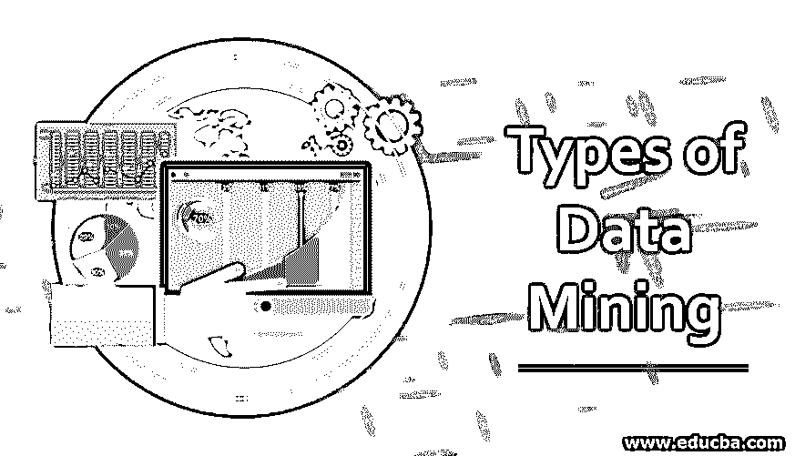

# 数据挖掘的类型

> 原文：<https://www.educba.com/type-of-data-mining/>

## 数据挖掘类型介绍

术语“数据挖掘”是指我们需要查看大型数据集并从中挖掘数据，以描绘数据想要表达的本质。与煤炭开采非常相似，使用各种工具开采地下深处的煤炭，数据挖掘也有相关的工具来充分利用数据。对数据挖掘的一个普遍误解是，它被认为是我们试图提取新数据的东西，但它并不总是正确的。它也指我们试图从已有数据中获取意义的东西。因此，数据挖掘本身是一个广阔的领域，我们将在接下来的几段中深入研究数据挖掘工具。在本文中，我们将讨论数据挖掘的类型。

### 什么是数据挖掘？

如前所述，数据挖掘是一个从数据中获得最大价值的过程。数据挖掘工具充当了数据和来自数据的信息之间的桥梁。在一些博客中，数据挖掘也被称为知识发现。在这里，我们想简单介绍一下数据挖掘的实现过程，这样数据挖掘背后的直觉就很清晰，读者也很容易理解。流程图下方表示流程:

<small>Hadoop、数据科学、统计学&其他</small>

在上面讨论的过程中，每个级别都有工具，我们将尝试深入研究最重要的工具。

### 数据挖掘的类型

可以对以下类型的数据执行数据挖掘:

#### 1.平滑(准备数据)

这种特殊的数据挖掘技术方法属于准备数据的范畴。这项技术的主要目的是消除数据中的噪声。这里使用简单指数、移动平均等算法来去除噪声。在探索性分析期间，这种技术便于可视化趋势/观点。

#### 2.汇总(准备数据)

顾名思义，聚合一组数据以获得更多信息。这项技术用于概述业务目标，可以手动执行，也可以使用专门的软件来执行。这种技术通常用于大数据，因为大数据并不提供整体所需的信息。

#### 3.概括(准备数据)

同样，顾名思义，这种技术用于将数据作为一个整体来概括。这与聚合不同，因此概化期间的数据不是为了获得更多信息而进行分组，而是对整个数据集进行概化。这将使数据科学模型能够适应更新的数据点。

#### 4.标准化(准备数据)

在这种技术中，要特别注意数据点，以便将它们放在同一尺度下进行分析。比如一个人的年龄和工资落在不同的测量尺度上；因此，将它们绘制在图表上不会帮助我们获得任何关于作为集体特征呈现的趋势的有用信息。使用标准化，我们可以将它们放入一个相等的范围内进行比较。

#### 5.属性/特征选择(准备数据)

在这种技术中，我们采用方法来选择特征，以便用于训练数据集的模型可以隐含预测它尚未看到的数据的值。这非常类似于从满是衣服的衣柜中选择合适的服装来适合自己参加活动。不相关的特性会对模型性能产生负面影响，更不用说提高性能了。

#### 6.分类(对数据建模)

在这种数据挖掘技术中，我们将组称为“类”。在这种技术中，我们将所选择的特征(如上面所讨论的)一起用于组/类别。例如，在一家商店里，如果我们必须评估一个人是否会购买一件产品，那么我们可以共同使用“n”个特征来得到真/假的结果。

#### 7.模式跟踪

这是数据挖掘中使用的基本技术之一，用于获取有关数据点可能呈现的趋势/模式的信息。例如，我们可以确定在周末或假日期间比在工作日或工作日销售更多的趋势。

#### 8.异常值分析或异常检测

顾名思义，这种技术用于发现或分析异常值或异常值。离群值或异常值不是负数据点；它们只是从整个数据集的总体趋势中脱颖而出的东西。在识别异常值时，我们可以将它们从数据集中完全删除，这发生在数据准备完成时。或者这种技术也广泛用于模型数据集中来预测异常值。

#### 9.群聚；聚集

这种技术与分类非常相似，但唯一的区别是我们不知道在收集特征后，数据点将归入哪个组。这种方法通常用于对人员进行分组，以获得相似的产品推荐。

#### 10.回归

该技术用于预测某个特征与其他特征同时存在的可能性。例如，我们可以根据需求、竞争和一些其他特征来制定一个项目价格的可能性。

#### 11.神经网络

这项技术基于生物神经元的工作原理。与人体中的神经元类似，数据挖掘工作中神经网络中的神经元也充当处理单元，并连接另一个神经元以沿着链传递信息。

#### 12.联合

在这种数据挖掘方法中，不同特征之间的关系被确定，并且反过来用于发现隐藏模式或者根据业务需求执行相关分析。例如，我们可以使用关联找到彼此相关的特征，并因此强调移除任何人以移除一些冗余特征并提高处理能力/时间。

### 结论

总之，在执行数据挖掘时，应该记住不同的要求。我们需要非常小心预期的输出是什么，以便使用相应的技术来实现它。尽管数据挖掘是一个不断发展的领域，我们还是试图为读者创建一个以上所有类型的数据挖掘工具的详尽列表。

### 推荐文章

这是数据挖掘类型的指南。这里我们详细讨论数据挖掘的基本概念和 12 种类型。您还可以浏览我们推荐的其他文章——

1.  [数据挖掘的优势](https://www.educba.com/advantages-of-data-mining/)
2.  [数据挖掘架构](https://www.educba.com/data-mining-architecture/)
3.  [数据挖掘方法](https://www.educba.com/data-mining-methods/)
4.  [数据挖掘工具](https://www.educba.com/data-mining-tool/)
5.  [数据挖掘中的模型类型](https://www.educba.com/models-in-data-mining/)

