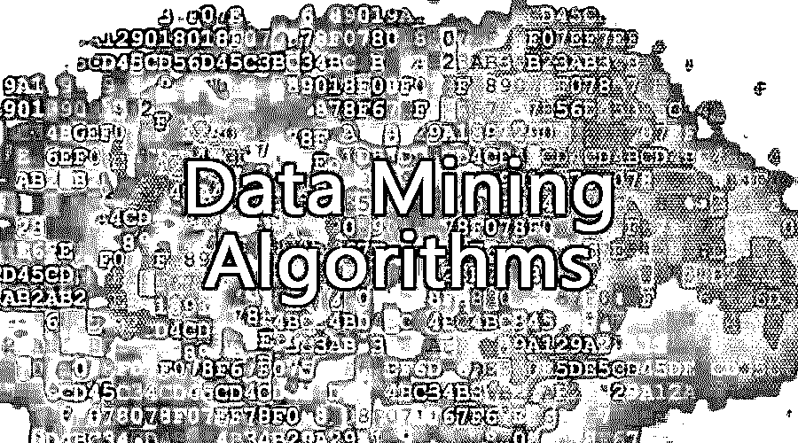

# 数据挖掘算法

> 原文：<https://www.educba.com/data-mining-algorithms/>

## 什么是数据挖掘算法？

数据挖掘算法是一类特殊的算法，用于分析数据和开发数据模型以识别有意义的模式。这些是机器学习算法的一部分。这些算法是通过各种编程实现的，如 R 语言、Python 和数据挖掘工具，以导出优化的数据模型。一些流行的数据挖掘算法是用于决策树的 C4.5、用于聚类数据分析的 K-means、[朴素贝叶斯算法](https://www.educba.com/naive-bayes-algorithm/)、支持向量机制算法、用于时间序列数据挖掘的 Apriori 算法。这些算法是企业数据分析实施的一部分。这些算法基于应用于数据集的统计和数学公式。

### 顶级数据挖掘算法

让我们来看看顶级的数据挖掘算法:

<small>Hadoop、数据科学、统计学&其他</small>

#### 1.C4.5 算法

数据挖掘工具分类器使用一些结构。这些系统从案例的集合中获取输入，其中每个案例属于少量类别中的一个，并通过其固定属性集的值来描述。输出分类器可以准确地预测它所属的级别。它使用决策树，其中第一个初始树是通过使用分治算法获得的。

假设 S 是一个类，并且树是用 S 中最频繁的类型标记的叶子。基于具有两个或更多结果的单个属性选择测试，而不是将该测试作为根，可以使用测试的每个工作的一个分支。这些分区对应于子集 S1、S2 等。，这是每种情况下的结果。C4.5 允许多种产品。C4.5 在 thorny decision trees 中引入了一个替代公式，它由一个规则列表组成，其中这些规则针对每个类进行分组。为了对案例进行分类，满足条件的第一类被命名为第一类。如果病人没有遇到电源，那么它被分配一个默认类别。C4.5 规则集由初始决策树形成。C4.5 通过多线程增强了可扩展性。

#### 2.k 均值算法

该算法是一种将给定数据集划分为用户指定数量的聚类的简单方法。该算法适用于 D 维向量，D={xi | i= 1，… N}其中 I 是数据点。为了获得这些初始数据种子，必须随机对数据进行采样。这就设定了聚类一个小的数据子集的解决方案，数据的全局均值 k 倍。该算法可以与另一种算法配对来描述非凸聚类。它从给定的一组对象中创建 k 个组。它通过聚类分析探索整个数据集。当与不同的算法配合使用时，它比其他算法简单、快速。这种算法大多被归类为半监督的。除了指定聚类数，它还在没有任何信息的情况下保持学习。它观察群体并学习。

#### 3.朴素贝叶斯算法

这个算法是[基于贝叶斯定理](https://www.educba.com/bayes-theorem/)。该算法主要用于输入维数较高的情况。这个分类器可以很容易地计算下一个可能的输出。新的原始数据可以在运行时添加，它提供了一个更好的概率分类器。每个类都有一组已知的向量，旨在创建一个规则，允许将来将对象分配给类。变量的向量描述了未来的事情。这是最舒适的算法之一，因为它易于构造并且没有任何复杂的参数估计模式。它也可以很容易地应用于大规模数据集。它不需要任何复杂的迭代参数估计方案，因此不熟练的用户可以理解为什么进行分类。

#### 4.支持向量机算法

如果用户想要稳健和准确的方法，那么必须尝试支持向量机算法。支持向量机主要用于学习分类、回归或排序函数。它是基于结构风险最小化和统计学习理论而形成的。必须确定决策边界，这就是所谓的超平面。它有助于类的最佳分离。SVM 的主要工作是确定最大化两种类型之间的差额。边距定义为两种类型之间的间距。超平面函数类似于直线 y= MX + b 的方程。SVM 也可以扩展到进行数值计算。SVM 使用了内核，因此它可以在更高维度中很好地运行。这是一个监督算法，数据集首先用于让 SVM 了解所有的类。一旦这项工作完成，SVM 就能够对这些新数据进行分类。

#### 5.Apriori 算法

Apriori 算法被广泛应用于从事务数据集中发现频繁项集和导出关联规则。发现频繁项集并不困难，因为它的组合爆炸。一旦我们得到了频繁项集，就很容易生成大于或等于指定最小置信度的关联规则。Apriori 是一种算法，它通过利用候选生成来帮助发现常规数据集。它假设项目集或存在的项目是按字典顺序排序的。在引入 Apriori 之后，数据挖掘的研究得到了特别的推动。它简单且易于实现。该算法的基本方法如下:

*   **Join** :整个数据库用于 hoe 频繁 1 项集。
*   **修剪**:该物品集必须满足支持度和置信度，才能进入 2 个物品集的下一轮。
*   **重复**:直到没有达到预定义的大小为止，然后对每个项集级别重复此操作。

### 结论

随着这五种算法被广泛使用，其他算法有助于挖掘数据和学习。它集成了不同的技术，包括机器学习、统计学、[模式识别](https://www.educba.com/pattern-recognition/)、人工智能和数据库系统。所有这些都有助于分析大型数据集和执行其他数据分析任务。因此，它们是最有用和最可靠的分析算法。

### 推荐文章

这是数据挖掘算法的指南。这里我们讨论了基本概念和顶级数据挖掘算法。你也可以浏览我们推荐的其他文章来了解更多信息-

1.  [什么是软件测试？](https://www.educba.com/what-is-software-testing/)
2.  [决策树算法](https://www.educba.com/decision-tree-algorithm/)
3.  [Java 中什么是泛型？](https://www.educba.com/what-is-generics-in-java/)
4.  [数据挖掘的架构](https://www.educba.com/data-mining-architecture/)
5.  [数据挖掘应用](https://www.educba.com/data-mining-applications/)
6.  [c#中泛型的例子和工作原理](https://www.educba.com/c-sharp-generics/)
7.  [具有优势的数据挖掘模型](https://www.educba.com/models-in-data-mining/)

