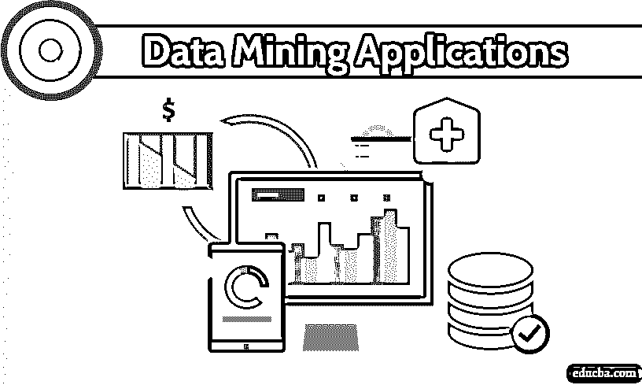

# 数据挖掘应用

> 原文：<https://www.educba.com/data-mining-applications/>

## 数据挖掘应用概述

[数据挖掘](https://www.educba.com/what-is-data-mining/)是如何使用交叉技术(如统计学、机器学习和数据库系统等)来查看和发现大型数据集中的模式。它包括从一组原始的和未识别的数据集中提取数据，通过挖掘提供一些有意义的结果。

然后，通过使用转换进一步使用提取的数据，并确保按照业务需求和需要安排数据以提供最佳服务。在本文中，我们将了解与数据挖掘相关的各种应用。

<small>Hadoop、数据科学、统计学&其他</small>

### 数据挖掘应用程序列表

以下是各种数据挖掘应用程序的列表

#### 1.金融公司、银行及其分析

许多数据挖掘技术涉及到关键的银行和金融数据的提供和保存，这些公司的数据是最重要的。一种这样的方法是分布式数据挖掘，其被研究、建模、制作和开发以帮助跟踪与信用卡、网上银行或任何其他银行服务相关的可疑活动或任何恶意或欺诈交易。

通过对大量[客户数据](https://www.educba.com/customer-data/)进行采样和识别，分析变得相当容易。此外，通过记录交易时间、地理位置、支付方式、客户活动历史等参数，跟踪可疑活动变得相对更加简单。基于这些参数，然后计算客户的相对度量，可以基于计算的指数将其用于任何形式的使用。

银行可以通过对历史数据和他们活动的性质执行正确的数据挖掘来保留他们的客户或获得新的客户。信息在任何组织的成功和失败中都起着巨大的作用，尤其是在大数据出现之后。然后，可以根据客户的活动以及历史交易和购买趋势推出诱人的优惠。利用数据挖掘可以找出各种财务指标之间的相关性。股票市场的模式、涨跌及其预测也可以通过使用数据挖掘来分析。

#### 2.医疗保健领域和保险领域

数据挖掘相关的应用程序可以有效地跟踪和监控患者的健康状况，并有助于根据过去的疾病记录进行有效的诊断。同样，保险业的发展依赖于将数据转化为知识形式的能力，或者通过提供有关客户、市场和潜在竞争对手的各种详细信息。因此，所有有效应用数据挖掘技术的公司都从中获益。这用于索赔及其分析，即识别一起索赔的医疗程序。它能够预测新政策，帮助发现有风险的客户行为模式，并帮助发现欺诈行为。

#### 3.在运输领域的应用

历史或批量形式的数据将有助于识别特定客户通常选择去特定地方(比如他的家乡)的交通方式，从而为他提供诱人的优惠和新产品及推出的服务的大幅折扣。因此，这将被包括在有针对性的有机广告中，其中客户的潜在领导产生转换领导的权利。它也有助于确定各种仓库和销售点之间的时间表分配，以便分析基于负载的模式。

#### 4.数据挖掘在医学领域的应用

在医学分析的情况下，病人的情况可以通过制作他的诊所访问和他的假期的标签来分析。它也有助于识别各种疾病的成功医学治疗模式。研究人员正在使用多维数据来降低成本，提高服务质量，提供更广泛和更好的服务。其他方法，如软计算、统计、数据可视化和机器学习，被有效地用于测量和预测单个类别内的患者数据量。制定这些流程是为了确保患者在任何需要的时候都能得到适当的关注。它还有助于医疗保健和医药保险公司检测伪造和欺诈案件。

#### 5.教育

在教育中，数据挖掘的应用已经很普遍，其中新兴的教育数据挖掘领域主要集中于从教育机构的古老过程和系统中提取数据的方式和方法。这一目标通常是通过使用先进的科学知识使学生在各个方面成长和学习来实现的。在这里，数据挖掘主要通过确保向教育部门提供正确质量的知识和决策内容来发挥作用。

#### 6.制造工程

可以通过确保制造企业拥有正确的知识集合来评估数据，因为其资产在于识别正确的产品组合、产品架构以及客户需求和要求集合。此外，高效的数据挖掘功能可以确保产品开发在相关的时间框架内完成，并且不会超出最初分配的预算。

### 结论

我们已经研究了不同领域中各种数据挖掘应用的基本概述和布局。这种巨大而无止境的技术的范围不仅仅局限于这些领域，而是延伸到一个企业能够蓬勃发展的每一个部分。

它只是关于正确的技术和一些分析，使你的日常业务不同于竞争对手。当今世界落后于数据及其管理，高效处理是影响组织发展的关键因素，尤其是在当今时代。我希望你喜欢我们的文章。继续收集数据，分析它们，继续阅读我们的博客，获取更多与技术相关的文章。

### 推荐文章

这是数据挖掘应用指南。在这里，我们讨论了与数据挖掘相关的各种应用的基本概念。您也可以浏览我们推荐的其他文章，了解更多信息——

1.  [数据挖掘的优势](https://www.educba.com/advantages-of-data-mining/)
2.  [什么是数据挖掘中的聚类？](https://www.educba.com/what-is-clustering-in-data-mining/)
3.  [什么是 Ajax？](https://www.educba.com/what-is-ajax/)
4.  [数据挖掘中的模型|算法|类型](https://www.educba.com/models-in-data-mining/)

